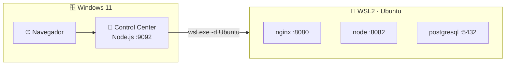

# 🔧 ENVIRONMENT_SETUP — WSL Control Center v1

> Guía completa para preparar un host **Windows 11 + WSL2 + Ubuntu + Node.js**
> hasta abrir el Control Center en `localhost:9092`.
> Para la operación del día a día, consulta [RUNBOOK.md](RUNBOOK.md).

---

## 🎯 Objetivo

Dejar el host listo para el flujo real del producto:

- 🪟 **Control Center** (Node.js) corriendo en Windows en `:9092`
- 🐧 **Backend WSL2** con una distro Ubuntu/Debian y servicios Linux nativos
- 🌐 **Servicios publicados en `localhost`** (nginx, apache, node, flask, postgres…)
- 🚀 Opción de usar también el **launcher Go** (`.exe`) para arrancar todo de un clic



---

## 🪟 Paso 1 · Instalar WSL2 + Ubuntu

Desde una terminal de **PowerShell como administrador**:

```powershell
wsl --install -d Ubuntu
```

Esto habilita las características de virtualización, instala WSL2 y descarga
Ubuntu. **Reinicia Windows** si el instalador lo solicita.

> [!NOTE]
> El primer arranque de Ubuntu pedirá crear un **usuario y contraseña** de Linux.
> Guárdalos: los usarás para los servicios que requieren `sudo`.

Verifica que la distro quedó en **WSL 2**:

```powershell
wsl -l -v
```

Debes ver `Ubuntu` con `VERSION 2`. Si aparece `1`, conviértela:

```powershell
wsl --set-version Ubuntu 2
```

---

## 📁 Paso 2 · Elegir la ubicación del repo

Hay dos layouts válidos:

### 🅐 Repo en Windows _(recomendado)_

Es el layout validado para el flujo de `localhost`, porque el Control Center
corre en Windows:

```text
C:\dev\wsl-labs
```

Visto desde WSL:

```text
/mnt/c/dev/wsl-labs
```

Clona el repo desde PowerShell:

```powershell
git clone https://github.com/vladimiracunadev-create/wsl-labs.git C:\dev\wsl-labs
cd C:\dev\wsl-labs
```

> [!TIP]
> El Control Center convierte automáticamente `C:\dev\wsl-labs` a
> `/mnt/c/dev/wsl-labs` y exporta esa ruta como `WSL_LABS_ROOT` para que los
> servicios de ejemplo (node, flask) la resuelvan dentro de la distro.

### 🅑 Repo en filesystem Linux

Recomendado si vas a trabajar sobre todo desde consola Linux (I/O más rápida):

```bash
mkdir -p ~/dev && cd ~/dev
git clone https://github.com/vladimiracunadev-create/wsl-labs.git
cd wsl-labs
```

---

## 📦 Paso 3 · Instalar Node.js en Windows

El Control Center corre en **Windows** con Node.js (no usa dependencias npm;
solo el módulo `http` nativo).

1. Descarga **Node.js 18 LTS o superior** desde <https://nodejs.org/>
2. Verifica en PowerShell:

```powershell
node --version
```

> [!IMPORTANT]
> Node.js debe estar en el **PATH de Windows**, no dentro de WSL. Es Windows
> quien ejecuta `node dashboard-server/server.js` y hace de puente hacia WSL2
> con `wsl.exe`.

---

## 🐧 Paso 4 · Preparar la distro (dentro de WSL)

Instala los paquetes base de los servicios (nginx, apache+php, postgresql,
python) con el script de instalación:

```powershell
wsl bash /mnt/c/dev/wsl-labs/scripts/install-base.sh
```

O, si el repo está en filesystem Linux:

```bash
bash scripts/install-base.sh
```

> [!TIP]
> Los servicios `05`–`09` usan `sudo service <nombre> start`. Para que el
> Control Center pueda arrancarlos sin pedir contraseña, considera un `sudoers`
> sin password para esos servicios (ver [COMPATIBILITY.md](COMPATIBILITY.md)).

---

## 🖥️ Paso 5 · Levantar el Control Center

Desde la raíz del repo, en PowerShell:

```powershell
cd C:\dev\wsl-labs
node dashboard-server/server.js
# o, con Makefile:
make serve
```

La consola debe mostrar algo como:

```text
  WSL Control Center
  http://localhost:9092
  Repo (Windows): C:\dev\wsl-labs
  Repo (WSL):     /mnt/c/dev/wsl-labs
  Distro:         Ubuntu
  Auth token:     desactivado (modo dev)
```

Abre → **<http://localhost:9092>**

El panel debe mostrar la distro detectada, los 12 labs del catálogo y el estado
de cada servicio.

---

## 🧪 Paso 6 · Validar un servicio real

Arranca **nginx (lab 05)** desde la UI o por API (el token está desactivado en
modo dev):

```powershell
$headers = @{ 'Content-Type' = 'application/json' }
Invoke-RestMethod -Method Post -Headers $headers `
  -Body '{ "id": "05" }' http://localhost:9092/api/wsl/start
```

Valida la salud del servicio:

```powershell
Invoke-RestMethod http://localhost:9092/api/health/05
Invoke-WebRequest http://localhost:8080 -UseBasicParsing
```

Debe responder `status: healthy` y NGINX debe contestar en `:8080`.

---

## 🚀 Paso 7 · Launcher Windows _(opcional)_

Si prefieres un `.exe` que verifique WSL2, arranque el Control Center y abra el
navegador por ti:

```powershell
# Compilar el launcher (requiere Go 1.21+)
cd C:\dev\wsl-labs\launcher\windows
go build -ldflags "-X main.launcherVersion=0.1.0" -o wsl-labs-launcher.exe .
.\wsl-labs-launcher.exe
```

También puedes descargar el `.exe` ya compilado desde
[GitHub Releases](https://github.com/vladimiracunadev-create/wsl-labs/releases).

> [!NOTE]
> El launcher usa el mismo modelo de `localhost` que el Control Center: detecta
> la distro con `wsl.exe -l -q`, arranca `node dashboard-server/server.js` en
> segundo plano y hace polling a `/api/overview` hasta 90 s antes de abrir el
> navegador.

---

## 🔥 Paso 8 · Troubleshooting rápido

> [!WARNING]
> Si `localhost:9092` no responde, sigue este checklist en orden:

1. Confirma que Node.js está en el PATH de Windows → `node --version`
2. Confirma que `wsl.exe --status` responde
3. Confirma la distro con `wsl -l -v` (debe ser VERSION 2)
4. Revisa que no haya otro proceso ocupando `:9092` → `netstat -ano | findstr 9092`
5. Dentro de WSL, verifica el servicio → `sudo service nginx status`
6. Revisa que no haya colisión de puertos en `8080`, `8081`, `8082`, `8083`, `5432`, `8090`
7. Consulta el lab [12-troubleshooting](labs/12-troubleshooting/) para casos comunes

---

📖 Ver también: [RUNBOOK.md](RUNBOOK.md) · [COMPATIBILITY.md](COMPATIBILITY.md) · [docs/00-que-es-wsl.md](docs/00-que-es-wsl.md)
