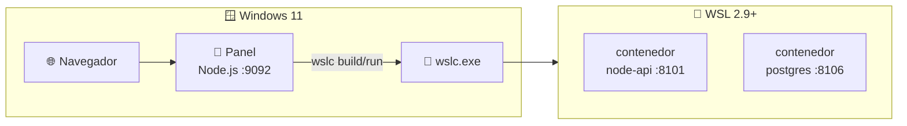

# 🔧 ENVIRONMENT_SETUP — WSL Container Center

> Guía completa para preparar un host **Windows 11 + WSL2 + `wslc` + Node.js**
> hasta abrir el panel en `localhost:9092` y levantar tu primer contenedor.
> Para la operación del día a día, consulta [RUNBOOK.md](RUNBOOK.md).

---

## 🎯 Objetivo

Dejar el host listo para el flujo real del producto:

- 🪟 **Panel** (Node.js) corriendo en Windows en `:9092`
- 🐳 **Motor `wslc`** disponible (WSL 2.9+, `C:\Program Files\WSL\wslc.exe`)
- 🌐 **Contenedores publicados en `localhost`** (los 12 casos del catálogo)
- 🚀 Opción de usar también el **launcher Go** (`.exe`) para arrancar todo de un clic



---

## 🪟 Paso 1 · Instalar WSL2

Desde una terminal de **PowerShell como administrador**:

```powershell
wsl --install
```

Esto habilita la virtualización e instala WSL2. **Reinicia Windows** si el
instalador lo solicita.

> [!NOTE]
> El motor de contenedores `wslc` **no** vive dentro de una distro: es parte del
> propio WSL. Aun así, WSL debe estar instalado y en versión 2.9+.

---

## 🐳 Paso 2 · Activar el motor de contenedores `wslc`

`wslc` llega con la rama **preview** de WSL. Actualiza y verifica:

```powershell
wsl --update --pre-release
wsl --version
& "C:\Program Files\WSL\wslc.exe" version
```

Debes ver WSL en **2.9+** y `wslc version` respondiendo.

> [!WARNING]
> Si `wslc` no aparece tras actualizar, reinicia WSL con `wsl --shutdown` y
> vuelve a comprobarlo. El panel localiza el binario en
> `C:\Program Files\WSL\wslc.exe` (o en `WSL_LABS_WSLC` si lo defines).

---

## 📁 Paso 3 · Clonar el repo

Clona en Windows (el panel y `wslc.exe` corren en Windows):

```powershell
git clone https://github.com/vladimiracunadev-create/wsl-labs.git C:\dev\wsl-labs
cd C:\dev\wsl-labs
```

El catálogo de casos vive en `containers/containers.config.json` y cada caso en
`containers/NN-nombre/`.

---

## 📦 Paso 4 · Instalar Node.js en Windows

El panel corre en **Windows** con Node.js (sin dependencias npm; solo el módulo
`http` nativo).

1. Descarga **Node.js 18 LTS o superior** desde <https://nodejs.org/>
2. Verifica en PowerShell:

```powershell
node --version
```

> [!IMPORTANT]
> Node.js debe estar en el **PATH de Windows**, no dentro de WSL. Es Windows quien
> ejecuta `node dashboard-server/server.js` e invoca `wslc.exe`.

---

## 🖥️ Paso 5 · Levantar el panel

Desde la raíz del repo, en PowerShell:

```powershell
cd C:\dev\wsl-labs
node dashboard-server/server.js
# o, con Makefile:
make serve
```

Abre → **<http://localhost:9092>**

El panel debe mostrar los 12 casos del catálogo, agrupados por categoría
(`starter`, `platform`, `infra`), con botones **Construir / Levantar / Bajar /
Logs**.

---

## 🧪 Paso 6 · Levantar tu primer contenedor

Desde la tarjeta **01 · API Node.js**:

1. Pulsa **🔨 Construir** (construye `wsl-labs/node-api:latest`).
2. Pulsa **▶ Levantar** (arranca `wslc-node-api` en `:8101`).
3. Verifica:

```powershell
Invoke-WebRequest http://localhost:8101 -UseBasicParsing
```

Debe responder HTTP 200 con JSON del contenedor.

O por API (token desactivado en modo dev):

```powershell
$h = @{ 'Content-Type' = 'application/json' }
Invoke-RestMethod -Method Post -Headers $h -Body '{ "id": "01" }' http://localhost:9092/api/wslc/build
Invoke-RestMethod -Method Post -Headers $h -Body '{ "id": "01" }' http://localhost:9092/api/wslc/up
```

---

## 🚀 Paso 7 · Launcher Windows _(opcional)_

Si prefieres un `.exe` que verifique WSL, arranque el panel y abra el navegador:

```powershell
# Compilar el launcher (requiere Go 1.21+)
cd C:\dev\wsl-labs\launcher\windows
go build -ldflags "-X main.launcherVersion=0.1.0" -o wsl-labs-launcher.exe .
.\wsl-labs-launcher.exe
```

También puedes descargar el `.exe` ya compilado (empaquetado con **Inno Setup**)
desde [GitHub Releases](https://github.com/vladimiracunadev-create/wsl-labs/releases).

---

## 🔥 Paso 8 · Troubleshooting rápido

> [!WARNING]
> Si `localhost:9092` no responde o un caso no levanta, sigue este checklist:

1. `wsl --version` → debe ser **2.9+** (si no, `wsl --update --pre-release`)
2. `& "C:\Program Files\WSL\wslc.exe" version` → el motor debe responder
3. `node --version` → Node ≥ 18 en el PATH de Windows
4. `netstat -ano | findstr 9092` → que nada más ocupe el puerto del panel
5. Colisión de puertos de casos → parten de `8100` (`8101`, `8102`…)
6. Casos pesados (Elasticsearch/Jenkins): levántalos de uno en uno; ajusta RAM en
   `%UserProfile%\.wslconfig`
7. Consulta [docs/TROUBLESHOOTING.md](docs/TROUBLESHOOTING.md)

---

## 📚 Contexto: fundamentos de WSL

Si quieres entender **qué es WSL** (la base del motor `wslc`), las guías
`docs/00-05` y la [historia y referencia](docs/wsl-historia-y-referencia.md)
están como **documentación de contexto**. No son necesarias para operar
contenedores.

---

📖 Ver también: [RUNBOOK.md](RUNBOOK.md) · [COMPATIBILITY.md](COMPATIBILITY.md) · [docs/wslc-contenedores.md](docs/wslc-contenedores.md)
