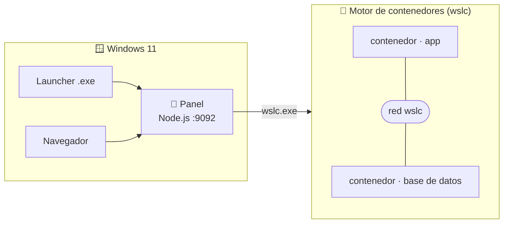

# 🐳 wsl-labs — WSL Container Center

**Levanta y controla contenedores en Windows con `wslc`**, el motor de contenedores
nativo de WSL. Panel de control web + launcher, con casos reales portados de
`docker-labs` — pero sin Docker Desktop.

[](https://github.com/vladimiracunadev-create/wsl-labs/actions/workflows/docs.yml)
[](https://github.com/vladimiracunadev-create/wsl-labs/actions/workflows/dashboard.yml)
[](https://github.com/vladimiracunadev-create/wsl-labs/actions/workflows/build-windows.yml)
[](https://github.com/vladimiracunadev-create/wsl-labs/releases)


[](LICENSE)

> [!NOTE]
> Desde WSL 2.9, WSL trae **WSLC** (`wslc`): un motor de contenedores nativo, tipo
> Docker (imágenes, contenedores, redes, volúmenes). `wsl-labs` es un **centro de
> control de contenedores** sobre `wslc` — el equivalente WSL de un panel Docker.

---

## 🗺️ Qué es este repo

| Pieza | Rol |
|-------|-----|
| 🧭 **Panel** (Node.js, `:9092`) | Construye, levanta, detiene y supervisa contenedores |
| 🪟 **Launcher Windows** (Go `.exe`) | Arranca el panel y abre el navegador |
| 🐳 **12 casos** (`containers/NN-*`) | Stacks reales portados de `docker-labs`, con imágenes propias |
| 📇 **`containers.config.json`** | Fuente única de verdad (imágenes, puertos, redes, comandos) |

### Arquitectura



---

## 🚀 Quickstart

```powershell
# 1. WSL 2 + habilitar wslc (canal preview, trae el motor de contenedores)
wsl --install
wsl --update --pre-release

# 2. Clonar el repo
git clone https://github.com/vladimiracunadev-create/wsl-labs.git
cd wsl-labs

# 3. Levantar el panel
make serve            # o: node dashboard-server/server.js
```

Abre **<http://localhost:9092>**. Por cada caso: **📦 Construir → ▶ Levantar → 🌐 Abrir**.

> [!TIP]
> ¿Prefieres un `.exe`? Descarga el **Launcher** desde
> [Releases](https://github.com/vladimiracunadev-create/wsl-labs/releases).

---

## 🐳 Casos de contenedores

Portados de [`docker-labs`](https://github.com/vladimiracunadev-create/docker-labs),
ejecutados con `wslc`. Los `platform` son multi-contenedor (app + base de datos por una red).

| # | Caso | Categoría | Stack | Puerto |
|---|------|-----------|-------|:------:|
| 01 | [node-api](containers/01-node-api/) | starter | Node.js | 8101 |
| 02 | [php-lamp](containers/02-php-lamp/) | platform | PHP + MariaDB | 8107 |
| 03 | [python-api](containers/03-python-api/) | starter | Flask | 8102 |
| 04 | [redis-cache](containers/04-redis-cache/) | platform | Node + Redis | 8105 |
| 05 | [postgres-api](containers/05-postgres-api/) | platform | Python + PostgreSQL | 8106 |
| 06 | [nginx-web](containers/06-nginx-web/) | starter | Nginx | 8104 |
| 07 | [rabbitmq](containers/07-rabbitmq/) | infra | RabbitMQ | 8109 |
| 08 | [prometheus-grafana](containers/08-prometheus-grafana/) | infra | Prometheus + Grafana | 8110 |
| 09 | [multi-service](containers/09-multi-service/) | platform | Node + MongoDB | 8112 |
| 10 | [go-api](containers/10-go-api/) | starter | Go | 8103 |
| 11 | [elasticsearch](containers/11-elasticsearch/) | infra | Elasticsearch 8 | 8113 |
| 12 | [jenkins](containers/12-jenkins/) | infra | Jenkins LTS | 8114 |

---

## 📖 Documentación

Empieza por el **[📗 índice maestro](docs/DOCUMENTATION_INDEX.md)**.

| Área | Documentos |
|------|-----------|
| 🚀 Uso | [INSTALL](docs/INSTALL.md) · [USER_MANUAL](docs/USER_MANUAL.md) · [DASHBOARD_SETUP](docs/DASHBOARD_SETUP.md) · [RUNBOOK](RUNBOOK.md) · [TROUBLESHOOTING](docs/TROUBLESHOOTING.md) |
| 🏗️ Técnico | [ARCHITECTURE](docs/ARCHITECTURE.md) · [TECHNICAL_SPECS](docs/TECHNICAL_SPECS.md) · [Catálogo de casos](docs/LABS_CATALOG.md) · [Runtime reference](docs/LABS_RUNTIME_REFERENCE.md) · [TOOLING](docs/TOOLING.md) |
| 🐳 Contenedores | [Guía wslc](docs/wslc-contenedores.md) · [Mapping docker-labs → wslc](docs/mapping-from-docker-labs.md) |
| 🐧 WSL (contexto) | [Historia y comandos de WSL](docs/wsl-historia-y-referencia.md) · [¿Qué es WSL?](docs/00-que-es-wsl.md) · [Cheatsheets](cheatsheets/) |
| 🪟 Distribución | [windows-installer](docs/windows-installer.md) · [Releases](docs/github-releases-distribution.md) |
| 📈 Gobernanza | [PROJECT_STATUS](PROJECT_STATUS.md) · [ROADMAP](ROADMAP.md) · [CHANGELOG](CHANGELOG.md) · [CONTRIBUTING](CONTRIBUTING.md) · [SECURITY](SECURITY.md) · [RECRUITER](RECRUITER.md) |

> [!NOTE]
> **WSL como contexto:** WSL es la plataforma que hace posible `wslc`. Su historia,
> fundamentos y comandos se conservan como **documentación** (no como el foco
> operativo del repo). Ver [docs/wsl-historia-y-referencia.md](docs/wsl-historia-y-referencia.md).

---

## 🧱 Requisitos

- Windows 10 (2004+) o Windows 11 · **WSL 2.9+** con `wslc` (`wsl --update --pre-release`)
- Node.js 18+ (panel) · Go 1.21+ (solo para compilar el launcher)
- RAM holgada para los casos pesados (Elasticsearch, Jenkins)

---

## ⚖️ Licencia

[Apache License 2.0](LICENSE) · Copyright 2026 vladimiracunadev-create
