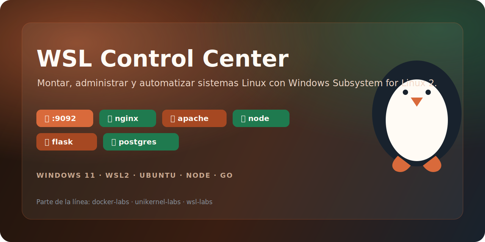
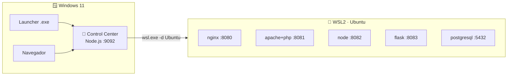

# 🐧 wsl-labs



**Suite de laboratorios para montar, administrar y automatizar sistemas Linux
con Windows Subsystem for Linux (WSL 2)** — con Control Center web, launcher de
Windows y servicios reales publicados en `localhost`.

[](https://github.com/vladimiracunadev-create/wsl-labs/actions/workflows/docs.yml)
[](https://github.com/vladimiracunadev-create/wsl-labs/actions/workflows/dashboard.yml)
[](https://github.com/vladimiracunadev-create/wsl-labs/actions/workflows/build-windows.yml)
[](https://github.com/vladimiracunadev-create/wsl-labs/releases)

[](LICENSE)

> [!NOTE]
> `wsl-labs` es parte de una línea de laboratorios sobre **tecnologías para
> montar sistemas**, junto a
> [`docker-labs`](https://github.com/vladimiracunadev-create/docker-labs) (contenedores)
> y [`unikernel-labs`](https://github.com/vladimiracunadev-create/unikernel-labs) (unikernels).
> Los tres comparten arquitectura: Control Center web + launcher Windows + servicios en localhost.

---

## 🗺️ Qué es este repo

WSL no es solo una terminal Linux dentro de Windows: es una plataforma para
levantar **servicios reales** (web, apps, bases de datos) accesibles desde
`localhost` de Windows. Este repo lo convierte en un panel operable:

| Pieza | Rol |
| ------- | ----- |
| 🧭 **Control Center** (Node.js, `:9092`) | Arranca/detiene servicios WSL y muestra su salud |
| 🪟 **Launcher Windows** (Go `.exe`) | Detecta la distro, levanta el stack y abre el navegador |
| 🐧 **12 labs** (`labs/NN-*`) | Guías paso a paso: instalación, systemd, nginx, apache, node, python, postgres, backup… |
| 📇 **`labs.config.json`** | Fuente única de verdad del catálogo (puertos, comandos, health) |

### Arquitectura



---

## 🚀 Quickstart

```powershell
# 1. Instalar WSL 2 + Ubuntu (reinicia si es la primera vez)
wsl --install

# 2. Clonar el repo
git clone https://github.com/vladimiracunadev-create/wsl-labs.git
cd wsl-labs

# 3. Preparar la distro (dentro de WSL)
wsl bash scripts/install-base.sh

# 4. Levantar el Control Center
make serve            # o: node dashboard-server/server.js
```

Abre **<http://localhost:9092>** y controla los servicios desde el panel.
El panel instala y levanta cada servicio con un clic, como Docker (corre
privilegiado en WSL, sin contraseñas): **📦 Instalar → ▶ Levantar**.

> [!TIP]
> ¿Prefieres un `.exe`? Descarga el **Launcher** desde
> [Releases](https://github.com/vladimiracunadev-create/wsl-labs/releases): levanta
> el stack y abre el navegador por ti.

---

## 🌐 Servicios en localhost

| Servicio | Lab | Puerto | URL |
| ---------- | ----- | :------: | ----- |
| 🧭 Control Center | — | 9092 | <http://localhost:9092> |
| 🌐 NGINX | 05 | 8080 | <http://localhost:8080> |
| 🐘 Apache + PHP | 06 | 8081 | <http://localhost:8081> |
| 🟢 Node API | 07 | 8082 | <http://localhost:8082> |
| 🐍 Flask | 08 | 8083 | <http://localhost:8083> |
| 🗄️ PostgreSQL | 09 | 5432 | `postgres://localhost:5432` |

---

## 🧪 Labs disponibles

| # | Lab | Tipo | Estado | Puerto |
| --- | ----- | ------ | :------: | :------: |
| 01 | [Instalación Ubuntu](labs/01-instalacion-ubuntu/) | 📚 learning | ✅ | — |
| 02 | [Comandos base WSL](labs/02-comandos-base-wsl/) | 📚 learning | ✅ | — |
| 03 | [Sistema de archivos](labs/03-sistema-de-archivos/) | 📚 learning | ✅ | — |
| 04 | [systemd y servicios](labs/04-systemd-servicios/) | 📚 learning | ✅ | — |
| 05 | [Servidor web NGINX](labs/05-servidor-web-nginx/) | ⚙️ service | ✅ | 8080 |
| 06 | [Apache + PHP](labs/06-servidor-apache-php/) | ⚙️ service | ✅ | 8081 |
| 07 | [Node.js entorno dev](labs/07-nodejs-entorno-dev/) | ⚙️ service | ✅ | 8082 |
| 08 | [Python entorno dev](labs/08-python-entorno-dev/) | ⚙️ service | ✅ | 8083 |
| 09 | [PostgreSQL en WSL](labs/09-postgresql-en-wsl/) | ⚙️ service | ✅ | 5432 |
| 10 | [Backup export/import](labs/10-backup-export-import/) | 📚 learning | ✅ | — |
| 11 | [Mini-servidor completo](labs/11-mini-servidor-completo/) | ⚙️ service | ✅ | 8090 |
| 12 | [Troubleshooting](labs/12-troubleshooting/) | 📚 learning | ✅ | — |

---

## 📖 Documentación

> [!TIP]
> ¿No sabes por dónde empezar? Abre el **[📗 índice maestro](docs/DOCUMENTATION_INDEX.md)**.
> Abajo tienes el índice completo — **todos** los documentos del repo enlazados.

### 🚀 Inicio y operación

| Documento | Para quién |
|-----------|-----------|
| [docs/BEGINNERS_GUIDE.md](docs/BEGINNERS_GUIDE.md) | Introducción para novatos |
| [docs/INSTALL.md](docs/INSTALL.md) | Instalación end-to-end |
| [docs/REQUIREMENTS.md](docs/REQUIREMENTS.md) | Requisitos del host y WSL |
| [ENVIRONMENT_SETUP.md](ENVIRONMENT_SETUP.md) | Preparar Windows + WSL2 paso a paso |
| [docs/USER_MANUAL.md](docs/USER_MANUAL.md) | Uso diario del panel + API REST |
| [docs/DASHBOARD_SETUP.md](docs/DASHBOARD_SETUP.md) | Arquitectura y operación del Control Center |
| [OPERATING-MODES.md](OPERATING-MODES.md) | Modos de uso (panel, terminal, launcher) |
| [RUNBOOK.md](RUNBOOK.md) | Operación diaria y respuesta rápida |
| [docs/TROUBLESHOOTING.md](docs/TROUBLESHOOTING.md) | Problemas comunes → solución |

### 🏗️ Arquitectura y referencia técnica

| Documento | Para quién |
|-----------|-----------|
| [docs/ARCHITECTURE.md](docs/ARCHITECTURE.md) | Arquitectura Windows ↔ WSL2 |
| [docs/TECHNICAL_SPECS.md](docs/TECHNICAL_SPECS.md) | Stacks, puertos, endpoints, contratos |
| [SYSTEM_SPECS.md](SYSTEM_SPECS.md) | Vista corta de componentes |
| [docs/LABS_CATALOG.md](docs/LABS_CATALOG.md) | Rol de los 12 labs |
| [docs/LABS_RUNTIME_REFERENCE.md](docs/LABS_RUNTIME_REFERENCE.md) | Servicio, puerto, health y RAM por lab |
| [FILE_ARCHITECTURE.md](FILE_ARCHITECTURE.md) | Mapa de carpetas |
| [docs/TOOLING.md](docs/TOOLING.md) | Herramientas de runtime, dev y CI |
| [COMPATIBILITY.md](COMPATIBILITY.md) | Compatibilidad por SO y modo |
| [GLOSSARY.md](GLOSSARY.md) | Glosario de términos |

### 🐧 Fundamentos y referencia de WSL

| Documento | Para quién |
|-----------|-----------|
| [docs/wsl-historia-y-referencia.md](docs/wsl-historia-y-referencia.md) | **Historia de WSL, por qué existe y referencia completa de comandos** |
| [docs/00-que-es-wsl.md](docs/00-que-es-wsl.md) | ¿Qué es WSL? |
| [docs/01-instalacion-wsl.md](docs/01-instalacion-wsl.md) | Instalar y configurar WSL 2 |
| [docs/02-comandos-basicos.md](docs/02-comandos-basicos.md) | Comandos básicos |
| [docs/03-wsl-vs-docker-vs-vm.md](docs/03-wsl-vs-docker-vs-vm.md) | WSL vs Docker vs VM |
| [docs/04-buenas-practicas.md](docs/04-buenas-practicas.md) | Buenas prácticas |
| [cheatsheets/](cheatsheets/) | Chuletas: WSL, Linux, systemd, redes |

### 🪟 Distribución Windows

| Documento | Para quién |
|-----------|-----------|
| [docs/windows-installer.md](docs/windows-installer.md) | Instalar y compilar el `.exe` |
| [docs/github-releases-distribution.md](docs/github-releases-distribution.md) | Distribución por GitHub Releases |
| [docs/technical-audit.md](docs/technical-audit.md) | Auditoría técnica y correcciones |

### 📈 Estado, release y gobernanza

| Documento | Para quién |
|-----------|-----------|
| [PROJECT_STATUS.md](PROJECT_STATUS.md) | Estado consolidado |
| [ROADMAP.md](ROADMAP.md) · [docs/05-roadmap.md](docs/05-roadmap.md) | Hacia dónde va el proyecto |
| [CHANGELOG.md](CHANGELOG.md) | Historial de cambios |
| [RELEASE.md](RELEASE.md) | Checklist de release |
| [SECURITY.md](SECURITY.md) | Modelo de confianza y reporte |
| [CONTRIBUTING.md](CONTRIBUTING.md) | Cómo añadir un lab |
| [CODE_OF_CONDUCT.md](CODE_OF_CONDUCT.md) | Normas de convivencia |
| [SUPPORT.md](SUPPORT.md) | Cómo obtener ayuda |
| [DEVELOPING.md](DEVELOPING.md) | Extender y mantener el repo |
| [docs/MAINTAINERS.md](docs/MAINTAINERS.md) | Responsabilidades del mantenedor |

### 👀 Evaluación y paridad

| Documento | Para quién |
|-----------|-----------|
| [RECRUITER.md](RECRUITER.md) | Recorrido de 5 min para reclutadores |
| [docs/PLAN_PARIDAD.md](docs/PLAN_PARIDAD.md) | Plan de paridad con los repos hermanos |
| [docs/mapping-from-docker-labs.md](docs/mapping-from-docker-labs.md) | Equivalencias Docker → WSL |

---

## 🧱 Requisitos

- Windows 10 (2004+) o Windows 11 · **WSL 2**
- Una distro Linux (Ubuntu/Debian recomendada)
- Node.js 18+ (para el Control Center) · Go 1.21+ (solo para compilar el launcher)
- Git · PowerShell / Windows Terminal

---

## ⚖️ Licencia

[Apache License 2.0](LICENSE) · Copyright 2026 vladimiracunadev-create
