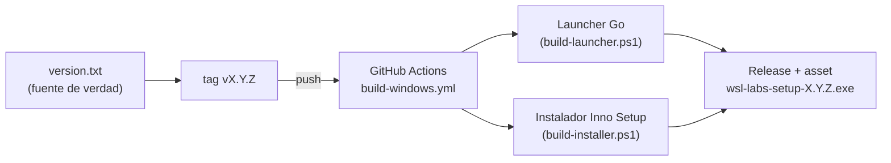

# 🚀 Release Guide

> **Estado**: Activo
> **Uso recomendado**: Léelo antes de publicar una nueva versión de `wsl-labs`,
> para que el repo quede coherente y el instalador Windows salga bien.

---

## 🎯 Objetivo

Definir el flujo para publicar una versión de `wsl-labs` con **versionado
semántico**. `version.txt` es la **fuente única de verdad** de la versión; el
tag `vX.Y.Z` dispara el build del launcher Go + instalador Inno Setup, que se
publica como `wsl-labs-setup-X.Y.Z.exe` en
[Releases](https://github.com/vladimiracunadev-create/wsl-labs/releases).

---

## 🧩 Cómo encaja el pipeline



---

## ✅ Checklist de release

| Paso | Acción |
| --- | --- |
| 1 | 🔢 Subir la versión en `version.txt` (p. ej. `0.1.3`) |
| 2 | 📓 Actualizar [CHANGELOG.md](CHANGELOG.md) con la nueva entrada (`Added` / `Fixed` / `Changed`) |
| 3 | 🧾 Revisar coherencia editorial: README, RUNBOOK y docs no prometen más de lo entregado |
| 4 | ✅ Correr validación local: `node dashboard-server/verify-localhost.js` |
| 5 | 💾 Crear el commit final (`chore: bump version to X.Y.Z`) |
| 6 | 🏷️ Crear el tag `vX.Y.Z` y pushearlo (dispara el build) |
| 7 | 👀 Verificar en Actions que `build-windows.yml` termina en verde |
| 8 | 📦 Confirmar que `wsl-labs-setup-X.Y.Z.exe` quedó adjunto al Release |

> [!IMPORTANT]
> El número del tag debe **coincidir** con `version.txt`. El workflow deriva la
> versión del propio tag (`v0.1.3` → `0.1.3`).

---

## ⚙️ Flujo recomendado — `release.ps1`

El script `scripts/windows/release.ps1` **no compila en local**: crea el tag y
delega el build a GitHub Actions.

```powershell
# 1. Subir la versión (fuente única de verdad)
"0.1.3" | Set-Content version.txt

# 2. Actualizar CHANGELOG y commitear
git add version.txt CHANGELOG.md
git commit -m "chore: bump version to 0.1.3"
git push origin main

# 3. Crear el tag y pushearlo (dispara build-windows.yml)
.\scripts\windows\release.ps1 -Push
```

Sin `-Push`, el script crea el tag **solo en local** (dry-run) y te recuerda el
`git push origin vX.Y.Z` para disparar el build.

> [!NOTE]
> `release.ps1` verifica que el árbol de trabajo esté **limpio** y que el tag no
> exista ya. Commitea o descarta cambios antes de ejecutarlo.

---

## 🖐️ Flujo manual (equivalente)

```powershell
"0.1.3" | Set-Content version.txt
git add version.txt CHANGELOG.md
git commit -m "chore: bump version to 0.1.3"
git tag -a v0.1.3 -m "WSL Labs v0.1.3"
git push origin main
git push origin v0.1.3
```

También puedes disparar el build **sin tag** desde Actions con
`workflow_dispatch` (genera un artefacto descargable, sin crear Release).

---

## 🔎 Qué revisar tras el build

1. En **Actions → Build Windows Installer**: los pasos *Build Go launcher*,
   *Build Inno Setup installer* y *Verify installer binary* en verde.
2. En **Releases**: el asset `wsl-labs-setup-X.Y.Z.exe` presente.
3. (Opcional) Probar el instalador en una máquina Windows limpia con WSL2 +
   Ubuntu: debe verificar WSL2, arrancar el Control Center y abrir
   `http://localhost:9092`.

---

## 🔏 Por qué el instalador no está firmado en v0.x

El instalador **no tiene firma digital** en la versión actual. Es una decisión
explícita: el objetivo de v0.x es validar la experiencia de instalación y del
launcher, no invertir aún en infraestructura de firma. Si Windows SmartScreen
avisa, el usuario elige *Más información → Ejecutar de todas formas* (esto se
documenta en las notas del Release).

---

## 🚫 Qué NO hacer

- ❌ Publicar con el README o CHANGELOG desalineados del estado real.
- ❌ Declarar capacidades no verificadas.
- ❌ Commitear artefactos de build (`.exe`, `dist/`) al repositorio.
- ❌ Crear un tag cuyo número no coincida con `version.txt`.

---

📖 Ver también: [CHANGELOG.md](CHANGELOG.md) · [DEVELOPING.md](DEVELOPING.md) · [RUNBOOK.md](RUNBOOK.md) · [docs/MAINTAINERS.md](docs/MAINTAINERS.md)
