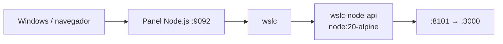

# 01 · API Node.js 🟢

API REST mínima en Node.js con el módulo `http` nativo, empaquetada en la imagen `node:20-alpine` y servida por `wslc`.

## 📋 Datos del caso

| Categoría | Valor |
|---|---|
| Categoría | `starter` |
| Imagen | `wsl-labs/node-api:latest` (base `node:20-alpine`) |
| Puerto host | `8101` → contenedor `3000` |
| Red | — (contenedor único) |
| Health | `GET /health` → `{"status":"ok"}` (HTTP 200) |

## 🚀 Construir y levantar

```bash
wslc build -t wsl-labs/node-api:latest containers/01-node-api
wslc run -d --name wslc-node-api -p 8101:3000 wsl-labs/node-api:latest
```

## ✅ Verificar

```bash
curl http://localhost:8101
curl http://localhost:8101/health
```

> [!NOTE]
> La raíz responde `{"project":"wsl-labs","case":"01-node-api","engine":"wslc","runtime":"container"}` con HTTP 200.

## 🧭 Desde el panel

En [http://localhost:9092](http://localhost:9092) busca la tarjeta **01 · API Node.js** y usa los botones **Construir**, **Levantar**, **Bajar** y **Logs**.

## 🛑 Bajar

```bash
wslc stop wslc-node-api
wslc rm wslc-node-api
```

## 🎯 Equivale a docker-labs

Porta el caso `01-node-api` de docker-labs (API Node.js mínima), ahora sobre el motor `wslc` en lugar de Docker.

## 🗺️ Esquema



---

Parte de [wsl-labs](../../README.md) · catálogo [containers.config.json](../containers.config.json)
