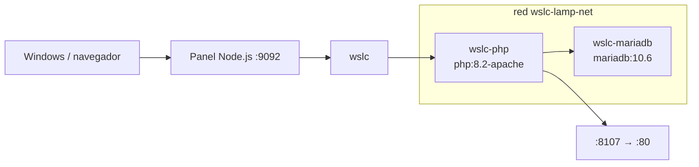

# 02 · LAMP (PHP + MariaDB) 🐘

Stack LAMP: PHP+Apache (`php:8.2-apache`) con MariaDB (`mariadb:10.6`) a través de una red `wslc`.

## 📋 Datos del caso

| Categoría | Valor |
|---|---|
| Categoría | `platform` |
| Imágenes | `wsl-labs/php-lamp:latest` (base `php:8.2-apache`) + `mariadb:10.6` |
| Puerto host | `8107` → contenedor PHP `80` |
| Red | `wslc-lamp-net` |
| Health | `GET /` → HTTP 200 (JSON con estado de la DB) |

## 🚀 Construir y levantar

```bash
wslc build -t wsl-labs/php-lamp:latest containers/02-php-lamp
wslc network create wslc-lamp-net
wslc run -d --name wslc-mariadb --network wslc-lamp-net -e MARIADB_ROOT_PASSWORD=wsl-labs -e MARIADB_DATABASE=app mariadb:10.6
wslc run -d --name wslc-php --network wslc-lamp-net -e DB_HOST=wslc-mariadb -p 8107:80 wsl-labs/php-lamp:latest
```

> [!TIP]
> MariaDB no publica puerto al host: PHP la alcanza por el nombre `wslc-mariadb` (variable `DB_HOST`) dentro de la red `wslc-lamp-net`.

## ✅ Verificar

```bash
curl http://localhost:8107
```

> [!NOTE]
> La app reporta la conexión a la DB en el campo `mariadb` (`"reachable"` cuando conecta), junto con `php` (versión) y `dbHost`.

## 🧭 Desde el panel

En [http://localhost:9092](http://localhost:9092) busca la tarjeta **02 · LAMP (PHP + MariaDB)** y usa los botones **Construir**, **Levantar**, **Bajar** y **Logs**.

## 🛑 Bajar

```bash
wslc stop wslc-php wslc-mariadb
wslc rm wslc-php wslc-mariadb
wslc network rm wslc-lamp-net
```

## 🎯 Equivale a docker-labs

Porta el caso `02-php-lamp` de docker-labs (stack LAMP PHP + MariaDB), ahora sobre el motor `wslc`.

## 🗺️ Esquema



---

Parte de [wsl-labs](../../README.md) · catálogo [containers.config.json](../containers.config.json)
