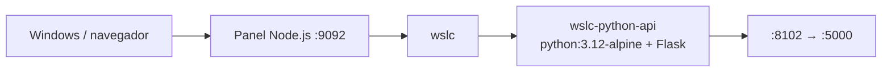

# 03 · API Python (Flask) 🐍

API REST en Flask sobre la imagen `python:3.12-alpine`, servida por `wslc`.

## 📋 Datos del caso

| Categoría | Valor |
|---|---|
| Categoría | `starter` |
| Imagen | `wsl-labs/python-api:latest` (base `python:3.12-alpine`) |
| Puerto host | `8102` → contenedor `5000` |
| Red | — (contenedor único) |
| Health | `GET /health` → `{"status":"ok"}` (HTTP 200) |

## 🚀 Construir y levantar

```bash
wslc build -t wsl-labs/python-api:latest containers/03-python-api
wslc run -d --name wslc-python-api -p 8102:5000 wsl-labs/python-api:latest
```

## ✅ Verificar

```bash
curl http://localhost:8102
curl http://localhost:8102/health
```

> [!NOTE]
> La raíz responde `{"project":"wsl-labs","case":"03-python-api","engine":"wslc","runtime":"container"}` con HTTP 200.

## 🧭 Desde el panel

En [http://localhost:9092](http://localhost:9092) busca la tarjeta **03 · API Python (Flask)** y usa los botones **Construir**, **Levantar**, **Bajar** y **Logs**.

## 🛑 Bajar

```bash
wslc stop wslc-python-api
wslc rm wslc-python-api
```

## 🎯 Equivale a docker-labs

Porta el caso `03-python-api` de docker-labs (API Flask), ahora sobre el motor `wslc`.

## 🗺️ Esquema



---

Parte de [wsl-labs](../../README.md) · catálogo [containers.config.json](../containers.config.json)
