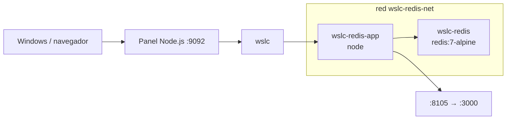

# 04 · Cache Redis + app 🔴

App Node que consulta un Redis (`redis:7-alpine`) a través de una red `wslc`, resolviendo el contenedor por nombre.

## 📋 Datos del caso

| Categoría | Valor |
|---|---|
| Categoría | `platform` |
| Imágenes | `wsl-labs/redis-app:latest` (base `node`) + `redis:7-alpine` |
| Puerto host | `8105` → contenedor app `3000` |
| Red | `wslc-redis-net` |
| Health | `GET /health` → `{"status":"ok"}` (HTTP 200 si Redis responde `PONG`) |

## 🚀 Construir y levantar

```bash
wslc build -t wsl-labs/redis-app:latest containers/04-redis-cache
wslc network create wslc-redis-net
wslc run -d --name wslc-redis --network wslc-redis-net redis:7-alpine
wslc run -d --name wslc-redis-app --network wslc-redis-net -e REDIS_HOST=wslc-redis -p 8105:3000 wsl-labs/redis-app:latest
```

> [!TIP]
> Redis no publica puerto al host: solo es accesible desde la red `wslc-redis-net`. La app lo alcanza por el nombre `wslc-redis` (variable `REDIS_HOST`).

## ✅ Verificar

```bash
curl http://localhost:8105
curl http://localhost:8105/health
```

> [!NOTE]
> La app reporta la conexión a Redis en el campo `redis` (`"PONG"` cuando hay conexión) y en `redisHost`. `/health` responde HTTP 200 solo si Redis contesta.

## 🧭 Desde el panel

En [http://localhost:9092](http://localhost:9092) busca la tarjeta **04 · Cache Redis + app** y usa los botones **Construir**, **Levantar**, **Bajar** y **Logs**.

## 🛑 Bajar

```bash
wslc stop wslc-redis-app wslc-redis
wslc rm wslc-redis-app wslc-redis
wslc network rm wslc-redis-net
```

## 🎯 Equivale a docker-labs

Porta el caso `04-redis-cache` de docker-labs (app + cache Redis en red propia), ahora sobre el motor `wslc`.

## 🗺️ Esquema



---

Parte de [wsl-labs](../../README.md) · catálogo [containers.config.json](../containers.config.json)
