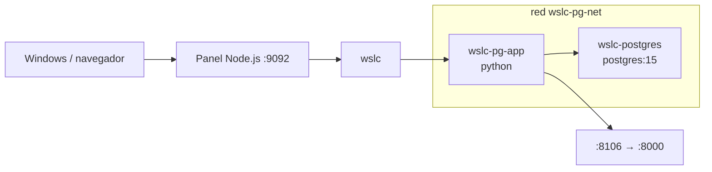

# 05 · API + PostgreSQL 🐘

API Python (`http.server` nativo) conectada a PostgreSQL (`postgres:15`) a través de una red `wslc`.

## 📋 Datos del caso

| Categoría | Valor |
|---|---|
| Categoría | `platform` |
| Imágenes | `wsl-labs/pg-app:latest` (base `python`) + `postgres:15` |
| Puerto host | `8106` → contenedor app `8000` |
| Red | `wslc-pg-net` |
| Health | `GET /health` → `{"status":"ok"}` (HTTP 200 si Postgres es alcanzable) |

## 🚀 Construir y levantar

```bash
wslc build -t wsl-labs/pg-app:latest containers/05-postgres-api
wslc network create wslc-pg-net
wslc run -d --name wslc-postgres --network wslc-pg-net -e POSTGRES_PASSWORD=wsl-labs -e POSTGRES_DB=app postgres:15
wslc run -d --name wslc-pg-app --network wslc-pg-net -e PG_HOST=wslc-postgres -p 8106:8000 wsl-labs/pg-app:latest
```

> [!TIP]
> PostgreSQL no publica puerto al host: la app lo alcanza por el nombre `wslc-postgres` (variable `PG_HOST`) dentro de la red `wslc-pg-net`.

## ✅ Verificar

```bash
curl http://localhost:8106
curl http://localhost:8106/health
```

> [!NOTE]
> La app reporta la conexión a la DB en el campo `postgres` (`"reachable"` cuando conecta) y en `pgHost`. `/health` responde HTTP 200 solo si Postgres es alcanzable.

## 🧭 Desde el panel

En [http://localhost:9092](http://localhost:9092) busca la tarjeta **05 · API + PostgreSQL** y usa los botones **Construir**, **Levantar**, **Bajar** y **Logs**.

## 🛑 Bajar

```bash
wslc stop wslc-pg-app wslc-postgres
wslc rm wslc-pg-app wslc-postgres
wslc network rm wslc-pg-net
```

## 🎯 Equivale a docker-labs

Porta el caso `05-postgres-api` de docker-labs (API + PostgreSQL en red propia), ahora sobre el motor `wslc`.

## 🗺️ Esquema



---

Parte de [wsl-labs](../../README.md) · catálogo [containers.config.json](../containers.config.json)
