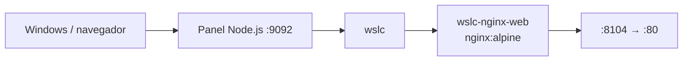

# 06 · Nginx web 🌐

Servidor web/estático con Nginx (imagen `nginx:alpine`) que sirve una página incluida en la imagen, servido por `wslc`.

## 📋 Datos del caso

| Categoría | Valor |
|---|---|
| Categoría | `starter` |
| Imagen | `wsl-labs/nginx-web:latest` (base `nginx:alpine`) |
| Puerto host | `8104` → contenedor `80` |
| Red | — (contenedor único) |
| Health | `GET /` → HTTP 200 (HTML) |

## 🚀 Construir y levantar

```bash
wslc build -t wsl-labs/nginx-web:latest containers/06-nginx-web
wslc run -d --name wslc-nginx-web -p 8104:80 wsl-labs/nginx-web:latest
```

## ✅ Verificar

```bash
curl http://localhost:8104
```

> [!NOTE]
> Devuelve la página estática con HTTP 200. También puedes abrir [http://localhost:8104](http://localhost:8104) en el navegador.

## 🧭 Desde el panel

En [http://localhost:9092](http://localhost:9092) busca la tarjeta **06 · Nginx web** y usa los botones **Construir**, **Levantar**, **Bajar** y **Logs**.

## 🛑 Bajar

```bash
wslc stop wslc-nginx-web
wslc rm wslc-nginx-web
```

## 🎯 Equivale a docker-labs

Porta el caso `06-nginx-web` de docker-labs (Nginx sirviendo contenido estático), ahora sobre el motor `wslc`.

## 🗺️ Esquema



---

Parte de [wsl-labs](../../README.md) · catálogo [containers.config.json](../containers.config.json)
