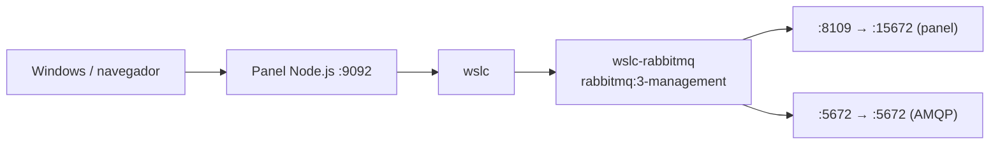

# 07 · RabbitMQ (mensajería) 🐰

Broker de mensajería RabbitMQ con panel de administración, usando la imagen pública `rabbitmq:3-management` (sin build).

## 📋 Datos del caso

| Categoría | Valor |
|---|---|
| Categoría | `infra` |
| Imagen | `rabbitmq:3-management` (pública, sin Dockerfile) |
| Puerto host | `8109` → panel `15672` · `5672` → AMQP `5672` |
| Red | — (contenedor único) |
| Health | `GET /` (panel) → HTTP 200 |

## 🚀 Construir y levantar

No requiere build: la imagen es pública.

```bash
wslc run -d --name wslc-rabbitmq -p 8109:15672 -p 5672:5672 rabbitmq:3-management
```

> [!TIP]
> El puerto `8109` expone el panel de administración; el `5672` expone el protocolo AMQP para productores/consumidores. Credenciales por defecto: `guest` / `guest`.

## ✅ Verificar

```bash
curl http://localhost:8109
```

> [!NOTE]
> El panel de administración responde con HTTP 200. Ábrelo en [http://localhost:8109](http://localhost:8109) e inicia sesión con `guest` / `guest`.

## 🧭 Desde el panel

En [http://localhost:9092](http://localhost:9092) busca la tarjeta **07 · RabbitMQ (mensajería)** y usa los botones **Levantar**, **Bajar** y **Logs** (no hay **Construir**: la imagen es pública).

## 🛑 Bajar

```bash
wslc stop wslc-rabbitmq
wslc rm wslc-rabbitmq
```

## 🎯 Equivale a docker-labs

Porta el caso `07-rabbitmq` de docker-labs (broker RabbitMQ con panel), ahora sobre el motor `wslc`.

## 🗺️ Esquema



---

Parte de [wsl-labs](../../README.md) · catálogo [containers.config.json](../containers.config.json)
