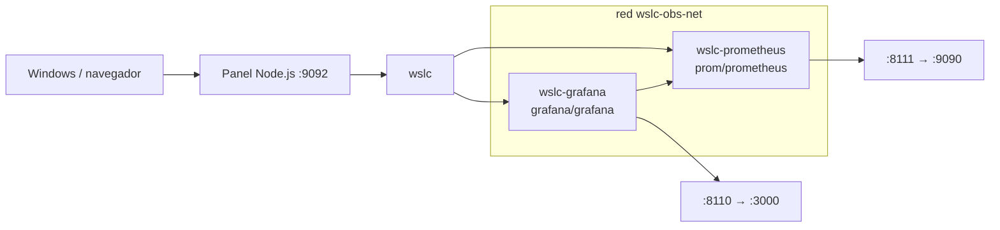

# 08 · Prometheus + Grafana 📊

Stack de observabilidad: Prometheus (recolección de métricas) + Grafana (visualización) conectados por una red `wslc`. Imágenes públicas, sin build.

## 📋 Datos del caso

| Categoría | Valor |
|---|---|
| Categoría | `infra` |
| Imágenes | `prom/prometheus` + `grafana/grafana` (públicas, sin Dockerfile) |
| Puerto host | `8110` → Grafana `3000` · `8111` → Prometheus `9090` |
| Red | `wslc-obs-net` |
| Health | Grafana `GET /` → HTTP 302 (redirección a login) |

## 🚀 Construir y levantar

No requiere build: las imágenes son públicas.

```bash
wslc network create wslc-obs-net
wslc run -d --name wslc-prometheus --network wslc-obs-net -p 8111:9090 prom/prometheus
wslc run -d --name wslc-grafana --network wslc-obs-net -p 8110:3000 grafana/grafana
```

> [!TIP]
> Ambos comparten la red `wslc-obs-net`, así Grafana puede usar `wslc-prometheus:9090` como origen de datos. Credenciales por defecto de Grafana: `admin` / `admin`.

## ✅ Verificar

```bash
curl http://localhost:8110
curl http://localhost:8111
```

> [!NOTE]
> Grafana responde HTTP 302 (redirige a `/login`) y Prometheus HTTP 200/302 en su UI. Abre [http://localhost:8110](http://localhost:8110) para Grafana y [http://localhost:8111](http://localhost:8111) para Prometheus.

## 🧭 Desde el panel

En [http://localhost:9092](http://localhost:9092) busca la tarjeta **08 · Prometheus + Grafana** y usa los botones **Levantar**, **Bajar** y **Logs** (no hay **Construir**: las imágenes son públicas).

## 🛑 Bajar

```bash
wslc stop wslc-grafana wslc-prometheus
wslc rm wslc-grafana wslc-prometheus
wslc network rm wslc-obs-net
```

## 🎯 Equivale a docker-labs

Porta el caso `08-prometheus-grafana` de docker-labs (observabilidad con Prometheus + Grafana), ahora sobre el motor `wslc`.

## 🗺️ Esquema



---

Parte de [wsl-labs](../../README.md) · catálogo [containers.config.json](../containers.config.json)
