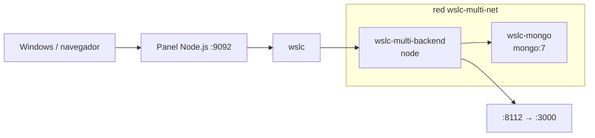

# 09 · App multi-servicio (Mongo) 🍃

Backend Node que comprueba MongoDB (`mongo:7`) a través de una red `wslc`, resolviendo el contenedor por nombre.

## 📋 Datos del caso

| Categoría | Valor |
|---|---|
| Categoría | `platform` |
| Imágenes | `wsl-labs/multi-backend:latest` (base `node`) + `mongo:7` |
| Puerto host | `8112` → contenedor backend `3000` |
| Red | `wslc-multi-net` |
| Health | `GET /health` → `{"status":"ok"}` (HTTP 200 si Mongo es alcanzable) |

## 🚀 Construir y levantar

```bash
wslc build -t wsl-labs/multi-backend:latest containers/09-multi-service
wslc network create wslc-multi-net
wslc run -d --name wslc-mongo --network wslc-multi-net mongo:7
wslc run -d --name wslc-multi-backend --network wslc-multi-net -e MONGO_HOST=wslc-mongo -p 8112:3000 wsl-labs/multi-backend:latest
```

> [!TIP]
> MongoDB no publica puerto al host: el backend la alcanza por el nombre `wslc-mongo` (variable `MONGO_HOST`) dentro de la red `wslc-multi-net`.

## ✅ Verificar

```bash
curl http://localhost:8112
curl http://localhost:8112/health
```

> [!NOTE]
> La app reporta la conexión a la DB en el campo `mongo` (`"reachable"` cuando conecta) y en `mongoHost`. `/health` responde HTTP 200 solo si Mongo es alcanzable.

## 🧭 Desde el panel

En [http://localhost:9092](http://localhost:9092) busca la tarjeta **09 · App multi-servicio (Mongo)** y usa los botones **Construir**, **Levantar**, **Bajar** y **Logs**.

## 🛑 Bajar

```bash
wslc stop wslc-multi-backend wslc-mongo
wslc rm wslc-multi-backend wslc-mongo
wslc network rm wslc-multi-net
```

## 🎯 Equivale a docker-labs

Porta el caso `09-multi-service` de docker-labs (backend Node + MongoDB en red propia), ahora sobre el motor `wslc`.

## 🗺️ Esquema



---

Parte de [wsl-labs](../../README.md) · catálogo [containers.config.json](../containers.config.json)
