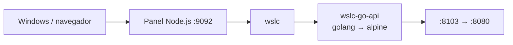

# 10 · API Go 🐹

API REST en Go con `net/http`, compilada en una imagen multi-stage (`golang` → `alpine`) y servida por `wslc`.

## 📋 Datos del caso

| Categoría | Valor |
|---|---|
| Categoría | `starter` |
| Imagen | `wsl-labs/go-api:latest` (multi-stage `golang` → `alpine`) |
| Puerto host | `8103` → contenedor `8080` |
| Red | — (contenedor único) |
| Health | `GET /health` → `{"status":"ok"}` (HTTP 200) |

## 🚀 Construir y levantar

```bash
wslc build -t wsl-labs/go-api:latest containers/10-go-api
wslc run -d --name wslc-go-api -p 8103:8080 wsl-labs/go-api:latest
```

> [!TIP]
> La imagen es multi-stage: compila el binario en `golang` y lo copia a una capa `alpine` mínima, así que el contenedor final es muy ligero.

## ✅ Verificar

```bash
curl http://localhost:8103
curl http://localhost:8103/health
```

> [!NOTE]
> La raíz responde `{"project":"wsl-labs","case":"10-go-api","engine":"wslc","runtime":"container"}` con HTTP 200.

## 🧭 Desde el panel

En [http://localhost:9092](http://localhost:9092) busca la tarjeta **10 · API Go** y usa los botones **Construir**, **Levantar**, **Bajar** y **Logs**.

## 🛑 Bajar

```bash
wslc stop wslc-go-api
wslc rm wslc-go-api
```

## 🎯 Equivale a docker-labs

Porta el caso `10-go-api` de docker-labs (API Go con build multi-stage), ahora sobre el motor `wslc`.

## 🗺️ Esquema



---

Parte de [wsl-labs](../../README.md) · catálogo [containers.config.json](../containers.config.json)
