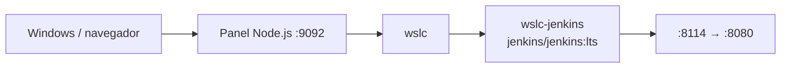

# 12 · Jenkins CI 🔧

Servidor de integración continua Jenkins LTS. Imagen pública, sin build.

## 📋 Datos del caso

| Categoría | Valor |
|---|---|
| Categoría | `infra` |
| Imagen | `jenkins/jenkins:lts` (pública, sin Dockerfile) |
| Puerto host | `8114` → contenedor `8080` |
| Red | — (contenedor único) |
| Health | `GET /` → HTTP 200/403 (UI de Jenkins) |

## 🚀 Construir y levantar

No requiere build: la imagen es pública.

```bash
wslc run -d --name wslc-jenkins -p 8114:8080 jenkins/jenkins:lts
```

> [!TIP]
> La contraseña inicial de administrador se genera al arrancar; recupérala de los logs del contenedor.

```bash
wslc logs wslc-jenkins
```

## ✅ Verificar

```bash
curl http://localhost:8114
```

> [!NOTE]
> La UI responde con HTTP 200 (o 403 mientras pide autenticación) con HTTP válido. Ábrela en [http://localhost:8114](http://localhost:8114) y completa el asistente inicial con la contraseña de los logs.

## 🧭 Desde el panel

En [http://localhost:9092](http://localhost:9092) busca la tarjeta **12 · Jenkins CI** y usa los botones **Levantar**, **Bajar** y **Logs** (no hay **Construir**: la imagen es pública).

## 🛑 Bajar

```bash
wslc stop wslc-jenkins
wslc rm wslc-jenkins
```

## 🎯 Equivale a docker-labs

Porta el caso `12-jenkins` de docker-labs (servidor Jenkins CI), ahora sobre el motor `wslc`.

## 🗺️ Esquema



---

Parte de [wsl-labs](../../README.md) · catálogo [containers.config.json](../containers.config.json)
