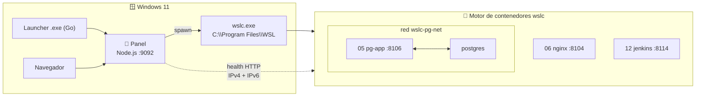
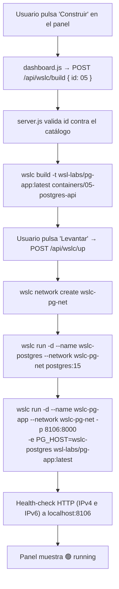

# 🏗️ Arquitectura — WSL Container Center

> **Versión**: v1
> **Estado**: 🟢 Activo
> **Audiencia**: 👥 Técnico, DevOps, administradores de sistemas
> **Objetivo**: Visión técnica del workspace y de cómo Windows controla contenedores `wslc`

---

## 📌 Objetivo de arquitectura

`wsl-labs` es un **panel para levantar y controlar contenedores** con `wslc`, el
motor de contenedores nativo de WSL (WSL 2.9+, tipo Docker). Es el equivalente de
[`docker-labs`](https://github.com/vladimiracunadev-create/docker-labs) pero usando
`wslc` como motor. La arquitectura busca tres cosas:

- 🕹️ operación local con un clic: **📦 Construir → ▶ Levantar → 🌐 Abrir**
- 🐳 contenedores reales (imágenes OCI, redes, multi-contenedor) accesibles desde `localhost`
- 🔗 una única fuente de verdad (`containers/containers.config.json`) que alimenta panel y launcher

## 📊 Estado arquitectónico

| Capa | Estado | Rol |
| --- | --- | --- |
| 🧭 Panel (`dashboard-server`) | 🟢 Operativo | Puente Windows → `wslc.exe` y diagnóstico |
| 🪟 Launcher Windows (Go) | 🟢 Operativo | Arranque del panel y apertura del navegador |
| 🐳 Motor `wslc` | 🟢 Operativo | Construye imágenes y ejecuta contenedores (con redes) |
| 📇 Catálogo (`containers.config.json`) | 🟢 Operativo | 12 casos verificados portados de docker-labs |
| 📦 Instalador (Inno Setup) | 🟢 Operativo | Distribución del launcher en Windows |

## 🧱 Capas del sistema

La frontera clave es el límite **Windows → motor de contenedores**. Todo lo que el
usuario ve (navegador, launcher, panel) corre en Windows; los contenedores corren en el
motor `wslc`. El panel cruza esa frontera **ejecutando `wslc.exe`** como proceso hijo.

> [!NOTE]
> Los casos **multi-contenedor** levantan sus contenedores sobre una **red wslc**
> dedicada, de forma que se resuelven entre sí por nombre (p. ej. `PG_HOST=wslc-postgres`).
> WSLC reexpone los puertos publicados en el `localhost` de Windows; el health-check y
> el acceso del usuario viajan por ese `localhost`.

## 🧠 Componentes principales

### 1. 🧭 Panel

| Atributo | Detalle |
| --- | --- |
| Componente | [`dashboard-server/server.js`](../dashboard-server/server.js) |
| Puerto | `9092` (solo `127.0.0.1`) |
| Tecnología | Node.js con módulo `http` nativo — **sin dependencias npm** |

**Responsabilidades:**

- Servir la UI estática (`index.html`, `dashboard.css`, `dashboard.js`)
- Exponer `GET /api/wslc/overview`
- Ejecutar acciones vía `POST /api/wslc/{build,up,down,logs}`
- Traducir cada acción a comandos `wslc` (`build`, `run`, `stop`, `rm`, `logs`, `network`)
- Localizar `wslc.exe` (env `WSL_LABS_WSLC` → `C:\Program Files\WSL\wslc.exe` → PATH)
- Sondear salud (HTTP, IPv4 + IPv6) y detectar imágenes construidas

---

### 2. 🪟 Launcher Windows

| Atributo | Detalle |
| --- | --- |
| Componente | [`launcher/windows/main.go`](../launcher/windows/main.go) |
| Tecnología | Go 1.21+ (stdlib puro, sin dependencias externas) |
| Salida | `wsl-labs-launcher.exe` |

**Responsabilidades:**

- Verificar que WSL 2 esté disponible
- Arrancar el panel en segundo plano
- Hacer polling a `/api/wslc/overview` hasta que responda
- Abrir el navegador en `http://localhost:9092`

---

### 3. 🐳 Motor de contenedores `wslc`

| Atributo | Detalle |
| --- | --- |
| Motor | `wslc` — motor de contenedores nativo de WSL (WSL 2.9+, preview) |
| Ejecutable | `C:\Program Files\WSL\wslc.exe` |
| Obtención | `wsl --update --pre-release` |

**Responsabilidades:**

- Construir imágenes custom desde `Dockerfile` (`wslc build`, contexto `containers/NN-*/`)
- Ejecutar contenedores publicando puertos en `localhost` (`wslc run -d -p …`)
- Crear redes para los casos multi-contenedor (`wslc network create`)
- Exponer logs consultables desde el panel (`wslc logs`)

---

### 4. 📇 Catálogo `containers/containers.config.json`

| Atributo | Detalle |
| --- | --- |
| Componente | [`containers/containers.config.json`](../containers/containers.config.json) |
| Rol | Fuente única de verdad del proyecto |

**Responsabilidades:**

- Definir cada caso: `id`, `name`, `title`, `category`, `port`, `url`, `healthProtocol`
- Declarar las imágenes a construir (`build[]`) con su `context`
- Declarar los contenedores (`containers[]`: `name`, `image`, `ports`, `env`) y la `network`
- Alimentar tanto al panel como al launcher

## 🗂️ Categorías del catálogo

| Categoría | Casos | Intención |
| --- | --- | --- |
| 🌱 `starter` | `01` node · `03` python · `06` nginx · `10` go | Un contenedor, imagen custom, arranque simple |
| 🧩 `platform` | `02` LAMP · `04` redis · `05` postgres · `09` mongo | App custom + dependencia sobre una red wslc |
| 🏗️ `infra` | `07` rabbitmq · `08` prometheus+grafana · `11` elasticsearch · `12` jenkins | Imágenes públicas de infraestructura |

## 🔄 Flujo de una acción (Construir / Levantar)

El corazón del sistema es cómo una pulsación en el navegador termina cambiando el
estado de un contenedor. Ejemplo: **📦 Construir → ▶ Levantar** el caso `05 API + PostgreSQL`.

> [!IMPORTANT]
> **Levantar es idempotente**: por cada contenedor, el panel hace `wslc stop` +
> `wslc rm` de un contenedor previo con el mismo nombre antes de recrearlo. Así no se
> duplican contenedores al pulsar **▶ Levantar** varias veces.

## 🩺 Modelo de health-check

Un contenedor puede publicar el puerto por IPv4 (`0.0.0.0`) o por IPv6 (`::`). Un check
que solo probara IPv4 marcaría "abajo" un caso que solo escucha por `::1`. Por eso los
checks prueban **ambas familias** (`127.0.0.1` y `::1`), igual que `curl localhost`.
Todos los casos usan `healthProtocol: http`.

| Estado | Significado |
| --- | --- |
| 🟢 `running` | Contenedor principal en `wslc list` y HTTP responde (`< 500`) |
| 🟡 `degraded` | Contenedor presente pero aún no responde (arrancando) |
| 🔴 `stopped` | Imagen lista, contenedor abajo |
| 📦 `missing` | Imagen custom sin construir |
| 🚫 `unavailable` | `wslc` no disponible |

## 🧩 Principios de diseño

| Principio | Descripción |
| --- | --- |
| Fuente única de verdad | Casos, imágenes, puertos y redes viven solo en `containers.config.json` |
| Cero dependencias | Panel en `http` nativo, launcher en stdlib de Go |
| Honestidad de estado | El panel distingue `missing` de `stopped` — no miente sobre lo construido |
| Idempotencia | Levantar recrea limpio; bajar conserva la imagen para relanzar rápido |
| Local only | Sin Kubernetes ni cloud: contenedores `wslc` en la máquina del usuario |

## 📚 Documentos relacionados

- [README](../README.md)
- [FILE_ARCHITECTURE.md](../FILE_ARCHITECTURE.md)
- [SYSTEM_SPECS.md](../SYSTEM_SPECS.md)
- [TECHNICAL_SPECS.md](TECHNICAL_SPECS.md)
- [Track de contenedores WSLC](wslc-contenedores.md)
- [Setup del panel](DASHBOARD_SETUP.md)
