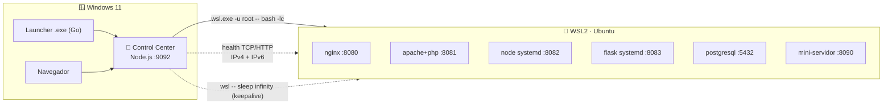
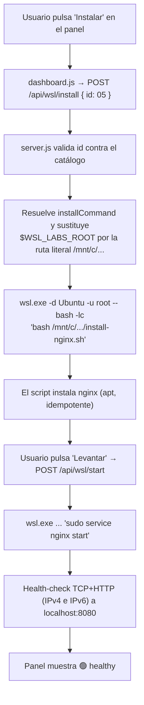

# 🏗️ Arquitectura — WSL Labs

> **Versión**: 0.1.2
> **Estado**: 🟢 Activo
> **Audiencia**: 👥 Técnico, DevOps, administradores de sistemas Linux
> **Objetivo**: Visión técnica del workspace y de cómo Windows controla servicios que viven dentro de WSL2

---

## 📌 Objetivo de arquitectura

`wsl-labs` convierte WSL2 en una **plataforma operable**: no una terminal Linux
suelta, sino un panel que arranca, detiene y vigila **servicios reales**
(nginx, apache, node, flask, postgresql) accesibles desde el `localhost` de
Windows. La arquitectura busca tres cosas:

- 🎓 aprendizaje práctico de Linux sobre WSL
- 🕹️ operación local con un clic, estilo Docker Desktop (sin contraseñas)
- 🔗 una única fuente de verdad (`labs.config.json`) que alimenta panel y launcher

## 📊 Estado arquitectónico

| Capa | Estado | Rol |
| --- | --- | --- |
| 🧭 Control Center (`dashboard-server`) | 🟢 Operativo | Puente Windows ↔ WSL2 y diagnóstico |
| 🪟 Launcher Windows (Go) | 🟢 Operativo | Arranque del stack y apertura del navegador |
| 🐧 Servicios en WSL2 (05–09, 11) | 🟢 Operativo | nginx, apache+php, node, flask, postgresql, mini-servidor |
| 📚 Labs de aprendizaje (01–04, 10, 12) | 🟢 Operativo | Guías sin servicio persistente |
| 📦 Instalador (Inno Setup) | 🟢 Operativo | Distribución del launcher en Windows |

## 🧱 Capas del sistema

La frontera clave es el límite **Windows ↔ WSL2**. Todo lo que el usuario ve
(navegador, launcher, panel) corre en Windows; los servicios corren dentro de la
distro Linux. El panel cruza esa frontera ejecutando
`wsl.exe -d Ubuntu -u root -- bash -lc "<comando>"`.

> [!NOTE]
> No hay red de contenedores ni orquestador: los servicios escuchan directamente
> en la distro y WSL2 reexpone esos puertos en el `localhost` de Windows. El
> health-check y el acceso del usuario viajan por ese `localhost`.

## 🧠 Componentes principales

### 1. 🧭 Control Center

| Atributo | Detalle |
| --- | --- |
| Componente | [`dashboard-server/server.js`](../dashboard-server/server.js) |
| Puerto | `9092` (solo `127.0.0.1`) |
| Tecnología | Node.js con módulo `http` nativo — **sin dependencias npm** |

**Responsabilidades:**

- Servir la UI estática (`index.html`, `dashboard.css`, `dashboard.js`)
- Exponer `GET /api/overview` y `GET /api/health/:id`
- Ejecutar acciones sobre WSL vía `POST /api/wsl/{start,stop,logs,install}`
- Traducir cada acción a `wsl.exe -d <distro> -u root -- bash -lc "<comando>"`
- Sondear salud (TCP/HTTP, IPv4 + IPv6) y detectar binarios instalados
- Mantener viva la distro mientras corre (keepalive con `sleep infinity`)

---

### 2. 🪟 Launcher Windows

| Atributo | Detalle |
| --- | --- |
| Componente | [`launcher/windows/main.go`](../launcher/windows/main.go) |
| Tecnología | Go 1.21+ (stdlib puro, sin dependencias externas) |
| Salida | `wsl-labs-launcher.exe` |

**Responsabilidades:**

- Verificar que WSL2 esté disponible y detectar la distro
- Arrancar el Control Center en segundo plano
- Hacer polling a `/api/overview` hasta que responda
- Abrir el navegador en `http://localhost:9092`

---

### 3. 🐧 Servicios WSL2

| Atributo | Detalle |
| --- | --- |
| Ubicación | Dentro de la distro Ubuntu |
| Instalación | Scripts idempotentes `scripts/install-*.sh` |
| Modelo | Servicios del sistema (nginx/apache/postgresql) + unidades systemd propias (node/flask) |

**Responsabilidades:**

- Publicar servicios reales en `localhost` (8080, 8081, 8082, 8083, 5432, 8090)
- Persistir tras reinicios de la instancia (systemd `enabled`)
- Escribir logs consultables desde el panel (`journalctl` / `/var/log/...`)

---

### 4. 📇 Catálogo `labs.config.json`

| Atributo | Detalle |
| --- | --- |
| Componente | [`labs.config.json`](../labs.config.json) |
| Rol | Fuente única de verdad del proyecto |

**Responsabilidades:**

- Definir puertos, URLs, `requires`, y comandos `install/start/stop/logs`
- Declarar `healthProtocol` (`http` / `tcp` / `null`) por lab
- Alimentar tanto al Control Center como al launcher

## 🗂️ Taxonomía del repositorio

| Tipo | Labs | Intención |
| --- | --- | --- |
| ⚙️ `service` | `05`, `06`, `07`, `08`, `09`, `11` | Servicios reales operables desde el panel |
| 📚 `learning` | `01`, `02`, `03`, `04`, `10`, `12` | Guías de aprendizaje sin servicio persistente |

## 🔄 Flujo de una acción (Instalar / Levantar)

El corazón del sistema es cómo una pulsación en el navegador termina cambiando
el estado de un servicio Linux. Ejemplo: **📦 Instalar → ▶ Levantar** nginx.

> [!IMPORTANT]
> Las variables de shell asignadas dentro de `wsl.exe -- bash -lc` **no se
> expanden de forma fiable**. Por eso el servidor **sustituye `$WSL_LABS_ROOT`
> por la ruta literal** (`/mnt/c/...`) antes de enviar el comando, en vez de
> confiar en la expansión del shell.

## 🔐 Modelo de ejecución privilegiada

| Aspecto | Implementación |
| --- | --- |
| Usuario | Los comandos corren como `root` (`wsl.exe -u root`), estilo Docker privilegiado |
| Sin contraseña | Windows ya autenticó al usuario → no hay `sudo` interactivo que cuelgue el panel |
| Passwordless sudo | Opcional, solo para uso por terminal; no lo necesita el panel |

## 💓 Keepalive de la instancia

WSL2 apaga la distro tras unos segundos de inactividad, lo que tumbaría los
servicios. Mientras el Control Center corre, mantiene una sesión abierta
(`wsl -- sleep infinity`) para que la instancia siga viva y los puertos sigan
accesibles desde `localhost` — igual que Docker Desktop mantiene su VM.

## 🩺 Modelo de health-check

Los servicios en WSL pueden bindear IPv4 (`0.0.0.0`) o IPv6 (`::`). Un check que
solo pruebe IPv4 marcaría "detenido" un servicio que solo escucha por `::1`. Por
eso los checks prueban **ambas familias** (`127.0.0.1` y `::1`), igual que
`curl localhost`.

| Estado | Significado |
| --- | --- |
| 🟢 `healthy` | Puerto abierto (y HTTP < 500 si `healthProtocol: http`) |
| 🔴 `stopped` | Puerto cerrado / sin respuesta |
| 🟡 `degraded` | Puerto abierto pero HTTP responde error |
| ⚪ `missing` | Servicio no instalado y parado |

## 🧩 Principios de diseño

| Principio | Descripción |
| --- | --- |
| Fuente única de verdad | Puertos y comandos viven solo en `labs.config.json` |
| Cero dependencias | Panel en `http` nativo, launcher en stdlib de Go |
| Honestidad de estado | El panel distingue `missing` de `stopped` — no miente sobre lo instalado |
| Operación estilo Docker | Root privilegiado + keepalive → un clic, sin contraseñas ni terminal |
| Local only | Sin Kubernetes ni cloud: todo vive en la máquina del usuario |

## 📚 Documentos relacionados

- [README](../README.md)
- [FILE_ARCHITECTURE.md](../FILE_ARCHITECTURE.md)
- [SYSTEM_SPECS.md](../SYSTEM_SPECS.md)
- [TECHNICAL_SPECS.md](TECHNICAL_SPECS.md)
- [LABS_CATALOG.md](LABS_CATALOG.md)
