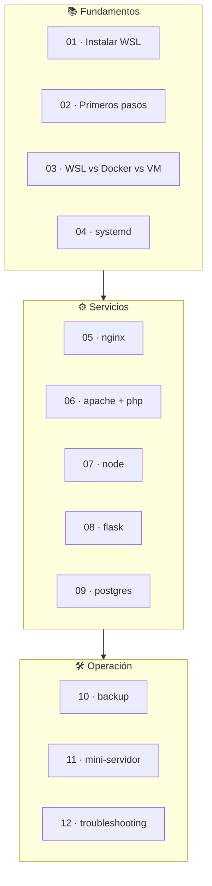

# 🎓 Guía para principiantes — wsl-labs

> **Versión**: v1 · Guía pensada para quien empieza con **WSL**, Linux dentro de
> Windows y este repositorio.

## 🗺️ Esquema



## 🧭 Si solo lees una cosa

Empieza así:

1. Instala WSL2 + Ubuntu (`wsl --install`) y reinicia si es la primera vez.
2. Arranca el Control Center: `make serve` (o `node dashboard-server/server.js`).
3. Abre el panel en **<http://localhost:9092>**.
4. Elige un servicio → **📦 Instalar → ▶ Levantar**.
5. Pulsa **🌐 Abrir** para verlo en el navegador.
6. Cuando termines, **⏹ Detener**.

Documentos relacionados:

- [Instalación completa](INSTALL.md)
- [Manual de usuario](USER_MANUAL.md)
- [Requisitos](REQUIREMENTS.md)

---

## 🐧 ¿Qué es WSL?

**WSL** (Windows Subsystem for Linux) es una capa de Windows que te deja correr
un Linux real (Ubuntu, Debian…) **dentro de Windows**, sin máquina virtual
pesada ni arranque dual. En su versión **WSL2** usa un kernel Linux real con
virtualización ligera.

Lo importante para este repo: WSL no es solo una terminal. Puedes levantar
**servicios reales** (nginx, apache, PostgreSQL, apps Node/Python) y accederlos
desde el `localhost` de Windows, como si fueran nativos.

> [!NOTE]
> `wsl-labs` es **local**: no hay contenedores, ni Kubernetes, ni nube. Todo vive
> en tu Windows + WSL2. Para entender las diferencias con contenedores y VMs, lee
> [WSL vs Docker vs VM](03-wsl-vs-docker-vs-vm.md).

---

## 🧱 Qué es este repositorio

`wsl-labs` convierte WSL en una plataforma **operable con un panel web**. Tiene
tres piezas:

| Pieza | Rol |
| --- | --- |
| 🧭 **Control Center** (Node.js, `:9092`) | Instala, arranca, detiene y monitorea servicios en WSL |
| 🪟 **Launcher Windows** (`.exe`) | Verifica WSL2, arranca el panel y abre el navegador |
| 🐧 **12 labs** (`labs/NN-*`) | Guías paso a paso de instalación, systemd, nginx, apache, node, python, postgres, backup… |

Y hay **12 labs** de dos tipos:

- ⚙️ **service** — publican un servicio real en un puerto (05, 06, 07, 08, 09, 11).
- 📚 **learning** — enseñan un concepto, sin servicio (01, 02, 03, 04, 10, 12).

---

## 🧠 Panel vs servicio

Esta es la confusión más común al inicio:

| Concepto | Qué significa |
| --- | --- |
| **Panel (`:9092`)** | La capa que instala/arranca/detiene servicios en WSL |
| **Servicio** | La app o servidor real (nginx, flask…) que corre dentro de WSL |

Ejemplo:

- `05-servidor-web-nginx` puede estar **healthy** en el panel.
- El sitio real lo abres en **<http://localhost:8080>**.

Por eso el panel separa el **estado** (¿está corriendo y sano?) del botón
**Abrir** (entrar al servicio real).

---

## 🚀 Primer flujo recomendado

### Paso 1 — Verifica los prerrequisitos

```powershell
wsl --status        # WSL en modo 2 por defecto
wsl -l -v           # tu distro (Ubuntu) con VERSION 2
node --version      # Node 18+ en Windows (para el panel)
```

Necesitas como mínimo:

- Windows 10 (2004+) o Windows 11 con **WSL2**
- Una distro Ubuntu/Debian
- **Node.js 18+** en **Windows** (no dentro de WSL)

### Paso 2 — Prepara la distro (una vez)

```powershell
wsl bash scripts/install-base.sh
```

### Paso 3 — Levanta el panel

```powershell
make serve
# o:
node dashboard-server/server.js
```

### Paso 4 — Entra al panel

Abre **<http://localhost:9092>**.

### Paso 5 — Elige un servicio simple

| Lab | Ideal para aprender |
| --- | --- |
| `05-servidor-web-nginx` | Servidor web básico y puertos en localhost |
| `07-nodejs-entorno-dev` | App Node.js como servicio systemd |
| `08-python-entorno-dev` | App Flask en un venv como servicio systemd |

Pulsa **📦 Instalar → ▶ Levantar** y luego **🌐 Abrir**.

### Paso 6 — Observa estas piezas

Cada vez que levantes un servicio, intenta responder:

- qué puerto publica
- si es un servicio `service` o una unidad `systemd`
- cómo se ve su salud en el panel (`healthy` / `stopped`…)
- dónde están sus logs
- cuál es su URL real en `localhost`

---

## 📚 Ruta de aprendizaje (labs 01 → 12)

El catálogo está numerado para seguirse en orden. Empieza por los learning y
ve sumando servicios.

### 🟢 Nivel 1 — Fundamentos de WSL

| Lab | Qué aprendes |
| --- | --- |
| `01-instalacion-ubuntu` | Instalar y configurar WSL2 + Ubuntu desde cero |
| `02-comandos-base-wsl` | Comandos de `wsl.exe` y del shell Linux |
| `03-sistema-de-archivos` | Interoperar archivos Windows ↔ WSL y rendimiento |

### 🟡 Nivel 2 — Servicios y systemd

| Lab | Qué aprendes |
| --- | --- |
| `04-systemd-servicios` | Habilitar systemd y administrar servicios en WSL |
| `05-servidor-web-nginx` | Servir web con nginx en `:8080` |
| `06-servidor-apache-php` | Apache + PHP en `:8081` |

### 🔴 Nivel 3 — Apps y datos

| Lab | Qué aprendes |
| --- | --- |
| `07-nodejs-entorno-dev` | API Node.js (http nativo, sin express) en `:8082` |
| `08-python-entorno-dev` | App Flask en un venv en `:8083` |
| `09-postgresql-en-wsl` | Base de datos PostgreSQL en `:5432` |

### 🏁 Nivel 4 — Integración y operación

| Lab | Qué aprendes |
| --- | --- |
| `10-backup-export-import` | Exportar, importar y clonar distros WSL |
| `11-mini-servidor-completo` | Stack combinado (web + db) en `:8090` |
| `12-troubleshooting` | Diagnóstico y resolución de problemas |

---

## 💻 Recomendación de hardware

| Perfil | CPU | RAM | Disco | Uso recomendado |
| --- | ---: | ---: | ---: | --- |
| Básico | 2 núcleos | 8 GB | 15 GB | Panel + 1 servicio |
| Cómodo | 4 núcleos | 16 GB | 20 GB SSD | Panel + varios servicios |
| Avanzado | 4+ núcleos | 16 GB+ | 30 GB SSD | Mini-servidor + todo el stack |

> [!TIP]
> WSL2 usa memoria dinámica: crece según lo que corras dentro. Con 8 GB puedes
> operar el panel y un par de servicios sin problema.

---

## ⚠️ Errores comunes

### El panel abre, pero el servicio no

Posibles causas:

- el servicio no está instalado (**📦 Instalar** primero)
- el servicio no está levantado (**▶ Levantar**)
- el puerto está ocupado por otra app en Windows

### Levanté un servicio y luego "desapareció"

WSL puede apagarse sola por inactividad. El **keepalive** del panel lo evita
mientras el Control Center corre. Si cerraste el panel, vuelve a abrirlo: los
servicios systemd (`node`, `flask`) rearrancan solos en el siguiente boot.

### El panel dice "No instalado" aunque instalé por terminal

Refresca el panel. La detección **cachea positivos**; si aun así falla, revisa
la [Guía de resolución de problemas](TROUBLESHOOTING.md).

---

## ✅ Objetivo de esta guía

Que puedas pasar de:

- "WSL es solo una terminal Linux"

a:

- "sé instalar, levantar y abrir servicios reales en localhost, y entiendo
  cuándo usar cada lab".

---

## 🔗 Documentos relacionados

- [¿Qué es WSL?](00-que-es-wsl.md)
- [WSL vs Docker vs VM](03-wsl-vs-docker-vs-vm.md)
- [Manual de usuario](USER_MANUAL.md)
- [Setup del Control Center](DASHBOARD_SETUP.md)
- [Resolución de problemas](TROUBLESHOOTING.md)
