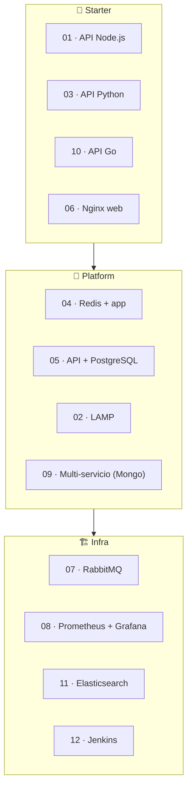

# 🎓 Guía para principiantes — WSL Container Center

> **Versión**: v1 · Guía pensada para quien empieza con **contenedores**, `wslc` y
> este repositorio.

## 🗺️ Esquema



## 🧭 Si solo lees una cosa

Empieza así:

1. Instala WSL 2 (`wsl --install`) y habilita el motor de contenedores:
   `wsl --update --pre-release`.
2. Instala Node.js 18+ en **Windows** y arranca el panel: `make serve`
   (o `node dashboard-server/server.js`).
3. Abre el panel en **<http://localhost:9092>**.
4. Elige un caso starter → **📦 Construir → ▶ Levantar**.
5. Pulsa **🌐 Abrir** para verlo en el navegador.
6. Cuando termines, **⏹ Bajar**.

Documentos relacionados:

- [Instalación completa](INSTALL.md)
- [Manual de usuario](USER_MANUAL.md)
- [Requisitos](REQUIREMENTS.md)

---

## 🐳 ¿Qué es un contenedor?

Un **contenedor** es una unidad ligera y aislada que empaqueta una app con todo lo que
necesita para correr (código, runtime, librerías), a partir de una **imagen**. Se crea,
se ejecuta y se descarta sin "ensuciar" el sistema anfitrión — a diferencia de instalar
un programa directamente en el sistema operativo.

Piensa en dos piezas:

- **Imagen** — la plantilla inmutable (p. ej. `nginx:alpine`, o una custom construida
  desde un `Dockerfile`).
- **Contenedor** — una instancia en ejecución de esa imagen, con sus puertos publicados.

---

## 🐳 ¿Qué es `wslc`?

**WSLC** es el **motor de contenedores nativo de WSL** que Microsoft añadió a partir de
WSL **2.9+** (en preview). Se maneja con el comando `wslc` (ejecutable en
`C:\Program Files\WSL\wslc.exe`) y su interfaz es casi idéntica a la de Docker:
`wslc build / run / images / list / logs / stop / rm / network`.

> [!NOTE]
> `wsl-labs` es como [`docker-labs`](https://github.com/vladimiracunadev-create/docker-labs),
> pero el motor es **`wslc`** en vez de Docker. Es **local**: no hay Kubernetes ni nube;
> todo vive en tu Windows + WSL 2. Para la referencia completa del motor, lee el
> [Track de contenedores WSLC](wslc-contenedores.md).

Para obtener `wslc`:

```powershell
wsl --update --pre-release
& "C:\Program Files\WSL\wslc.exe" version
```

---

## 🧱 Qué es este repositorio

`wsl-labs` es un **panel para levantar y controlar contenedores** con `wslc`. Tiene
tres piezas:

| Pieza | Rol |
| --- | --- |
| 🧭 **Panel** (Node.js, `:9092`) | Construye imágenes, levanta/baja contenedores y muestra su estado |
| 🪟 **Launcher Windows** (`.exe`) | Verifica WSL 2, arranca el panel y abre el navegador |
| 🐳 **12 casos** (`containers/NN-*`) | Casos portados de docker-labs, ejecutados con `wslc` |

Los 12 casos se agrupan en tres categorías:

- 🌱 **starter** — un contenedor, imagen custom, arranque simple (`01`, `03`, `06`, `10`).
- 🧩 **platform** — app custom + dependencia sobre una red wslc (`02`, `04`, `05`, `09`).
- 🏗️ **infra** — imágenes públicas de infraestructura (`07`, `08`, `11`, `12`).

---

## 🧠 Panel vs contenedor

Esta es la confusión más común al inicio:

| Concepto | Qué significa |
| --- | --- |
| **Panel (`:9092`)** | La capa que construye/levanta/baja contenedores con `wslc` |
| **Contenedor** | La app real (nginx, la API, redis…) que corre en el motor `wslc` |

Ejemplo:

- `06 Nginx web` puede aparecer **running** en el panel.
- El sitio real lo abres en **<http://localhost:8104>**.

Por eso el panel separa el **estado** (¿está corriendo y sano?) del botón **Abrir**
(entrar al contenedor real).

---

## 🚀 Primer flujo recomendado

### Paso 1 — Verifica los prerrequisitos

```powershell
wsl --status                                     # WSL en modo 2
node --version                                   # Node 18+ en Windows (para el panel)
& "C:\Program Files\WSL\wslc.exe" version        # motor wslc disponible
```

Necesitas como mínimo:

- Windows 10 (2004+) o Windows 11 con **WSL 2.9+** y `wslc`
- **Node.js 18+** en **Windows** (no dentro de WSL)

### Paso 2 — Levanta el panel

```powershell
make serve
# o:
node dashboard-server/server.js
```

### Paso 3 — Entra al panel

Abre **<http://localhost:9092>**.

### Paso 4 — Elige un caso simple

| Caso | Ideal para aprender |
| --- | --- |
| `01 API Node.js` | Construir una imagen custom y publicar un puerto |
| `06 Nginx web` | Servir contenido estático desde un contenedor |
| `10 API Go` | Imagen compilada multi-stage |

Pulsa **📦 Construir → ▶ Levantar** y luego **🌐 Abrir**.

### Paso 5 — Observa estas piezas

Cada vez que levantes un caso, intenta responder:

- si usa **imagen custom** (hay que construir) o **pública** (va directo a levantar)
- qué puerto publica
- si es **un solo contenedor** o **varios sobre una red wslc**
- cómo se ve su estado en el panel (`running` / `stopped` / `degraded`…)
- cuál es su URL real en `localhost`

---

## 📚 Ruta de aprendizaje (starter → platform → infra)

El catálogo está pensado para subir de dificultad. Empieza por los starter y ve
sumando complejidad.

### 🌱 Nivel 1 — Starter (un contenedor)

| Caso | Qué aprendes |
| --- | --- |
| `01 API Node.js` | Construir imagen custom (`node:20-alpine`) y publicar `:8101` |
| `03 API Python` | API Flask en contenedor (`python:3.12-alpine`) en `:8102` |
| `10 API Go` | Imagen multi-stage compilada en `:8103` |
| `06 Nginx web` | Servir estáticos con `nginx:alpine` en `:8104` |

### 🧩 Nivel 2 — Platform (multi-contenedor + red)

| Caso | Qué aprendes |
| --- | --- |
| `04 Redis + app` | App Node que habla con `redis:7-alpine` por una red wslc (`:8105`) |
| `05 API + PostgreSQL` | API Python conectada a `postgres:15` por red (`:8106`) |
| `02 LAMP` | PHP + Apache con `mariadb:10.6` por red (`:8107`) |
| `09 Multi-servicio` | Backend Node + `mongo:7` por red (`:8112`) |

### 🏗️ Nivel 3 — Infra (imágenes públicas)

| Caso | Qué aprendes |
| --- | --- |
| `07 RabbitMQ` | Broker de mensajería con panel de administración (`:8109`) |
| `08 Prometheus + Grafana` | Observabilidad: métricas + dashboards por red (`:8110`/`:8111`) |
| `11 Elasticsearch` | Motor de búsqueda de nodo único (`:8113`) |
| `12 Jenkins CI` | Servidor de integración continua (`:8114`) |

---

## 💻 Recomendación de hardware

| Perfil | CPU | RAM | Disco | Uso recomendado |
| --- | ---: | ---: | ---: | --- |
| Básico | 2 núcleos | 8 GB | 15 GB | Panel + 1 caso starter |
| Cómodo | 4 núcleos | 16 GB | 25 GB SSD | Panel + varios casos platform |
| Avanzado | 4+ núcleos | 16 GB+ | 30 GB SSD | Casos infra (Elasticsearch, Jenkins) |

> [!TIP]
> Los casos **infra** (`11` Elasticsearch, `12` Jenkins) consumen bastante RAM y tardan
> más en arrancar. Con 8 GB, quédate en starter/platform.

---

## ⚠️ Errores comunes

### El panel abre, pero el caso no

Posibles causas:

- la imagen custom no está construida (**📦 Construir** primero)
- el contenedor no está levantado (**▶ Levantar**)
- el puerto está ocupado por otra app en Windows

### El panel dice "unavailable"

`wslc` no está disponible. Actualiza WSL con `wsl --update --pre-release`, reinicia con
`wsl --shutdown` y comprueba `& "C:\Program Files\WSL\wslc.exe" version`.

### Un caso queda "degraded" un rato

El contenedor arrancó pero su proceso interno aún no responde. Refresca el panel;
pasará a **running**. Los casos infra (Elasticsearch, Jenkins) tardan más. Si persiste,
revisa la [Guía de resolución de problemas](TROUBLESHOOTING.md).

---

## ✅ Objetivo de esta guía

Que puedas pasar de:

- "no sé qué es un contenedor ni qué es `wslc`"

a:

- "sé construir imágenes, levantar y abrir contenedores reales en localhost con `wslc`,
  y entiendo la diferencia entre starter, platform e infra".

---

## 🔗 Documentos relacionados

- [¿Qué es WSL?](00-que-es-wsl.md)
- [WSL vs Docker vs VM](03-wsl-vs-docker-vs-vm.md)
- [Track de contenedores WSLC](wslc-contenedores.md)
- [Manual de usuario](USER_MANUAL.md)
- [Setup del panel](DASHBOARD_SETUP.md)
- [Resolución de problemas](TROUBLESHOOTING.md)
