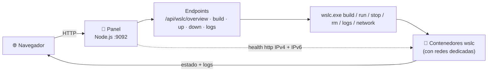
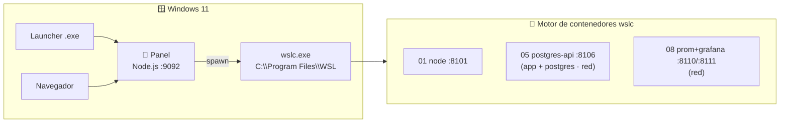

# 🖥️ Setup del panel — WSL Container Center

> **Versión**: v1 · **Estado**: 🟢 Activo
> **Objetivo**: Explicar cómo arranca y opera el panel en `:9092` — arquitectura,
> endpoints `wslc`, localización de `wslc.exe`, health IPv4/IPv6 y token.

---

## 🧩 Rol del componente

El panel en **`http://localhost:9092`** existe para:

- mostrar el estado real de los 12 casos del catálogo
- **construir** imágenes custom con un clic (`wslc build`)
- **levantar / bajar** contenedores y leer sus **logs**
- diagnosticar la salud (`http`) de cada caso en `localhost`
- guiar al usuario hacia la URL correcta de cada caso

> [!NOTE]
> Es un servidor **Node.js con el módulo `http` nativo**: **sin dependencias npm**.
> No necesitas `npm install` para arrancarlo.

### 🗺️ Esquema



---

## 🏗️ Arquitectura



El panel es el **puente Windows ↔ motor de contenedores**: traduce cada acción de
la UI a un comando `wslc` tomado del catálogo
[`containers/containers.config.json`](../containers/containers.config.json), la
**fuente única de verdad**.

Piezas del panel:

- `dashboard-server/server.js` — servidor HTTP nativo (`:9092`) que localiza y ejecuta `wslc.exe`
- `index.html` · `dashboard.css` · `dashboard.js` — UI estática servida por el propio servidor
- `containers/containers.config.json` — catálogo (casos, imágenes, puertos, redes, health)

---

## ⚡ Cómo arrancarlo

### Opción A — `make serve`

```powershell
cd C:\dev\wsl-labs
make serve
```

### Opción B — Node directo

```powershell
node dashboard-server/server.js
```

### Opción C — Launcher Windows

El `wsl-labs-launcher.exe` verifica WSL 2, arranca el panel en segundo plano, hace
polling a `/api/wslc/overview` y abre el navegador. Ver el flujo completo en el
[RUNBOOK](../RUNBOOK.md).

Abre → **<http://localhost:9092>**.

> [!NOTE]
> El servidor escucha **solo en `127.0.0.1`**. No se expone a la red por diseño
> (ver [SECURITY.md](../SECURITY.md)).

---

## 🔌 Endpoints

| Método | Ruta | Qué hace |
| --- | --- | --- |
| `GET` | `/api/wslc/overview` | Disponibilidad del motor + estado de los 12 casos |
| `POST` | `/api/wslc/build` | `wslc build -t <imagen> <contexto>` por cada imagen del caso |
| `POST` | `/api/wslc/up` | Crea la red (si aplica) y hace `wslc run -d` de cada contenedor |
| `POST` | `/api/wslc/down` | `wslc stop` + `wslc rm` de cada contenedor (+ `network rm`) |
| `POST` | `/api/wslc/logs` | `wslc logs` del contenedor principal del caso |

Los `POST` reciben un body JSON con el `id` del caso, p. ej. `{ "id": "01" }`. El
servidor también sirve la UI estática (`/`, `/index.html`, `/dashboard.css`,
`/dashboard.js`). Ver ejemplos con `Invoke-RestMethod` en el
[Manual de usuario](USER_MANUAL.md#-la-api-rest-ejemplos-powershell).

---

## 📍 Localización de `wslc.exe`

El panel corre en Windows y ejecuta `wslc.exe` como proceso hijo. Para encontrarlo,
resuelve la ruta en este orden y **cachea** el primer resultado:

1. La variable de entorno `WSL_LABS_WSLC`, si está definida.
2. La ruta estándar `C:\Program Files\WSL\wslc.exe`.
3. Como último recurso, `wslc.exe` en el `PATH`.

```powershell
# Forzar una ruta alternativa de wslc.exe antes de arrancar el panel
$env:WSL_LABS_WSLC = 'D:\WSL\wslc.exe'
make serve
```

> [!IMPORTANT]
> `wslc` es el motor de contenedores nativo de WSL (WSL **2.9+**, en preview). Si el
> panel no lo encuentra, `overview` responde `available: false` con la pista
> `wsl --update --pre-release`. Ver [Instalación](INSTALL.md) y
> [Track de contenedores WSLC](wslc-contenedores.md).

---

## 🩺 Overview y estado por caso

`GET /api/wslc/overview` primero comprueba el motor con `wslc version`; si responde,
lee `wslc images` y `wslc list` **una sola vez** y con eso deriva el estado de cada caso:

- **`missing`** — el caso declara imágenes custom (`build`) y **no** están construidas.
- **`stopped`** — imagen lista, pero el contenedor principal no aparece en `wslc list`.
- **`running`** — el contenedor principal está en la lista **y** responde el health-check.
- **`degraded`** — el contenedor está pero aún no responde (arrancando).
- **`unavailable`** — `wslc` no está disponible.

### Health-check IPv4 + IPv6

Un contenedor puede publicar el puerto por IPv4 (`0.0.0.0`) o por IPv6 (`::`). Un
check que solo probara IPv4 marcaría "abajo" a un caso que escucha por `::1`. Por eso
los checks prueban **ambas familias** (`127.0.0.1` y `::1`), igual que `curl localhost`.
Todos los casos del catálogo usan `healthProtocol: http` (GET `/`, sano si el status
es `< 500`).

---

## 🔐 Seguridad y token

El servidor aplica por defecto:

- Escucha **solo en `127.0.0.1`** (nunca en la red).
- **Rate-limit nativo** (30 POST / IP / 60 s) en las rutas `/api`.
- **Body limit** de 8 KB en las peticiones POST.
- **Token opcional** `WSL_LABS_TOKEN`.

Para activar autenticación por token, defínelo **antes** de arrancar el panel:

```powershell
$env:WSL_LABS_TOKEN = 'tu-token-secreto'
make serve
```

Con el token activo, cada llamada `/api` requiere el header
`Authorization: Bearer tu-token-secreto`.

Ver [SECURITY.md](../SECURITY.md) para el detalle completo del modelo de seguridad.

---

## 📝 Notas operativas

- El panel usa `wslc` como prerrequisito: si el motor no está, la UI lo indica.
- El launcher Windows usa el **mismo** catálogo `containers/containers.config.json`.
- Los puertos deben ser **estables** (ver [RUNBOOK](../RUNBOOK.md)).
- `WSL_LABS_ROOT_WIN` permite fijar la raíz del repo en Windows (default: la carpeta
  padre del servidor).

---

## 🔗 Documentos relacionados

- [Instalación completa](INSTALL.md)
- [Manual de usuario](USER_MANUAL.md)
- [Requisitos](REQUIREMENTS.md)
- [Especificaciones técnicas](TECHNICAL_SPECS.md)
- [Track de contenedores WSLC](wslc-contenedores.md)
- [Resolución de problemas](TROUBLESHOOTING.md)
- [RUNBOOK operativo](../RUNBOOK.md)
- [SECURITY.md](../SECURITY.md)
