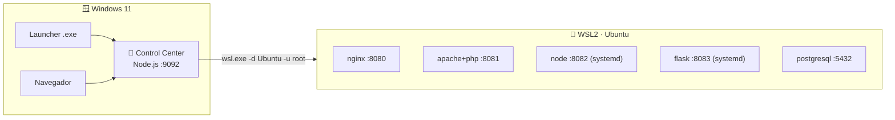

# 🖥️ Setup del Control Center — wsl-labs

> **Versión**: v1 · **Estado**: 🟢 Activo
> **Objetivo**: Explicar cómo arranca y opera el Control Center en `:9092`
> (arquitectura, endpoints, modelo `root`, keepalive y token).

---

## 🧩 Rol del componente

El Control Center en **`http://localhost:9092`** existe para:

- mostrar el estado real de los 12 labs del catálogo
- **instalar** servicios en WSL con un clic (`install-*.sh` como root)
- **arrancar / detener** servicios y leer sus **logs**
- diagnosticar la salud (`http` / `tcp`) de cada servicio
- guiar al usuario hacia la URL correcta de cada servicio

> [!NOTE]
> Es un servidor **Node.js con el módulo `http` nativo**: **sin dependencias
> npm**. No necesitas `npm install` para arrancarlo.

---

## 🏗️ Arquitectura



El panel es el **puente Windows ↔ WSL2**: traduce cada acción de la UI a un
comando `wsl.exe -d <distro> -u root -- bash -lc "<comando>"` tomado del catálogo
[`labs.config.json`](../labs.config.json), la **fuente única de verdad**.

Piezas del panel:

- `dashboard-server/server.js` — servidor HTTP nativo (`:9092`)
- `dashboard-server/verify-localhost.js` — verificación automatizada
- `labs.config.json` — catálogo (puertos, `start/stop/logs`, health, install)

---

## ⚡ Cómo arrancarlo

### Opción A — `make serve`

```powershell
cd C:\dev\wsl-labs
make serve
```

### Opción B — Node directo

```powershell
node dashboard-server/server.js
```

### Opción C — Launcher Windows

El `wsl-labs-launcher.exe` verifica WSL2, arranca el panel en segundo plano,
hace polling a `/api/overview` (hasta 90 s) y abre el navegador. Ver el flujo
completo en el [RUNBOOK](../RUNBOOK.md).

Abre → **<http://localhost:9092>**.

> [!NOTE]
> El servidor escucha **solo en `127.0.0.1`**. No se expone a la red por diseño
> (ver [SECURITY.md](../SECURITY.md)).

---

## 🔌 Endpoints

| Método | Ruta | Qué hace |
| --- | --- | --- |
| `GET` | `/api/overview` | Estado de los 12 labs del catálogo |
| `GET` | `/api/health/:id` | Salud de un servicio concreto (`http`/`tcp`) |
| `POST` | `/api/wsl/install` | Ejecuta el `install-*.sh` del servicio (root) |
| `POST` | `/api/wsl/start` | Arranca el servicio (`startCommand`) |
| `POST` | `/api/wsl/stop` | Detiene el servicio (`stopCommand`) |
| `POST` | `/api/wsl/logs` | Devuelve las últimas líneas de log |

Los `POST` reciben un body JSON con el `id` del lab, p. ej. `{ "id": "05" }`.
Ver ejemplos con `Invoke-RestMethod` en el [Manual de usuario](USER_MANUAL.md#-la-api-rest-ejemplos-powershell).

---

## 👑 Modelo `root` (estilo Docker)

El Control Center ejecuta los comandos dentro de WSL **como `root`** vía:

```text
wsl.exe -d Ubuntu -u root -- bash -lc "<comando>"
```

Windows ya autenticó al usuario, así que **nunca se pide contraseña** — igual que
Docker corre privilegiado. Por eso el flujo del panel es:

1. **📦 Instalar** → `POST /api/wsl/install` corre el `install-*.sh` como root.
2. **▶ Levantar** → `POST /api/wsl/start` arranca el servicio.

> [!IMPORTANT]
> `scripts/setup-passwordless-sudo.sh` **ya no es requisito del panel** (el panel
> usa `-u root`). Solo aplica si operas por terminal con `make up-*` como tu
> propio usuario, donde el arranque usa `sudo service …`.
<!-- -->

> [!NOTE]
> Detalle interno: las variables de shell como `$WSL_LABS_ROOT` **no se expanden**
> vía `wsl.exe -- bash -lc`, así que el servidor **sustituye la ruta literal**
> antes de ejecutar el comando del catálogo.

---

## 💓 Keepalive

Mientras el Control Center corre, mantiene **viva la instancia WSL** (como Docker
Desktop mantiene su VM). Sin esto, WSL se apagaría por inactividad y tiraría
abajo los servicios levantados.

- Con el panel **abierto**: WSL sigue viva y los servicios accesibles.
- Con el panel **cerrado**: WSL puede apagarse sola tras un rato. Los servicios
  `service` (nginx/apache/postgres) están `enabled` y los `systemd`
  (`wsl-labs-node`, `wsl-labs-flask`) rearrancan solos en el siguiente boot.

---

## 🔐 Seguridad y token

El servidor aplica por defecto:

- Escucha **solo en `127.0.0.1`** (nunca en la red).
- **Rate-limit nativo** en las rutas `/api`.
- **Token opcional** `WSL_LABS_TOKEN`.

Para activar autenticación por token, defínelo **antes** de arrancar el panel:

```powershell
$env:WSL_LABS_TOKEN = 'tu-token-secreto'
make serve
```

Con el token activo, cada llamada `/api` requiere el header
`Authorization: Bearer tu-token-secreto`.

Ver [SECURITY.md](../SECURITY.md) para el detalle completo del modelo de seguridad.

---

## 🧪 Verificación

```powershell
node dashboard-server/verify-localhost.js
# o
make test-dashboard
```

---

## 📝 Notas operativas

- El panel **no reemplaza WSL**: lo usa como prerrequisito (WSL2 debe estar activo).
- El launcher Windows usa el **mismo** catálogo `labs.config.json`.
- Los puertos deben ser **estables** (ver [RUNBOOK](../RUNBOOK.md)).

---

## 🔗 Documentos relacionados

- [Instalación completa](INSTALL.md)
- [Manual de usuario](USER_MANUAL.md)
- [Requisitos](REQUIREMENTS.md)
- [Resolución de problemas](TROUBLESHOOTING.md)
- [RUNBOOK operativo](../RUNBOOK.md)
- [SECURITY.md](../SECURITY.md)
