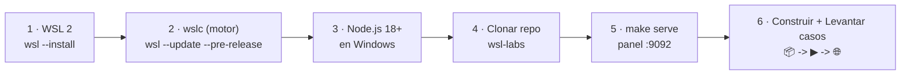

# 📦 Guía de instalación — WSL Container Center

> **Versión**: v1 · **Estado**: 🟢 Activo
> **Audiencia**: 👥 Todos
> **Objetivo**: Instalar y operar `wsl-labs` de punta a punta —
> WSL 2 + `wslc` + Node.js en Windows + repo + panel + casos de contenedores.

## 🗺️ Esquema



---

## ✅ Requisitos

### Software

| Componente | Dónde | Notas |
| --- | --- | --- |
| 🪟 Windows 10 (2004+) / 11 | host | WSL 2 requiere build 19041+ |
| 🐧 WSL **2.9+** con `wslc` | host | Motor de contenedores nativo (preview) |
| 🟢 Node.js 18+ | **Windows** | Para el panel (sin deps npm) |
| 🚀 Go 1.21+ | Windows | **Solo** para compilar el launcher |
| 🌐 Git · PowerShell / Windows Terminal | host | — |

> [!IMPORTANT]
> Node.js debe estar en el PATH de **Windows**, no dentro de WSL: el panel corre en
> Windows y ejecuta `wslc.exe`. Ver [Requisitos](REQUIREMENTS.md).

### Hardware recomendado

| Escenario | CPU | RAM | Disco libre |
| --- | ---: | ---: | ---: |
| Panel + 1 caso starter | 2 hilos | 8 GB | 15 GB |
| Panel + varios casos platform | 4 hilos | 16 GB | 25 GB |
| Casos infra pesados (Elasticsearch / Jenkins) | 4+ hilos | 16 GB+ | 30 GB |

---

## Opción A — Instalar desde fuente

### Paso 1 — Instalar WSL 2

```powershell
wsl --install
```

Reinicia si es la primera vez. Después verifica:

```powershell
wsl --status        # WSL en modo 2 por defecto
wsl -l -v           # tu distro con VERSION 2
```

> [!TIP]
> Si tu distro aparece en **VERSION 1**, conviértela con
> `wsl --set-version <distro> 2`. Para el detalle paso a paso, ver
> [ENVIRONMENT_SETUP.md](../ENVIRONMENT_SETUP.md).

### Paso 2 — Habilitar el motor de contenedores `wslc`

`wslc` (el motor de contenedores nativo de WSL, tipo Docker) llega con la versión
**preview** de WSL:

```powershell
wsl --update --pre-release
wsl --version
```

Verifica que el binario existe:

```powershell
& "C:\Program Files\WSL\wslc.exe" version
```

> [!WARNING]
> Si `wslc` no aparece tras actualizar, ejecuta `wsl --shutdown` y vuelve a
> comprobarlo. El panel localiza el binario en `C:\Program Files\WSL\wslc.exe` (o en
> `WSL_LABS_WSLC` si lo defines).

### Paso 3 — Instalar Node.js 18+ en Windows

Descárgalo de <https://nodejs.org> (LTS) y verifica en PowerShell:

```powershell
node --version      # >= v18
```

### Paso 4 — Clonar el repo

```powershell
git clone https://github.com/vladimiracunadev-create/wsl-labs.git
cd wsl-labs
```

### Paso 5 — Arrancar el panel

```powershell
make serve
# o:
node dashboard-server/server.js
```

Abre → **<http://localhost:9092>**.

### Paso 6 — Construir y levantar casos desde el panel

Por cada caso que quieras usar:

1. Si usa **imagen custom** y aparece **Imagen sin construir**, pulsa **📦 Construir**.
2. Pulsa **▶ Levantar**.
3. Verifica que pasa a **✅ running** y pulsa **🌐 Abrir**.

Eso es todo: el flujo estilo Docker es **📦 Construir → ▶ Levantar → 🌐 Abrir**. Los
casos con imágenes públicas (redis, postgres, jenkins…) van directo a **▶ Levantar**.

---

## Opción B — Operar por terminal con `wslc`

Alternativa sin panel, ejecutando `wslc` a mano. Ejemplo con el caso `01 API Node.js`
(imagen custom, contexto `containers/01-node-api`):

```powershell
# (1) Construir la imagen del caso
& "C:\Program Files\WSL\wslc.exe" build -t wsl-labs/node-api:latest containers/01-node-api

# (2) Levantar el contenedor
& "C:\Program Files\WSL\wslc.exe" run -d --name wslc-node-api -p 8101:3000 wsl-labs/node-api:latest

# (3) Comprobar
Invoke-WebRequest http://localhost:8101 -UseBasicParsing

# (4) Bajar
& "C:\Program Files\WSL\wslc.exe" stop wslc-node-api
& "C:\Program Files\WSL\wslc.exe" rm   wslc-node-api
```

> [!NOTE]
> Los casos **multi-contenedor** requieren primero crear la red
> (`wslc network create <red>`) y luego lanzar cada contenedor con `--network <red>`.
> El panel hace esto por ti; a mano, revisa los campos `network` y `containers[]` del
> caso en [`containers/containers.config.json`](../containers/containers.config.json).

---

## Opción C — Launcher / instalador Windows

1. Descarga el instalador desde
   **[GitHub Releases](https://github.com/vladimiracunadev-create/wsl-labs/releases/latest)**.
   El archivo se llama `wsl-labs-setup-<version>.exe` (construido con Inno Setup).
2. Ejecuta el instalador. Si SmartScreen avisa → "Más información" → "Ejecutar de todas formas".
3. Usa el acceso directo **wsl-labs**. El launcher (`wsl-labs-launcher.exe`, compilado
   desde `launcher/windows/main.go`) verifica WSL 2, arranca el panel y abre el
   navegador en `http://localhost:9092`.

> [!NOTE]
> El instalador **no** empaqueta WSL 2, `wslc` ni Node.js: deben estar instalados antes.

---

## 🔍 Verificación inicial

| Caso | URL |
| --- | --- |
| 🧭 Panel | <http://localhost:9092> |
| `01` API Node.js | <http://localhost:8101> |
| `06` Nginx web | <http://localhost:8104> |
| `05` API + PostgreSQL | <http://localhost:8106> |
| `08` Prometheus + Grafana | <http://localhost:8110> |

Comprobación del motor y del catálogo:

```powershell
& "C:\Program Files\WSL\wslc.exe" version
Invoke-RestMethod http://localhost:9092/api/wslc/overview
```

---

## ⚡ Equipos con recursos limitados

- Deja solo el panel (`9092`) arriba y levanta **un caso a la vez**.
- Empieza por los **starter** (node, python, go, nginx): una sola imagen ligera.
- Evita `11` Elasticsearch y `12` Jenkins salvo que tengas 16 GB+ de RAM.
- Usa **⏹ Bajar** para liberar contenedores; la imagen queda cacheada para relanzar.

---

## 📝 Notas de distribución

| Punto | Detalle |
| --- | --- |
| WSL 2 / `wslc` / Node.js | El instalador no los empaqueta — deben estar previamente |
| Launcher | `launcher/windows/main.go` → `wsl-labs-launcher.exe` |
| Instalador | Inno Setup → `wsl-labs-setup-<ver>.exe` en Releases |
| Canal oficial | GitHub Releases es la fuente del binario |

---

## 🔗 Documentos relacionados

- [Requisitos](REQUIREMENTS.md)
- [Setup del panel](DASHBOARD_SETUP.md)
- [Manual de usuario](USER_MANUAL.md)
- [Track de contenedores WSLC](wslc-contenedores.md)
- [Resolución de problemas](TROUBLESHOOTING.md)
- [ENVIRONMENT_SETUP.md](../ENVIRONMENT_SETUP.md)
- [RUNBOOK operativo](../RUNBOOK.md)
