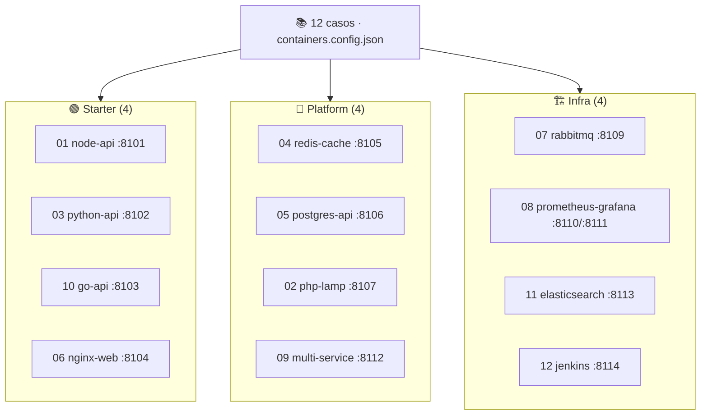

# 📚 Catálogo de casos de contenedores — WSL Container Center

> **Versión**: 0.3.0
> **Estado**: 🟢 Activo
> **Audiencia**: 👥 Todos
> **Objetivo**: Rol de los 12 casos de contenedores, qué monta cada uno y su puerto

---

## 🗺️ Esquema

---

## 🗺️ Vista general

| Caso | Categoría | Puerto | Qué monta |
| --- | --- | :---: | --- |
| `01-node-api` | 🟢 starter | `8101` | API REST Node.js (`node:20-alpine`, `http` nativo) |
| `03-python-api` | 🟢 starter | `8102` | API REST Flask (`python:3.12-alpine`) |
| `10-go-api` | 🟢 starter | `8103` | API REST Go (`net/http`, imagen multi-stage) |
| `06-nginx-web` | 🟢 starter | `8104` | Servidor web/estático Nginx (`nginx:alpine`) |
| `04-redis-cache` | 🧩 platform | `8105` | App Node + Redis (`redis:7-alpine`) por red `wslc` |
| `05-postgres-api` | 🧩 platform | `8106` | API Python + PostgreSQL (`postgres:15`) por red `wslc` |
| `02-php-lamp` | 🧩 platform | `8107` | LAMP: PHP+Apache + MariaDB (`mariadb:10.6`) por red `wslc` |
| `09-multi-service` | 🧩 platform | `8112` | Backend Node + MongoDB (`mongo:7`) por red `wslc` |
| `07-rabbitmq` | 🏗️ infra | `8109` | Broker RabbitMQ + panel admin (`rabbitmq:3-management`) |
| `08-prometheus-grafana` | 🏗️ infra | `8110`/`8111` | Observabilidad: Grafana + Prometheus por red `wslc` |
| `11-elasticsearch` | 🏗️ infra | `8113` | Motor de búsqueda Elasticsearch 8 (nodo único) |
| `12-jenkins` | 🏗️ infra | `8114` | Servidor de CI Jenkins LTS |

Tres familias conviven en el catálogo:

- 🟢 **starter** — un único contenedor de aplicación (imagen custom construida con
  `wslc build`). Caso base para entender el ciclo Construir → Levantar → Health.
- 🧩 **platform** — app + backend de datos comunicados por una **red `wslc`**. Es el
  patrón multi-contenedor sin `compose`.
- 🏗️ **infra** — piezas de infraestructura levantadas desde imágenes oficiales
  (`wslc pull` implícito), algunas pesadas (ES, Jenkins).

> [!NOTE]
> Los 12 casos están **portados de docker-labs** y **verificados corriendo** con
> `wslc` (HTTP 200/302/403 según el servicio, DBs alcanzables). Ver la
> [auditoría técnica](technical-audit.md).

---

## 🟢 Casos starter

Un solo contenedor de aplicación desde una imagen custom (`wslc build` sobre un
`Dockerfile` propio). Son la puerta de entrada al motor de contenedores.

### `01-node-api` · 🟢 `:8101`

API REST mínima en **Node.js** con el módulo `http` nativo (imagen
`node:20-alpine`, sin `npm install`). El caso más simple: una imagen, un
contenedor, un puerto.

### `03-python-api` · 🐍 `:8102`

API REST en **Flask** (imagen `python:3.12-alpine`). Muestra el patrón Python
containerizado con dependencias instaladas en tiempo de build.

### `10-go-api` · 🐹 `:8103`

API REST en **Go** (`net/http`) con imagen **multi-stage**: compila el binario y lo
copia a una imagen final mínima. Demuestra builds por capas eficientes.

### `06-nginx-web` · 🌐 `:8104`

Servidor **web/estático con Nginx** (imagen `nginx:alpine`). El clásico "sirve
contenido" containerizado, ideal como primer contacto con `wslc`.

---

## 🧩 Casos platform

App de aplicación + un backend de datos, comunicados por una **red `wslc`** creada
para el caso. La app referencia al backend por nombre de contenedor.

### `04-redis-cache` · 🟢 `:8105`

App Node que consulta **Redis** (`redis:7-alpine`) por la red `wslc-redis-net`. La
app apunta a `REDIS_HOST=wslc-redis`. Patrón cache + aplicación.

### `05-postgres-api` · 🗄️ `:8106`

API Python conectada a **PostgreSQL** (`postgres:15`) por la red `wslc-pg-net`. La
app apunta a `PG_HOST=wslc-postgres`. Patrón API + base de datos relacional.

### `02-php-lamp` · 🐘 `:8107`

Stack **LAMP**: PHP+Apache (imagen custom) + **MariaDB** (`mariadb:10.6`) por la red
`wslc-lamp-net`. El PHP apunta a `DB_HOST=wslc-mariadb`.

### `09-multi-service` · 🍃 `:8112`

Backend **Node + MongoDB** (`mongo:7`) por la red `wslc-multi-net`. El backend apunta
a `MONGO_HOST=wslc-mongo`. Patrón app + base de datos documental.

---

## 🏗️ Casos infra

Piezas de infraestructura desde imágenes oficiales. Algunas son pesadas: reserva RAM
para Elasticsearch y Jenkins (ver la [referencia de runtime](LABS_RUNTIME_REFERENCE.md)).

### `07-rabbitmq` · 🐰 `:8109`

Broker de mensajería **RabbitMQ** con panel de administración
(`rabbitmq:3-management`). Publica el panel en `:8109` y el broker AMQP en `:5672`.

### `08-prometheus-grafana` · 📊 `:8110` / `:8111`

Stack de **observabilidad**: **Grafana** (`:8110`) + **Prometheus** (`:8111`) por la
red `wslc-obs-net`. Grafana consume las métricas que expone Prometheus.

### `11-elasticsearch` · 🔍 `:8113`

Motor de búsqueda **Elasticsearch 8** (nodo único, seguridad desactivada,
`ES_JAVA_OPTS=-Xms512m -Xmx512m`). Publica la API REST en `:8113`. **Pesa** (JVM).

### `12-jenkins` · 🧰 `:8114`

Servidor de **integración continua Jenkins LTS** (`jenkins/jenkins:lts`). Publica la
UI en `:8114`. **Pesa** (JVM + arranque largo).

---

## 🧭 Orden recomendado

| Prioridad | Casos | Motivo |
| ---: | --- | --- |
| 1 | `01`, `06` | Starter: primer `wslc build` + `wslc run` |
| 2 | `03`, `10` | Más lenguajes containerizados (Python, Go multi-stage) |
| 3 | `04`, `05` | Primer multi-contenedor con red `wslc` |
| 4 | `02`, `09` | Stacks platform completos (LAMP, Mongo) |
| 5 | `07`, `08` | Infra ligera (mensajería, observabilidad) |
| 6 | `11`, `12` | Infra pesada (ES, Jenkins) cuando tengas RAM de sobra |

---

## 📚 Documentos relacionados

- [LABS_RUNTIME_REFERENCE.md](LABS_RUNTIME_REFERENCE.md)
- [wslc-contenedores.md](wslc-contenedores.md)
- [mapping-from-docker-labs.md](mapping-from-docker-labs.md)
- [../README.md](../README.md)
- [../containers/containers.config.json](../containers/containers.config.json)
