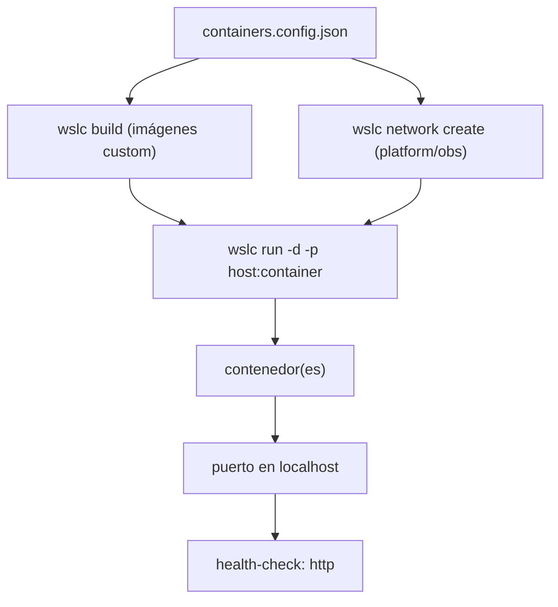

# 🧾 Referencia de runtime por caso — WSL Container Center

> **Versión**: 0.3.0
> **Estado**: 🟢 Activo
> **Objetivo**: Referencia operativa por caso — imagen(es), puerto host, comando `wslc` de arranque real, red, health y RAM aproximada

---

## 🗺️ Esquema



---

## 📖 Cómo leer esta tabla

- **Imagen(es)**: qué imágenes participan; las `wsl-labs/*` se construyen con
  `wslc build` desde un `Dockerfile`, el resto son oficiales (`wslc pull` implícito).
- **Puerto host**: puerto publicado en `localhost` de Windows.
- **Comando `wslc` de arranque real**: el `wslc run` tal como el panel lo ejecuta.
- **Red**: red `wslc` del caso (solo casos multi-contenedor); `—` si no aplica.
- **Health**: protocolo de comprobación (`http` en todos).
- **RAM aprox.**: memoria orientativa para levantar el caso, no una medición.

Los valores de RAM aquí son orientativos. Para **datos medidos** (tamaño real de
imagen con `wslc images` y RAM en reposo con `wslc stats`, más mínimo/recomendado por
caso y del sistema), consulta [REQUIREMENTS.md → sección "Tamaños y RAM medidos"](REQUIREMENTS.md).
El panel muestra el 💾 tamaño y la 🧠 RAM de cada caso en su tarjeta.

---

## 🖥️ Requisitos globales

### Software mínimo

- Windows 10 (2004+) o Windows 11 con **WSL 2.9+** (preview, para `wslc`)
- `wslc` disponible en `C:\Program Files\WSL\wslc.exe` (`wsl --update --pre-release`)
- Node.js 18+ (para el panel WSL Container Center)
- Navegador moderno

### Hardware recomendado por escenario

| Escenario | CPU | RAM | Disco libre |
| --- | ---: | ---: | ---: |
| Panel + 1–2 casos starter (`01`, `06`) | 2 núcleos | 4 GB | 10 GB |
| Panel + un caso platform (`04`, `05`, `02`, `09`) | 4 núcleos | 8 GB | 20 GB |
| Panel + infra pesada (`11` ES o `12` Jenkins) | 4 núcleos | 8–16 GB | 25 GB |

---

## 🟢 Matriz — casos starter (un contenedor)

| Caso | Imagen | Puerto host | Comando `wslc` de arranque real | Red | Health | RAM aprox. |
| --- | --- | :---: | --- | :---: | :---: | ---: |
| `01-node-api` | `wsl-labs/node-api:latest` (custom) | `8101` | `wslc run -d --name wslc-node-api -p 8101:3000 wsl-labs/node-api:latest` | — | `http` | `~40 MB` |
| `03-python-api` | `wsl-labs/python-api:latest` (custom) | `8102` | `wslc run -d --name wslc-python-api -p 8102:5000 wsl-labs/python-api:latest` | — | `http` | `~55 MB` |
| `10-go-api` | `wsl-labs/go-api:latest` (custom, multi-stage) | `8103` | `wslc run -d --name wslc-go-api -p 8103:8080 wsl-labs/go-api:latest` | — | `http` | `~20 MB` |
| `06-nginx-web` | `wsl-labs/nginx-web:latest` (custom) | `8104` | `wslc run -d --name wslc-nginx-web -p 8104:80 wsl-labs/nginx-web:latest` | — | `http` | `~15 MB` |

> [!NOTE]
> Las imágenes `wsl-labs/*` se construyen una vez con `wslc build -t <imagen>
> containers/<caso>` antes del primer `wslc run`.

---

## 🧩 Matriz — casos platform (app + datos por red `wslc`)

Cada caso crea una red `wslc`, levanta el backend de datos y luego la app conectada
por nombre de contenedor.

| Caso | Imágenes | Puerto host | Red | Health | RAM aprox. |
| --- | --- | :---: | --- | :---: | ---: |
| `04-redis-cache` | `redis:7-alpine` + `wsl-labs/redis-app:latest` | `8105` | `wslc-redis-net` | `http` | `~70 MB` |
| `05-postgres-api` | `postgres:15` + `wsl-labs/pg-app:latest` | `8106` | `wslc-pg-net` | `http` | `~130 MB` |
| `02-php-lamp` | `mariadb:10.6` + `wsl-labs/php-lamp:latest` | `8107` | `wslc-lamp-net` | `http` | `~180 MB` |
| `09-multi-service` | `mongo:7` + `wsl-labs/multi-backend:latest` | `8112` | `wslc-multi-net` | `http` | `~200 MB` |

Comandos de arranque real (patrón, mostrado para `04-redis-cache`):

```bash
wslc network create wslc-redis-net
wslc run -d --name wslc-redis --network wslc-redis-net redis:7-alpine
wslc run -d --name wslc-redis-app --network wslc-redis-net -e REDIS_HOST=wslc-redis -p 8105:3000 wsl-labs/redis-app:latest
```

Variables de conexión por caso:

| Caso | Backend | La app apunta a |
| --- | --- | --- |
| `04-redis-cache` | `wslc-redis` | `REDIS_HOST=wslc-redis` |
| `05-postgres-api` | `wslc-postgres` (`POSTGRES_DB=app`) | `PG_HOST=wslc-postgres` |
| `02-php-lamp` | `wslc-mariadb` (`MARIADB_DATABASE=app`) | `DB_HOST=wslc-mariadb` |
| `09-multi-service` | `wslc-mongo` | `MONGO_HOST=wslc-mongo` |

---

## 🏗️ Matriz — casos infra (imágenes oficiales)

| Caso | Imagen(es) | Puerto host | Comando `wslc` de arranque real | Red | Health | RAM aprox. |
| --- | --- | :---: | --- | :---: | :---: | ---: |
| `07-rabbitmq` | `rabbitmq:3-management` | `8109` (+`5672`) | `wslc run -d --name wslc-rabbitmq -p 8109:15672 -p 5672:5672 rabbitmq:3-management` | — | `http` | `~120 MB` |
| `08-prometheus-grafana` | `prom/prometheus` + `grafana/grafana` | `8110`/`8111` | red `wslc-obs-net` + `wslc run` de Prometheus (`8111:9090`) y Grafana (`8110:3000`) | `wslc-obs-net` | `http` | `~180 MB` |
| `11-elasticsearch` | `elasticsearch:8.11.0` | `8113` | `wslc run -d --name wslc-elasticsearch -p 8113:9200 -e discovery.type=single-node -e xpack.security.enabled=false -e "ES_JAVA_OPTS=-Xms512m -Xmx512m" elasticsearch:8.11.0` | — | `http` | `~1.2 GB` |
| `12-jenkins` | `jenkins/jenkins:lts` | `8114` | `wslc run -d --name wslc-jenkins -p 8114:8080 jenkins/jenkins:lts` | — | `http` | `~600 MB` |

> [!WARNING]
> **`11-elasticsearch` y `12-jenkins` pesan**: ambos corren sobre JVM.
> Elasticsearch reserva ~512 MB de heap (más overhead) y Jenkins tarda en arrancar.
> No los levantes junto a varios casos platform si tienes 8 GB o menos.

### Health esperado por caso

| Caso | Respuesta verificada |
| --- | --- |
| starter (`01`, `03`, `10`, `06`) | HTTP `200` |
| `04`, `05`, `02`, `09` | HTTP `200` (app) + backend de datos alcanzable |
| `07-rabbitmq` | panel admin HTTP `200`/`302` |
| `08-prometheus-grafana` | Grafana `302` (login), Prometheus `200` |
| `11-elasticsearch` | HTTP `200` en `/` (JSON del clúster) |
| `12-jenkins` | HTTP `403` (setup inicial protegido) — el servicio está vivo |

---

## 💡 Recomendaciones de uso

### Si tienes 4 GB de RAM

- Panel + un solo caso starter a la vez (`01`, `06`, `10`)
- Evita los casos infra pesados (`11`, `12`)

### Si tienes 8 GB de RAM

- Panel + un caso platform (`04`, `05`) o dos starter
- Un caso infra ligero (`07`, `08`) — pero de a uno con ES/Jenkins

### Flujo más rápido para probar el motor

1. `06-nginx-web` — verifica el ciclo `wslc build` → `wslc run`
2. `04-redis-cache` — primer multi-contenedor con red `wslc`
3. `08-prometheus-grafana` — dos servicios oficiales conectados

---

## 📚 Documentos relacionados

- [LABS_CATALOG.md](LABS_CATALOG.md)
- [wslc-contenedores.md](wslc-contenedores.md)
- [mapping-from-docker-labs.md](mapping-from-docker-labs.md)
- [../containers/containers.config.json](../containers/containers.config.json)
