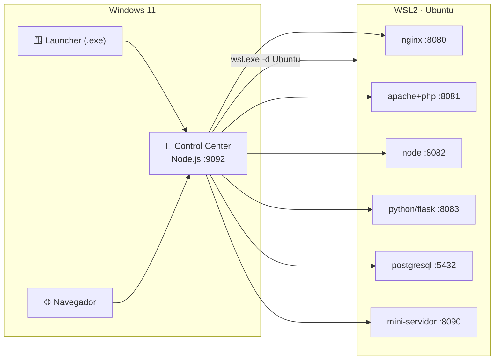

# 🧭 Plan de Paridad — wsl-labs ↔ docker-labs · unikernel-labs

> [!NOTE]
> Documento de planificación. Define cómo elevar **wsl-labs** al mismo nivel
> **funcional, visual y estructural** que sus repos hermanos de la línea
> "tecnologías para montar sistemas": [`docker-labs`](https://github.com/vladimiracunadev-create/docker-labs)
> y [`unikernel-labs`](https://github.com/vladimiracunadev-create/unikernel-labs).

---

## 0. ¿Por qué existe este repo y qué significa "paridad"?

La línea está formada por tres laboratorios que enseñan a **montar y operar
sistemas** con distintas tecnologías de base:

| Repo | Motor de ejecución | Punto de acceso | Estado hoy |
| ------ | -------------------- | ----------------- | ----------- |
| `docker-labs` | Docker / Compose | `http://localhost:9090` | v1.5.0 — maduro |
| `unikernel-labs` | Unikraft sobre WSL2 | `http://localhost:9091` | v1 — validado |
| **`wsl-labs`** | **WSL2 + servicios Linux nativos** | **`http://localhost:9092`** (objetivo) | **documental — sin plataforma** |

Los tres comparten un mismo **ADN**:

1. **README con identidad visual** — badges shields.io, diagrama Mermaid de
   arquitectura, tablas, un emoji por sección.
2. **Un Control Center web** (Node.js) que corre en localhost y actúa de puente
   Windows ↔ motor, con `index.html` + `dashboard.css` + `dashboard.js`.
3. **Un Launcher de Windows** (Go en docker-labs, WinForms/.NET en unikernel-labs)
   - **instalador** (Inno Setup) distribuido por GitHub Releases.
4. **Un catálogo como fuente única de verdad** (`lab-manifest.json` por lab en
   docker-labs, `labs.config.json` central en unikernel-labs).
5. **Labs numerados** `NN-nombre-kebab` con README homogéneo.
6. **Suite documental por audiencia** (RECRUITER, ROADMAP, RUNBOOK,
   CONTRIBUTING, CODE_OF_CONDUCT, CHANGELOG, SECURITY…).
7. **CI/CD en GitHub Actions** (tests + lint + build del instalador Windows).
8. **Paleta de color y sistema de emojis** consistentes + **branding SVG**.
9. **Licencia Apache-2.0**, `version.txt` como versión canónica, `Makefile`.

**Paridad** = wsl-labs presenta esos nueve rasgos, adaptando el *motor* a WSL2.

---

## 1. Matriz de brechas (gap analysis)

| # | Componente | docker-labs | unikernel-labs | wsl-labs (hoy) | Acción |
| --- | ----------- | :-----------: | :--------------: | :--------------: | -------- |
| 1 | README con badges + Mermaid | ✅ | ✅ | ❌ (texto plano) | **Rehacer** |
| 2 | Control Center web (Node) | ✅ 9090 | ✅ 9091 | ❌ | **Crear** 9092 |
| 3 | `index.html`+`dashboard.css`+`.js` | ✅ | ✅ | ❌ | **Crear** |
| 4 | Launcher Windows + instalador | ✅ Go+Inno | ✅ .NET+Inno | ❌ | **Crear** |
| 5 | Catálogo fuente-de-verdad | ✅ manifests | ✅ `labs.config.json` | ❌ | **Crear** `labs.config.json` |
| 6 | Labs numerados con README homogéneo | ✅ | ✅ | ⚠️ (READMEs simples) | **Normalizar** |
| 7 | Suite documental por audiencia | ✅ 25+ | ✅ 15+ | ⚠️ (6 docs) | **Ampliar** |
| 8 | CI/CD workflows | ✅ 2 | ✅ 4 | ❌ | **Crear** |
| 9 | Issue + PR templates | ✅ 4 | ✅ 2 | ⚠️ (2) | **Completar** |
| 10 | Paleta + emojis + branding SVG | ✅ | ✅ | ❌ | **Crear** |
| 11 | `Makefile` | ✅ | ✅ | ❌ | **Crear** |
| 12 | `version.txt` + versionado semántico | ✅ | ✅ | ❌ | **Crear** |
| 13 | `.markdownlint.json` | — | ✅ | ❌ | **Crear** |
| 14 | Licencia Apache-2.0 | ✅ | ✅ | ⚠️ **MIT** | **Decidir** (§7) |

Lo que wsl-labs **ya tiene bien** y se conserva: `docs/` conceptual,
`labs/` (12), `scripts/` (install .sh + backup .ps1), `examples/`,
`cheatsheets/`, `.gitignore` correcto.

---

## 2. Adaptación del "motor" a WSL2

El puente que en docker-labs ejecuta `docker compose` y en unikernel-labs
ejecuta `kraft`, en wsl-labs ejecuta comandos **dentro de la distro WSL** vía
`wsl.exe -d <distro> -- <cmd>`. Cada "servicio" es un demonio Linux real
(systemd o proceso) publicado en un puerto que WSL2 reenvía a `localhost` de
Windows.



**Mapa lab → servicio ejecutable** (fuente para `labs.config.json`):

| Lab | Servicio | Puerto | Health |
| ----- | ---------- | :------: | -------- |
| 05-servidor-web-nginx | nginx | 8080 | `curl :8080` |
| 06-servidor-apache-php | apache2+php | 8081 | `curl :8081` |
| 07-nodejs-entorno-dev | node API | 8082 | `curl :8082/health` |
| 08-python-entorno-dev | flask | 8083 | `curl :8083/health` |
| 09-postgresql-en-wsl | postgresql | 5432 | `pg_isready` |
| 11-mini-servidor-completo | stack combinado | 8090 | `curl :8090` |

Los labs **01, 02, 03, 04, 10, 12** son de *aprendizaje/operación*
(instalación, comandos, filesystem, systemd, backup, troubleshooting): en el
catálogo se marcan `type: learning` (sin puerto), igual que docker-labs
distingue `platform` de `starter`/`infra`.

---

## 3. Plan por fases

### Fase 1 — Identidad y gobernanza (rápida, alto impacto visual)

- [ ] Reescribir `README.md`: título con emoji `🐧 wsl-labs`, fila de badges
      (CI · Docs · Release · Platform Windows+WSL2 · License), diagrama Mermaid,
      tabla de labs con estado/puerto, quickstart, tabla de servicios localhost,
      links a docs. **Referencia de estructura: README de unikernel-labs.**
- [ ] `version.txt` → `0.1.0`; adoptar versionado semántico.
- [ ] `.markdownlint.json` (misma config que unikernel-labs).
- [ ] `Makefile` con targets: `help`, `serve`, `doctor`, `up-nginx/apache/node/python/postgres`, `down-*`, `status`, `logs-*`.
- [ ] Completar `.github/`: `ISSUE_TEMPLATE/bug_report.md`, `ISSUE_TEMPLATE/new_lab.md` (ya existe `lab_request.md` → renombrar/alinear), conservar `PULL_REQUEST_TEMPLATE.md`.
- [ ] **Decisión de licencia** (§7).

### Fase 2 — Catálogo + normalización de labs

- [ ] `labs.config.json` como fuente única (project, subtitle, array de 12 labs
      con `id, name, path, type, status, port, url, startCommand, stopCommand, logsCommand, healthProtocol`).
- [ ] Normalizar los 12 `labs/NN-*/README.md` a la plantilla homogénea:
      título+estado, tabla de datos, 🚀 Ejecutar (comandos WSL), ✅ Verificar,
      🧭 Desde el dashboard, 🎯 Por qué importa, enlaces cruzados.
- [ ] Convertir scripts `install-*.sh` en instaladores idempotentes que dejen
      cada servicio escuchando en su puerto (usados por el dashboard).

### Fase 3 — Control Center web (Node.js)

- [ ] `dashboard-server/server.js` (Express o http nativo) en `:9092`,
      endpoints: `GET /api/overview`, `POST /api/wsl/{start|stop|logs}`,
      `GET /api/health/:lab`; puente vía `wsl.exe`; rate-limit + token opcional
      (paridad con server.js de docker-labs).
- [ ] `index.html` + `dashboard.css` + `dashboard.js` con la **paleta compartida**
      (naranja `#d96a3b`, verde `#1f7a4f`, gris `#18222d`) y sistema de emojis.
- [ ] `scripts/verify-localhost.js` + target `make test-dashboard`.

### Fase 4 — Launcher Windows + instalador

- [ ] Launcher (recomendado **Go**, como docker-labs: sin dependencias, un `.exe`):
      detecta distro WSL, arranca servicios core, espera a `/api/overview`, abre
      el navegador en `:9092`.
- [ ] `installer/wsl-labs.iss` (Inno Setup) → `wsl-labs-setup-<version>.exe`.
- [ ] `scripts/windows/build-launcher.ps1`, `build-installer.ps1`, `release.ps1`.

### Fase 5 — CI/CD

- [ ] `.github/workflows/docs.yml` — markdownlint sobre `**/*.md`.
- [ ] `.github/workflows/scripts.yml` — `shellcheck` para `.sh` + `PSScriptAnalyzer` para `.ps1`.
- [ ] `.github/workflows/dashboard.yml` — tests Node del Control Center.
- [ ] `.github/workflows/build-windows.yml` — build launcher Go + Inno Setup, publica en Releases al taggear `v*.*.*`.

### Fase 6 — Suite documental y branding

- [ ] Docs de paridad: `RECRUITER.md`, `ROADMAP.md`, `RUNBOOK.md`,
      `ENVIRONMENT_SETUP.md`, `CONTRIBUTING.md`, `CODE_OF_CONDUCT.md`,
      `CHANGELOG.md`, `SECURITY.md`, `COMPATIBILITY.md`, `FILE_ARCHITECTURE.md`,
      `PROJECT_STATUS.md`.
- [ ] `docs/mapping-from-docker-labs.md` (equivalente al de unikernel-labs).
- [ ] `assets/branding/` con `cover.svg` + `logo.svg` (estilo de la línea).

---

## 4. Estructura final objetivo

```text
wsl-labs/
├── .github/
│   ├── workflows/         # docs, scripts, dashboard, build-windows
│   ├── ISSUE_TEMPLATE/    # bug_report.md, new_lab.md
│   └── PULL_REQUEST_TEMPLATE.md
├── assets/branding/       # cover.svg, logo.svg
├── dashboard-server/      # server.js, package.json, verify-localhost.js
├── launcher/windows/      # main.go / go.mod  (+ .exe generado)
├── installer/             # wsl-labs.iss
├── scripts/               # install-*.sh, backup/restore .ps1
│   └── windows/           # build-launcher.ps1, build-installer.ps1, release.ps1
├── docs/                  # conceptuales + suite por audiencia + PLAN_PARIDAD.md
├── labs/ 01..12/          # README homogéneo por lab
├── examples/              # nginx, apache-php, node, python, postgres
├── cheatsheets/
├── index.html · dashboard.css · dashboard.js   # Control Center UI
├── labs.config.json       # fuente única de verdad
├── Makefile · version.txt · .markdownlint.json
├── README.md · LICENSE · CHANGELOG.md · CONTRIBUTING.md · ...
```

---

## 5. Identidad visual (paridad exacta)

- **Paleta** (de `dashboard.css` de docker-labs): panel beige
  `rgba(255,251,245,.92)`, texto `#18222d`, acento naranja `#d96a3b` /
  `#a64822`, ok `#1f7a4f`, warn `#b06a12`, danger `#b23131`.
- **Emojis por estado**: ✅ saludable · 🔄 corriendo · ⚠️ degradado · ⏹ detenido ·
  🧩 componente · 📚 docs · 🎯 objetivo · 🚀 ejecutar · 🪟 Windows · 🐧 WSL.
- **Badges README** (shields.io): CI workflow · Docs · Release ·
  `Platform-Windows%2BWSL2-orange` · License.
- **Bloques** `> [!NOTE] / [!TIP] / [!IMPORTANT] / [!WARNING]` en la documentación.
- **Mermaid** `flowchart LR` de arquitectura en el README.

---

## 6. Decisiones abiertas

| # | Decisión | Opciones | Recomendación |
|---|----------|----------|---------------|
| A | **Licencia** | Mantener MIT / migrar a Apache-2.0 | **Apache-2.0** para alinear con los hermanos |
| B | **Tecnología del launcher** | Go (como docker-labs) / .NET WinForms (como unikernel-labs) | **Go** — un solo `.exe`, sin runtime, CI más simple |
| C | **Alcance inicial** | Full parity de una / por fases (1→6) | **Por fases**, empezando por Fase 1 (visual + gobernanza) |

---

## 7. Resumen ejecutivo

Para alcanzar la misma lógica funcional, visual y estructural hay que añadir a
wsl-labs **cinco piezas** que hoy no tiene —(1) README con identidad visual,
(2) Control Center web en `:9092`, (3) Launcher Windows + instalador,
(4) catálogo `labs.config.json`, (5) CI/CD— y **normalizar** labs y docs a la
plantilla de la línea, adaptando el motor de Docker/Unikraft a **servicios WSL2
nativos**. El trabajo se entrega en 6 fases, siendo la Fase 1 la de mayor
impacto visible con menor esfuerzo.
