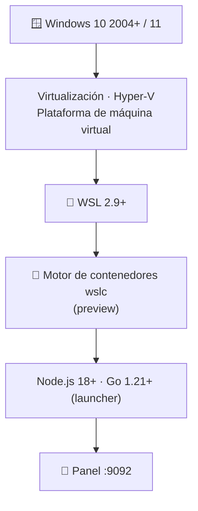

# 🧱 Requisitos — WSL Container Center

> **Versión**: v1 · **Estado**: 🟢 Activo
> **Uso recomendado**: Revisa este documento antes de instalar el proyecto o si
> quieres saber qué necesita tu equipo para operar el panel y los casos de contenedores.
<!-- -->

> [!NOTE]
> `wsl-labs` es **local**: todo corre en tu Windows + WSL 2 con `wslc`. No hay nube
> ni Kubernetes, así que los requisitos son los de tu propia máquina.

## 🗺️ Esquema



---

## 🖥️ Requisitos del host (Windows)

| Recurso | Mínimo | Recomendado | Notas |
| --- | --- | --- | --- |
| 🪟 Windows | 10 versión **2004** (build 19041) | Windows 11 | WSL 2 requiere 2004+ |
| 🐧 WSL | **2.9+** con `wslc` | 2.9+ preview | El motor de contenedores llega con `--pre-release` |
| 🟢 Node.js | **18 LTS** | 20 LTS+ | En **Windows**, para el panel; sin deps npm |
| 🚀 Go | **1.21** | 1.22+ | **Solo** para compilar el launcher |
| 🌐 Navegador | Cualquiera moderno | Edge / Chrome | Para abrir `:9092` |
| 🧠 RAM | 8 GB | 16 GB o más | Elasticsearch y Jenkins pesan bastante |
| 🖴 Disco libre | 15 GB | 30 GB SSD | Incluye imágenes base y capas de contenedores |
| ⚙️ CPU | 2 hilos | 4 hilos o más | — |

> [!IMPORTANT]
> **Virtualización activada en BIOS/UEFI** (VT-x / AMD-V) y la característica de
> Windows **"Plataforma de máquina virtual"** son obligatorias para WSL 2.

---

## 🐳 Requisitos del motor `wslc`

| Recurso | Requisito | Notas |
| --- | --- | --- |
| Motor | `wslc` presente | Binario en `C:\Program Files\WSL\wslc.exe` |
| Versión de WSL | **2.9+** (preview) | Se obtiene con `wsl --update --pre-release` |
| Verificación | `wslc version` responde | Si no, el panel muestra `unavailable` |

> [!TIP]
> Para obtener `wslc`, actualiza WSL a la rama preview:
>
> ```powershell
> wsl --update --pre-release
> wsl --shutdown
> ```
>
> y comprueba con `& "C:\Program Files\WSL\wslc.exe" version`.

---

## 🔌 Puertos

El proyecto publica los casos en `localhost` de Windows. Deben estar **libres**:

| Puerto | Caso |
| ---: | --- |
| 9092 | 🧭 Panel |
| 8101 | `01` API Node.js |
| 8102 | `03` API Python (Flask) |
| 8103 | `10` API Go |
| 8104 | `06` Nginx web |
| 8105 | `04` Cache Redis + app |
| 8106 | `05` API + PostgreSQL |
| 8107 | `02` LAMP (PHP + MariaDB) |
| 8109 | `07` RabbitMQ |
| 8110 / 8111 | `08` Prometheus + Grafana |
| 8112 | `09` App multi-servicio (Mongo) |
| 8113 | `11` Elasticsearch |
| 8114 | `12` Jenkins CI |

> [!WARNING]
> Si otro proceso de Windows ya usa uno de estos puertos, el caso quedará
> **degraded** o no arrancará. Verifica con `netstat -ano | findstr <puerto>` y
> libéralo. Ver [Resolución de problemas](TROUBLESHOOTING.md).

---

## 📊 Requisitos por escenario

| Escenario | RAM sugerida | Comentario |
| --- | --- | --- |
| Solo panel `9092` | 8 GB | Muy liviano |
| Panel + un caso starter (node/python/go/nginx) | 8 GB | Apto para equipos medios |
| Panel + varios casos platform (redis/postgres/mongo) | 16 GB | Cómodo para practicar stacks |
| Casos infra pesados (`11` Elasticsearch, `12` Jenkins) | 16 GB o más | Cada uno consume memoria de sobra |

---

## 📌 Nota importante

Los requisitos reales dependen del modo de uso. El proyecto recomienda **levantar el
panel primero** y decidir después qué casos construir y levantar, uno a uno. Los casos
**infra** (Elasticsearch, Jenkins) son los más exigentes en RAM y tiempo de arranque.

---

## 🔗 Documentos relacionados

- [Instalación completa](INSTALL.md)
- [Setup del panel](DASHBOARD_SETUP.md)
- [Track de contenedores WSLC](wslc-contenedores.md)
- [Resolución de problemas](TROUBLESHOOTING.md)
- [ENVIRONMENT_SETUP.md](../ENVIRONMENT_SETUP.md)
- [COMPATIBILITY.md](../COMPATIBILITY.md)
