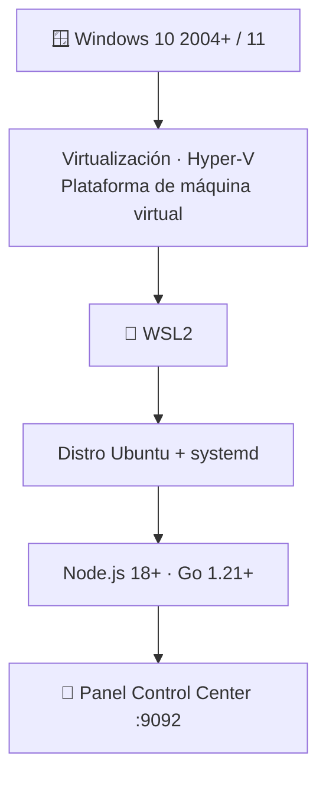

# 🧱 Requisitos — wsl-labs

> **Versión**: v1 · **Estado**: 🟢 Activo
> **Uso recomendado**: Revisa este documento antes de instalar el proyecto o si
> quieres saber qué necesita tu equipo para operar el Control Center y los servicios.
<!-- -->

> [!NOTE]
> `wsl-labs` es **local**: todo corre en tu Windows + WSL2. No hay nube ni
> Kubernetes, así que los requisitos son los de tu propia máquina.

## 🗺️ Esquema



---

## 🖥️ Requisitos del host (Windows)

| Recurso | Mínimo | Recomendado | Notas |
| --- | --- | --- | --- |
| 🪟 Windows | 10 versión **2004** (build 19041) | Windows 11 | WSL2 requiere 2004+ |
| 🐧 WSL | **WSL 2** | WSL 2 | WSL 1 no soporta la topología de servicios |
| 🟢 Node.js | **18 LTS** | 20 LTS+ | En **Windows**, para el panel; sin deps npm |
| 🚀 Go | **1.21** | 1.22+ | **Solo** para compilar el launcher |
| 🌐 Navegador | Cualquiera moderno | Edge / Chrome | Para abrir `:9092` |
| 🧠 RAM | 8 GB | 16 GB o más | WSL2 usa memoria dinámica |
| 🖴 Disco libre | 15 GB | 30 GB SSD | Incluye distro + paquetes de servicios |
| ⚙️ CPU | 2 hilos | 4 hilos o más | — |

> [!IMPORTANT]
> **Virtualización activada en BIOS/UEFI** (VT-x / AMD-V) y la característica de
> Windows **"Plataforma de máquina virtual"** son obligatorias para WSL2.

---

## 🐧 Requisitos dentro de WSL

| Recurso | Requisito | Notas |
| --- | --- | --- |
| 🐧 Distro | Ubuntu 20.04 / Debian 11 mínimo · Ubuntu 22.04+ recomendado | Otras distros: parcial |
| ⚙️ systemd | **Activo** | Necesario para `node`/`flask` (unidades `wsl-labs-node`, `wsl-labs-flask`) |
| 📦 Gestor de paquetes | `apt` disponible | Los `install-*.sh` usan `apt` |
| 🐍 Python 3 + venv | Para el lab 08 | Flask corre en un venv |

> [!TIP]
> Para habilitar systemd, añade a `/etc/wsl.conf` dentro de WSL:
>
> ```ini
> [boot]
> systemd=true
> ```
>
> y ejecuta `wsl --shutdown` desde Windows.

---

## 🔌 Puertos

El proyecto publica servicios en `localhost` de Windows. Deben estar **libres**:

| Puerto | Servicio | Lab |
| ---: | --- | :---: |
| 9092 | 🧭 Control Center | — |
| 8080 | 🌐 NGINX | 05 |
| 8081 | 🐘 Apache + PHP | 06 |
| 8082 | 🟢 Node API | 07 |
| 8083 | 🐍 Flask | 08 |
| 5432 | 🗄️ PostgreSQL | 09 |
| 8090 | 🧱 Mini-servidor | 11 |

> [!WARNING]
> Si otro proceso de Windows ya usa uno de estos puertos, el servicio quedará
> **degraded** o **stopped**. Verifica con
> `netstat -ano | findstr <puerto>` y libéralo. Ver
> [Resolución de problemas](TROUBLESHOOTING.md).

---

## 📊 Requisitos por escenario

| Escenario | RAM sugerida | Comentario |
| --- | --- | --- |
| Solo panel `9092` | 8 GB | Muy liviano |
| Panel + un servicio (nginx, flask…) | 8 GB | Apto para equipos medios |
| Panel + varios servicios | 16 GB | Cómodo para practicar el stack |
| Mini-servidor (11) + web + db | 16 GB o más | Carga completa simultánea |

---

## 📌 Nota importante

Los requisitos reales dependen del modo de uso. El proyecto recomienda **levantar
el panel primero** y decidir después qué servicios instalar y encender, uno a uno.

---

## 🔗 Documentos relacionados

- [Instalación completa](INSTALL.md)
- [Setup del Control Center](DASHBOARD_SETUP.md)
- [Resolución de problemas](TROUBLESHOOTING.md)
- [ENVIRONMENT_SETUP.md](../ENVIRONMENT_SETUP.md)
- [COMPATIBILITY.md](../COMPATIBILITY.md)
