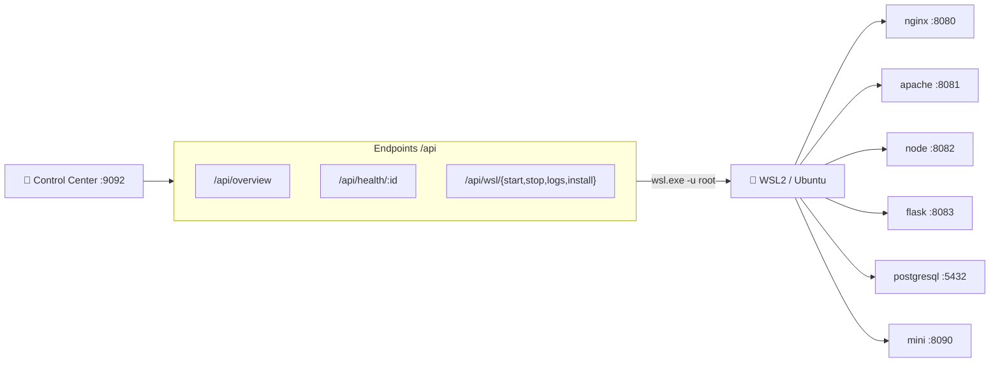

# ⚙️ Especificaciones Técnicas — WSL Labs

> **Versión**: 0.1.2
> **Estado**: 🟢 Activo
> **Audiencia**: 👥 Técnico, DevOps, reclutadores
> **Objetivo**: Stacks, puertos, endpoints del panel, contrato del catálogo y modelo root / keepalive / health

---

## 🗺️ Esquema



---

## 🖥️ Base de ejecución

| Componente | Estado actual |
| --- | --- |
| Runtime Linux | WSL 2 con distro Ubuntu (systemd habilitado) |
| Panel principal | `dashboard-server/server.js` en `9092` (solo `127.0.0.1`) |
| Puente Windows ↔ WSL | `wsl.exe -d Ubuntu -u root -- bash -lc "<cmd>"` |
| Launcher Windows | `wsl-labs-launcher.exe` compilado con Go 1.21 (stdlib puro, cero dependencias) |
| Instalador Windows | Inno Setup `.exe` (`installer/wsl-labs.iss`) distribuido por GitHub Releases |
| Fuente de verdad | `labs.config.json` (puertos, comandos, health, estado) |

---

## 🧬 Stacks por servicio

| Lab | Servicio | Stack | Modelo de arranque |
| --- | --- | --- | --- |
| `05` | NGINX | `nginx` (paquete apt) | `service nginx` del sistema |
| `06` | Apache + PHP | `apache2` + `php` | `service apache2` del sistema |
| `07` | Node API | Node.js 18+, módulo `http` nativo (sin express) | unidad systemd `wsl-labs-node` (`enabled`) |
| `08` | Flask | Python 3 + Flask en venv | unidad systemd `wsl-labs-flask` (`enabled`) |
| `09` | PostgreSQL | `postgresql` (paquete apt) | `service postgresql` del sistema |
| `11` | Mini-servidor | nginx con vhost propio (`nginx-mini.conf`) + postgresql | vhost enlazado en `sites-enabled` + `service` |

> [!NOTE]
> `node` y `flask` **no son procesos en background**: son **servicios systemd
> habilitados**, creados por sus `install-*.sh`. Así persisten tras reinicios de
> la instancia WSL, igual que nginx/apache/postgresql.

---

## 🔌 Puertos — servicios en localhost

| Lab | Servicio | Puerto host | URL |
| --- | --- | ---: | --- |
| — | 🧭 Control Center | `9092` | <http://localhost:9092> |
| `05` | NGINX | `8080` | <http://localhost:8080> |
| `06` | Apache + PHP | `8081` | <http://localhost:8081> |
| `07` | Node API | `8082` | <http://localhost:8082> |
| `08` | Flask | `8083` | <http://localhost:8083> |
| `09` | PostgreSQL | `5432` | `postgres://localhost:5432` |
| `11` | Mini-servidor | `8090` | <http://localhost:8090> |

> Los labs `01`–`04`, `10` y `12` son de aprendizaje: no exponen puerto.

---

## 📡 Endpoints del Control Center

Todos bajo `http://localhost:9092`. Los `/api/*` respetan el token opcional
(ver más abajo); las acciones `POST` están además limitadas por rate-limit.

| Método | Ruta | Descripción |
| --- | --- | --- |
| `GET` | `/api/overview` | Estado de los 12 labs: instalado, salud, totales |
| `GET` | `/api/health/:id` | Health-check puntual de un lab por id |
| `POST` | `/api/wsl/start` | Ejecuta `startCommand` del lab `{ id }` |
| `POST` | `/api/wsl/stop` | Ejecuta `stopCommand` del lab `{ id }` |
| `POST` | `/api/wsl/logs` | Devuelve las últimas líneas de `logsCommand` |
| `POST` | `/api/wsl/install` | Ejecuta `installCommand` (el `install-*.sh` del lab) |
| `GET` | `/`, `/index.html`, `/dashboard.css`, `/dashboard.js` | UI estática |

**Contrato de las acciones POST** — cuerpo `{ "id": "05" }`. Respuesta:

```json
{ "ok": true, "id": "05", "action": "start", "exitCode": 0, "output": "..." }
```

| Aspecto | Valor |
| --- | --- |
| `id` válido | Regex `^[\w-]+$` y debe existir en el catálogo (si no → `400`/`404`) |
| Body máximo | 8 KB (excede → error) |
| Timeout start/stop | 30 s |
| Timeout install | 300 s (`apt install` puede tardar) |
| Timeout logs | 12 s |
| Timeout health | 2,5 s |

---

## 📇 Contrato del catálogo (`labs.config.json`)

Cabecera del documento:

| Campo | Ejemplo | Rol |
| --- | --- | --- |
| `project` | `"WSL Control Center v1"` | Nombre mostrado en el panel |
| `distro` | `"Ubuntu"` | Distro objetivo (override: `WSL_LABS_DISTRO`) |
| `dashboardPort` | `9092` | Puerto del Control Center |
| `labs[]` | array | Definición de cada lab |

Campos de cada lab:

| Campo | Aplica a | Descripción |
| --- | --- | --- |
| `id` | todos | Identificador (`"05"`) usado por la API |
| `name` / `path` | todos | Nombre de carpeta y ruta bajo `labs/` |
| `type` | todos | `service` o `learning` |
| `status` | todos | `ready` |
| `description` | todos | Texto mostrado en la tarjeta |
| `healthProtocol` | todos | `http`, `tcp` o `null` |
| `url` / `port` | service | URL y puerto publicados |
| `requires` | service | Binario a detectar (`nginx`, `node`, `pg_isready`…) |
| `installHint` | service | Pista textual de instalación |
| `installCommand` | service | Comando del `install-*.sh` (usa `$WSL_LABS_ROOT`) |
| `startCommand` | service | Comando de arranque real |
| `stopCommand` | service | Comando de parada |
| `logsCommand` | service | Comando de logs |

> [!IMPORTANT]
> Los comandos usan el token `$WSL_LABS_ROOT`. El servidor **lo sustituye por la
> ruta literal** (`/mnt/c/dev/wsl-labs`) antes de enviarlo a WSL, porque las
> variables de shell no se expanden de forma fiable a través de `wsl.exe -- bash -lc`.

---

## 🔐 Modelo root / keepalive / health

### Ejecución como root

| Aspecto | Implementación |
| --- | --- |
| Usuario | `root` (`wsl.exe -u root`), configurable con `WSL_LABS_USER` |
| Sin contraseña | Windows ya autenticó → sin `sudo` interactivo que cuelgue el panel |
| Analogía | Equivalente a cómo Docker corre privilegiado |

### Keepalive

Mientras el panel corre, mantiene `wsl -- sleep infinity` para que la instancia
no se apague y los puertos sigan accesibles. Se levanta al arrancar y se mata al
recibir `SIGINT`/`SIGTERM`/`exit`.

### Health-check IPv4 + IPv6

| Aspecto | Implementación |
| --- | --- |
| Hosts probados | `127.0.0.1` **y** `::1` (evita falsos "detenido" por bind IPv6) |
| Protocolo `tcp` | Basta con que el puerto acepte conexión |
| Protocolo `http` | GET `/`, sano si el status es `< 500` |
| Estados | `healthy` · `stopped` · `degraded` · `missing` · `n/a` |
| Cache de "instalado" | Acumula positivos; TTL 30 s; un servicio instalado no parpadea a "No instalado" |

---

## 🔒 Seguridad y robustez del Control Center

| Aspecto | Implementación |
| --- | --- |
| Bind | Solo `127.0.0.1` — no expuesto a la red |
| Autenticación | Token Bearer/Cookie opcional vía `WSL_LABS_TOKEN` (sin él, modo dev abierto) |
| Validación de inputs | `id` validado con regex `^[\w-]+$` contra el catálogo antes de ejecutar |
| Body limit | 8 KB máximo en requests POST |
| Rate limiting | 30 requests POST / IP / 60 s (en memoria, sin dependencias) |
| Timeouts | start/stop 30 s · install 300 s · logs 12 s · health 2,5 s |
| Error handling | Errores internos capturados; respuesta sin volcar internals |

### Variables de entorno

| Variable | Efecto |
| --- | --- |
| `PORT` | Puerto del panel (default `9092`) |
| `WSL_LABS_DISTRO` | Distro objetivo (override de `config.distro`) |
| `WSL_LABS_USER` | Usuario de ejecución en WSL (default `root`) |
| `WSL_LABS_TOKEN` | Activa autenticación por token |
| `WSL_LABS_ROOT_WIN` | Raíz del repo en Windows (default: carpeta padre del servidor) |

---

## 🧪 CI/CD — GitHub Actions

| Workflow | Trigger | Descripción |
| --- | --- | --- |
| `docs` | push / PR | markdownlint sobre la documentación |
| `scripts` | push / PR | shellcheck sobre los `scripts/*.sh` |
| `dashboard` | push / PR | Tests Node del Control Center |
| `build-windows` | tag `v*.*.*` | Compila el launcher Go y el instalador Inno Setup (Chocolatey en CI) |

---

## 📚 Documentos relacionados

- [ARCHITECTURE.md](ARCHITECTURE.md)
- [TOOLING.md](TOOLING.md)
- [LABS_CATALOG.md](LABS_CATALOG.md)
- [LABS_RUNTIME_REFERENCE.md](LABS_RUNTIME_REFERENCE.md)
- [../SYSTEM_SPECS.md](../SYSTEM_SPECS.md)
