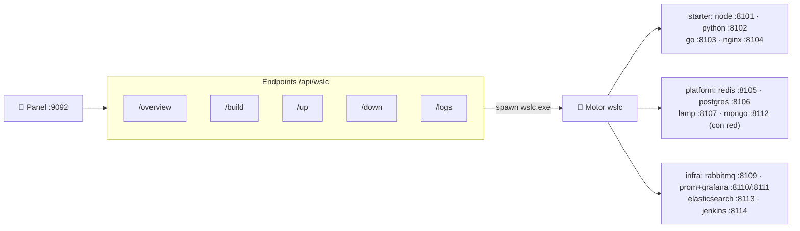

# ⚙️ Especificaciones Técnicas — WSL Container Center

> **Versión**: v1
> **Estado**: 🟢 Activo
> **Audiencia**: 👥 Técnico, DevOps, reclutadores
> **Objetivo**: Stacks, puertos, endpoints del panel, esquema del catálogo, multi-contenedor + red y health IPv4/IPv6

---

## 🗺️ Esquema



---

## 🖥️ Base de ejecución

| Componente | Estado actual |
| --- | --- |
| Motor de contenedores | `wslc` (WSL 2.9+, preview) en `C:\Program Files\WSL\wslc.exe` |
| Panel principal | `dashboard-server/server.js` en `9092` (solo `127.0.0.1`) |
| Puente Windows → motor | El panel ejecuta `wslc.exe` como proceso hijo |
| Launcher Windows | `wsl-labs-launcher.exe` compilado con Go 1.21 (stdlib puro, cero dependencias) |
| Instalador Windows | Inno Setup `.exe` distribuido por GitHub Releases |
| Fuente de verdad | `containers/containers.config.json` (casos, imágenes, puertos, redes, health) |

---

## 🧬 Stacks por caso

| Caso | Título | Categoría | Imágenes | Red |
| :---: | --- | --- | --- | --- |
| `01` | API Node.js | starter | `wsl-labs/node-api` (custom, `node:20-alpine`) | — |
| `03` | API Python (Flask) | starter | `wsl-labs/python-api` (custom, `python:3.12-alpine`) | — |
| `10` | API Go | starter | `wsl-labs/go-api` (custom, multi-stage) | — |
| `06` | Nginx web | starter | `wsl-labs/nginx-web` (custom, `nginx:alpine`) | — |
| `04` | Cache Redis + app | platform | `wsl-labs/redis-app` + `redis:7-alpine` | `wslc-redis-net` |
| `05` | API + PostgreSQL | platform | `wsl-labs/pg-app` + `postgres:15` | `wslc-pg-net` |
| `02` | LAMP (PHP + MariaDB) | platform | `wsl-labs/php-lamp` + `mariadb:10.6` | `wslc-lamp-net` |
| `09` | App multi-servicio | platform | `wsl-labs/multi-backend` + `mongo:7` | `wslc-multi-net` |
| `07` | RabbitMQ | infra | `rabbitmq:3-management` (público) | — |
| `08` | Prometheus + Grafana | infra | `prom/prometheus` + `grafana/grafana` (públicas) | `wslc-obs-net` |
| `11` | Elasticsearch | infra | `elasticsearch:8.11.0` (público) | — |
| `12` | Jenkins CI | infra | `jenkins/jenkins:lts` (público) | — |

> [!NOTE]
> Las imágenes **custom** se construyen con `wslc build -t <imagen> <contexto>` desde
> un `Dockerfile` en `containers/NN-*/`. Las imágenes **públicas** se descargan al
> ejecutar `wslc run` y no requieren **📦 Construir**.

---

## 🔌 Puertos — casos en localhost

| Caso | Puerto host | URL |
| :---: | ---: | --- |
| 🧭 Panel | `9092` | <http://localhost:9092> |
| `01` API Node.js | `8101` | <http://localhost:8101> |
| `03` API Python | `8102` | <http://localhost:8102> |
| `10` API Go | `8103` | <http://localhost:8103> |
| `06` Nginx web | `8104` | <http://localhost:8104> |
| `04` Redis + app | `8105` | <http://localhost:8105> |
| `05` API + PostgreSQL | `8106` | <http://localhost:8106> |
| `02` LAMP | `8107` | <http://localhost:8107> |
| `07` RabbitMQ | `8109` | <http://localhost:8109> |
| `08` Prometheus / Grafana | `8110` / `8111` | <http://localhost:8110> · <http://localhost:8111> |
| `09` Multi-servicio (Mongo) | `8112` | <http://localhost:8112> |
| `11` Elasticsearch | `8113` | <http://localhost:8113> |
| `12` Jenkins CI | `8114` | <http://localhost:8114> |

> RabbitMQ además expone `5672` (protocolo AMQP) junto a `8109` (panel de administración).

---

## 📡 Endpoints del panel

Todos bajo `http://localhost:9092`. Los `/api/*` respetan el token opcional (ver más
abajo); las acciones `POST` están además limitadas por rate-limit.

| Método | Ruta | Descripción |
| --- | --- | --- |
| `GET` | `/api/wslc/overview` | Disponibilidad del motor + estado de los 12 casos (built, running, totales) |
| `POST` | `/api/wslc/build` | `wslc build -t <imagen> <contexto>` por cada imagen del caso `{ id }` |
| `POST` | `/api/wslc/up` | Crea la red (si aplica) y `wslc run -d` de cada contenedor del caso |
| `POST` | `/api/wslc/down` | `wslc stop` + `wslc rm` de cada contenedor (+ `network rm`) |
| `POST` | `/api/wslc/logs` | `wslc logs` del contenedor principal del caso |
| `GET` | `/`, `/index.html`, `/dashboard.css`, `/dashboard.js` | UI estática |

**Contrato de las acciones POST** — cuerpo `{ "id": "01" }`. Respuesta:

```json
{ "ok": true, "id": "01", "action": "up", "output": "[run wslc-node-api] OK\n..." }
```

| Aspecto | Valor |
| --- | --- |
| `id` válido | Regex `^[\w-]+$` y debe existir en el catálogo (si no → `400`/`404`) |
| Body máximo | 8 KB (excede → error) |
| Timeout build/up | 600 s (pull + capas + arranque) |
| Timeout logs | 12 s |
| Timeout health | 3 s |
| Rate-limit | 30 POST / IP / 60 s |

---

## 📇 Esquema del catálogo (`containers/containers.config.json`)

Cabecera del documento:

| Campo | Ejemplo | Rol |
| --- | --- | --- |
| `project` | `"WSL Container Center"` | Nombre mostrado en el panel |
| `subtitle` | `"Levanta y controla contenedores con wslc…"` | Subtítulo del panel |
| `engine` | `"wslc"` | Motor de contenedores |
| `portBase` | `8100` | Base de puertos del catálogo |
| `cases[]` | array | Definición de cada caso |

Campos de cada caso:

| Campo | Aplica a | Descripción |
| --- | --- | --- |
| `id` | todos | Identificador (`"01"`) usado por la API |
| `name` / `title` | todos | Nombre corto y título mostrado en la tarjeta |
| `description` | todos | Texto descriptivo del caso |
| `category` | todos | `starter`, `platform` o `infra` |
| `port` / `url` | todos | Puerto y URL publicados en `localhost` |
| `healthProtocol` | todos | `http` (todos los casos actuales) |
| `network` | multi-contenedor | Nombre de la red wslc a crear (p. ej. `wslc-pg-net`) |
| `build[]` | casos custom | Lista de `{ image, context }` a construir con `wslc build` |
| `containers[]` | todos | Lista de `{ name, image, ports[], env[], volumes[] }` a ejecutar con `wslc run` |
| `requirements` | todos | Datos medidos: `{ imageSizeMB, ramIdleMB, ramMinMB, ramRecMB }` |
| `limits` | todos | Tope de recursos aplicado al `run`: `{ memMB, cpus }` (`-m`, `--cpus`) |
| `containers[].volumes[]` | casos con datos | `"nombre:/ruta"` — volumen con nombre que persiste al bajar/levantar |

Ejemplo de un caso multi-contenedor (`05`):

```json
{
  "id": "05",
  "network": "wslc-pg-net",
  "build": [{ "image": "wsl-labs/pg-app:latest", "context": "containers/05-postgres-api" }],
  "containers": [
    { "name": "wslc-postgres", "image": "postgres:15", "ports": [], "env": ["POSTGRES_PASSWORD=wsl-labs", "POSTGRES_DB=app"] },
    { "name": "wslc-pg-app", "image": "wsl-labs/pg-app:latest", "ports": ["8106:8000"], "env": ["PG_HOST=wslc-postgres"] }
  ]
}
```

> [!IMPORTANT]
> El contenedor **principal** de un caso es el que publica el puerto del caso
> (`ports` empieza por `<port>:`). El panel usa ese contenedor para el health-check y
> para **📄 Logs**.

---

## 🕸️ Multi-contenedor + red

Los casos **platform** y `08` observabilidad levantan más de un contenedor sobre una
**red wslc** dedicada:

1. **▶ Levantar** primero ejecuta `wslc network create <network>` (idempotente).
2. Cada contenedor se lanza con `--network <network>`, de modo que se **resuelven por
   nombre** (p. ej. la app apunta a su base con `PG_HOST=wslc-postgres`, `REDIS_HOST=wslc-redis`,
   `DB_HOST=wslc-mariadb`, `MONGO_HOST=wslc-mongo`).
3. **⏹ Bajar** elimina los contenedores y luego la red con `wslc network rm`.

---

## 🩺 Health-check IPv4 + IPv6

| Aspecto | Implementación |
| --- | --- |
| Hosts probados | `127.0.0.1` **y** `::1` (evita falsos "abajo" por bind IPv6) |
| Protocolo | `http`: GET `/`, sano si el status es `< 500` |
| Detección de "construido" | Se compara el nombre de imagen del caso contra `wslc images` |
| Detección de "corriendo" | Se busca el contenedor principal en `wslc list` |
| Estados | `running` · `degraded` · `stopped` · `missing` · `unavailable` |

---

## 🔒 Seguridad y robustez del panel

| Aspecto | Implementación |
| --- | --- |
| Bind | Solo `127.0.0.1` — no expuesto a la red |
| Autenticación | Token Bearer/Cookie opcional vía `WSL_LABS_TOKEN` (sin él, modo dev abierto) |
| Validación de inputs | `id` validado con regex `^[\w-]+$` contra el catálogo antes de ejecutar |
| Body limit | 8 KB máximo en requests POST |
| Rate limiting | 30 requests POST / IP / 60 s (en memoria, sin dependencias) |
| Timeouts | build/up 600 s · logs 12 s · health 3 s |
| Error handling | Errores internos capturados; respuesta sin volcar internals |

### Variables de entorno

| Variable | Efecto |
| --- | --- |
| `PORT` | Puerto del panel (default `9092`) |
| `WSL_LABS_WSLC` | Ruta a `wslc.exe` (override del default `C:\Program Files\WSL\wslc.exe`) |
| `WSL_LABS_TOKEN` | Activa autenticación por token |
| `WSL_LABS_ROOT_WIN` | Raíz del repo en Windows (default: carpeta padre del servidor) |

---

## 🧪 CI/CD — GitHub Actions

| Workflow | Trigger | Descripción |
| --- | --- | --- |
| `docs` | push / PR | markdownlint sobre la documentación |
| `dashboard` | push / PR | Tests Node del panel |
| `build-windows` | tag `v*.*.*` | Compila el launcher Go y el instalador Inno Setup |

---

## 📚 Documentos relacionados

- [ARCHITECTURE.md](ARCHITECTURE.md)
- [TOOLING.md](TOOLING.md)
- [Track de contenedores WSLC](wslc-contenedores.md)
- [Setup del panel](DASHBOARD_SETUP.md)
- [../SYSTEM_SPECS.md](../SYSTEM_SPECS.md)
