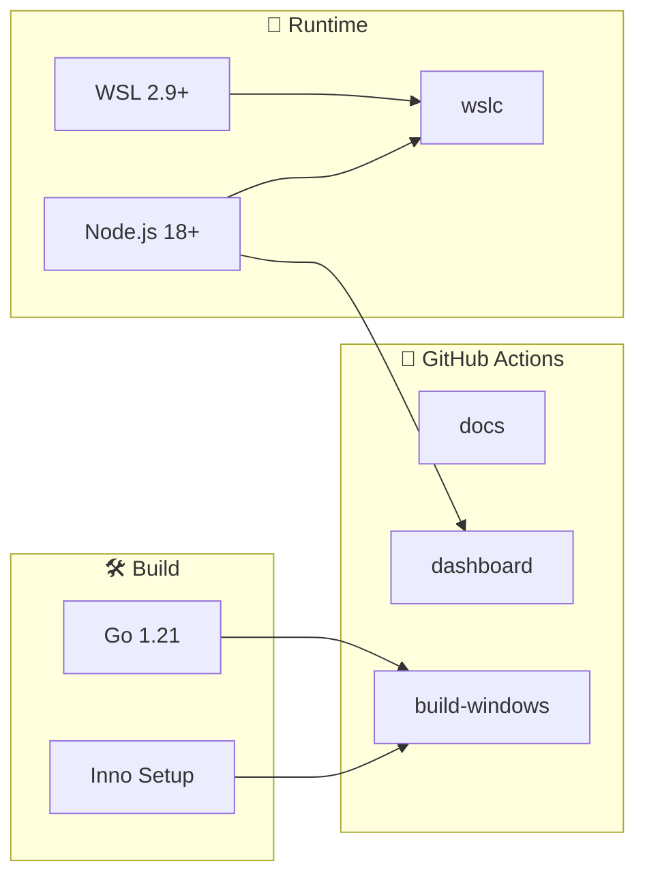

# 🧰 Tooling — WSL Container Center

> **Versión**: v1
> **Estado**: 🟢 Activo
> **Uso recomendado**: Referencia corta de herramientas para operar, desarrollar y mantener el workspace

---

## 🗺️ Esquema

---

## 🐳 Herramientas de runtime

Lo mínimo para **ejecutar** el sistema y sus contenedores.

| Herramienta | Uso |
| --- | --- |
| WSL 2.9+ | Aloja el motor de contenedores nativo; reexpone puertos en `localhost` |
| `wslc` | Motor de contenedores nativo de WSL (`C:\Program Files\WSL\wslc.exe`) |
| `wslc build` | Construye imágenes custom desde un `Dockerfile` (contexto `containers/NN-*/`) |
| `wslc run` / `stop` / `rm` | Ciclo de vida de los contenedores (levantar / bajar) |
| `wslc network` | Redes para los casos multi-contenedor |
| `wslc images` / `list` / `logs` | Inspección de imágenes, contenedores y logs |
| Node.js 18+ | Motor del panel (módulo `http` nativo, sin npm) que ejecuta `wslc.exe` |
| `curl` / `Invoke-WebRequest` | Comprobación manual de endpoints en `localhost` |

> [!NOTE]
> `wslc` es un runtime de contenedores **tipo Docker** integrado en WSL: su interfaz
> (`build`, `run`, `pull`, `images`, `list`, `logs`, `stop`, `rm`, `network`, `volume`)
> reproduce el subconjunto más habitual de `docker`. Ver el
> [Track de contenedores WSLC](wslc-contenedores.md).

---

## 🛠️ Herramientas de desarrollo

Para **construir, versionar y compilar** los componentes.

| Herramienta | Uso |
| --- | --- |
| Go 1.21+ | Compilar el launcher Windows (`go build`, stdlib puro) |
| Inno Setup | Empaquetar el instalador `.exe` |
| Git | Versionado y publicación |
| PowerShell / Windows Terminal | Operación local en Windows |
| Make | Targets de automatización (`make serve`) |

> [!NOTE]
> El launcher no tiene dependencias externas (solo la stdlib de Go) y el panel no tiene
> dependencias npm (solo el módulo `http`). Ambos compilan/corren sin descargar paquetes.

---

## 🤖 Herramientas de calidad y CI

Automatizan la validación en cada push/PR y la publicación de releases.

| Herramienta | Uso |
| --- | --- |
| GitHub Actions | Orquesta los workflows del repo |
| markdownlint | Linter de la documentación (workflow `docs`) |
| Node test runner | Tests del panel (workflow `dashboard`) |
| Chocolatey | Instala Inno Setup en el runner de CI (`build-windows`) |

### Workflows

| Workflow | Trigger | Rol |
| --- | --- | --- |
| `docs` | push / PR | markdownlint |
| `dashboard` | push / PR | tests Node del panel |
| `build-windows` | tag `v*.*.*` | compila launcher + instalador y publica en Releases |

---

## 📚 Documentos relacionados

- [TECHNICAL_SPECS.md](TECHNICAL_SPECS.md)
- [ARCHITECTURE.md](ARCHITECTURE.md)
- [Track de contenedores WSLC](wslc-contenedores.md)
- [../ENVIRONMENT_SETUP.md](../ENVIRONMENT_SETUP.md)
- [../RUNBOOK.md](../RUNBOOK.md)
