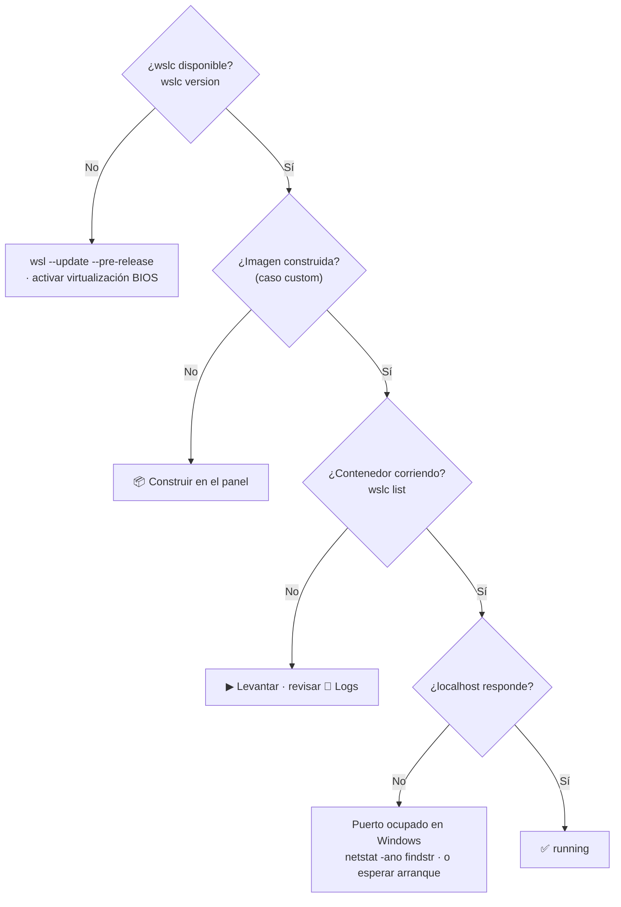

# 🧯 Resolución de problemas — WSL Container Center

> Problemas comunes al operar el panel y los casos de contenedores, en formato
> **problema → causa → solución**.
> Para conceptos de contenedores WSLC, ver el
> [Track de contenedores WSLC](wslc-contenedores.md) y los
> [cheatsheets](../cheatsheets/troubleshooting.md).

## 🗺️ Esquema



---

## 🚫 `wslc` no está instalado

**Problema:** el panel muestra los casos como **unavailable** o el overview responde
`available: false`.

**Causa:** `wslc` (el motor de contenedores de WSL) no está presente. Llega con la
versión **preview** de WSL 2.9+.

**Solución:**

```powershell
wsl --update --pre-release
wsl --shutdown
& "C:\Program Files\WSL\wslc.exe" version
```

- Si el binario está en otra ruta, apúntalo con `WSL_LABS_WSLC` antes de arrancar el panel.
- Habilita en BIOS/UEFI la **virtualización** (VT-x / AMD-V) y en Windows la
  característica **"Plataforma de máquina virtual"** (requisito de WSL 2).

---

## 📦 Imagen sin construir

**Problema:** un caso custom (starter, `06`, `10`) aparece como **missing / Imagen
sin construir** y no levanta.

**Causa:** la imagen del caso todavía no existe en `wslc images`.

**Solución:**

1. Pulsa **📦 Construir** en la tarjeta del caso (`POST /api/wslc/build`).
2. Espera a `[build <imagen>] OK` en la salida. La primera vez descarga la imagen base.
3. Verifica a mano si hace falta:

```powershell
& "C:\Program Files\WSL\wslc.exe" images
```

---

## 🔌 Puerto ocupado

**Problema:** un caso queda **degraded** / no arranca, o el panel no levanta en `:9092`.

**Causa:** otro proceso de Windows ya usa ese puerto (8101, 8104, 9092…).

**Solución:**

```powershell
netstat -ano | findstr 8101      # ¿quién usa el puerto?
tasklist | findstr <PID>          # identifica el proceso
```

Cierra el proceso que ocupa el puerto, o cambia el puerto del caso en
[`containers/containers.config.json`](../containers/containers.config.json) de forma
consciente (campo `port` y el mapeo `ports` del contenedor). Ver la tabla de puertos
en [Requisitos](REQUIREMENTS.md#-puertos).

---

## ⚙️ Un contenedor no arranca

**Problema:** pulsas **▶ Levantar** y el caso no pasa a **running**.

**Causa:** la imagen no está construida, el puerto está ocupado, o el contenedor
falla al iniciarse.

**Solución:**

1. Si el estado es **📦 Imagen sin construir**, pulsa **📦 Construir** primero.
2. Revisa **📄 Logs** en la tarjeta del caso (`POST /api/wslc/logs`).
3. Inspecciona a mano:

```powershell
& "C:\Program Files\WSL\wslc.exe" list
& "C:\Program Files\WSL\wslc.exe" logs wslc-node-api
```

1. Vuelve a **▶ Levantar**: es idempotente (hace `stop` + `rm` del contenedor previo
   con el mismo nombre antes de recrearlo).

---

## 🕸️ Multi-contenedor sin red

**Problema:** un caso multi-contenedor (LAMP, redis, postgres, mongo, observabilidad)
levanta, pero la app no ve a su base de datos / dependencia.

**Causa:** los contenedores se comunican por **nombre** a través de una **red wslc**
dedicada. Si la red no existe, no se resuelven entre sí.

**Solución:** desde el panel, **▶ Levantar** crea la red automáticamente
(`wslc network create <red>`) antes de lanzar los contenedores. Si operas a mano,
créala tú y usa `--network`:

```powershell
& "C:\Program Files\WSL\wslc.exe" network create wslc-pg-net
& "C:\Program Files\WSL\wslc.exe" network ls
```

El nombre de la red y las variables como `PG_HOST=wslc-postgres` vienen en el campo
`network` y `containers[].env` del caso en el catálogo.

---

## 🐢 Elasticsearch / Jenkins tardan

**Problema:** `11` Elasticsearch o `12` Jenkins quedan **degraded** un buen rato tras
levantarlos.

**Causa:** son casos **infra** pesados: la JVM y la inicialización interna tardan más
que un starter. Elasticsearch necesita memoria (`ES_JAVA_OPTS=-Xms512m -Xmx512m`).

**Solución:**

- Dales tiempo: refresca el panel varias veces; pasarán a **running** cuando el
  servicio interno esté listo.
- Comprueba el avance en **📄 Logs**.
- Asegúrate de tener **RAM suficiente** (ver [Requisitos](REQUIREMENTS.md)); con la
  máquina saturada, tardan más o fallan.

---

## 🧭 El panel no responde

**Problema:** `http://localhost:9092` no abre o la API no responde.

**Causa:** el panel no está corriendo, o Node.js no está en el PATH de Windows.

**Solución:**

```powershell
node --version                              # ¿Node 18+ en Windows?
cd C:\dev\wsl-labs
node dashboard-server/server.js             # o: make serve
Invoke-RestMethod http://localhost:9092/api/wslc/overview
```

- Recuerda que escucha **solo en `127.0.0.1`** (no en la red, por diseño).
- Si activaste `WSL_LABS_TOKEN`, añade el header `Authorization: Bearer <token>` a las
  llamadas `/api`.

---

## ⚠️ Un caso queda "degraded"

**Problema:** el estado es **degraded** ⚠️ (contenedor arriba, pero aún no responde
en el puerto).

**Causa:** el proceso interno del contenedor todavía está arrancando, o su config falla.

**Solución:**

1. Espera unos segundos y **refresca** el panel: casos recién levantados pasan de
   `degraded` a `running` cuando el proceso interno acepta conexiones.
2. Si persiste, revisa **📄 Logs** del contenedor.
3. **⏹ Bajar** y volver a **▶ Levantar** si la config quedó a medias.

---

## 🧹 Reinicio limpio

**Problema:** varios casos en estado inconsistente y quieres empezar de cero.

**Solución:** baja los casos desde el panel (**⏹ Bajar** en cada uno), o a mano:

```powershell
& "C:\Program Files\WSL\wslc.exe" list                # ver qué corre
& "C:\Program Files\WSL\wslc.exe" stop <contenedor>
& "C:\Program Files\WSL\wslc.exe" rm   <contenedor>
```

> [!NOTE]
> Bajar un caso **elimina sus contenedores pero conserva la imagen** en
> `wslc images`. Relanzar es rápido y no requiere reconstruir.

---

## 🔗 Documentos relacionados

- [Manual de usuario](USER_MANUAL.md)
- [Setup del panel](DASHBOARD_SETUP.md)
- [Requisitos](REQUIREMENTS.md)
- [Instalación completa](INSTALL.md)
- [Track de contenedores WSLC](wslc-contenedores.md)
- [RUNBOOK operativo](../RUNBOOK.md)
- [COMPATIBILITY.md](../COMPATIBILITY.md)
- [Cheatsheet de troubleshooting](../cheatsheets/troubleshooting.md)
