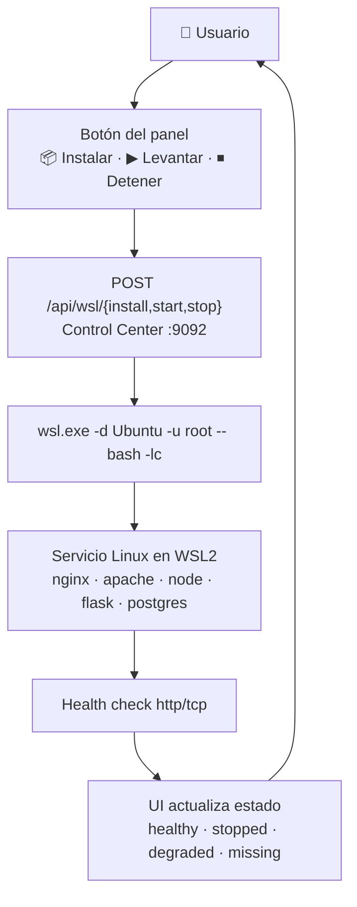

# 📘 Manual de Usuario — WSL Control Center

> **Versión**: v1 · **Estado**: 🟢 Operativo
> **Audiencia**: 👥 Operadores del panel, usuarios del día a día
> **Objetivo**: Operar el Control Center para instalar, levantar, inspeccionar y
> detener servicios Linux sobre WSL2 desde Windows.
<!-- -->

> [!NOTE]
> `wsl-labs` es **100 % local**: todo corre en tu Windows + WSL2. No hay
> Kubernetes ni nube (a diferencia de [`docker-labs`](https://github.com/vladimiracunadev-create/docker-labs)).
> El Control Center es un servidor Node.js en `http://localhost:9092` que ejecuta
> comandos **dentro de WSL como `root`** (estilo Docker, sin contraseña).

## 🗺️ Esquema



---

## 🧭 Flujo recomendado

1. Abre el panel en **<http://localhost:9092>**
2. Elige un servicio (por ejemplo, `05` nginx)
3. Si aparece **No instalado**, pulsa **📦 Instalar**
4. Pulsa **▶ Levantar**
5. Comprueba que el estado pasa a **✅ healthy**
6. Pulsa **🌐 Abrir** para verlo en el navegador
7. Revisa **📄 Logs** si algo queda a medias
8. Pulsa **⏹ Detener** cuando termines

> [!TIP]
> El ciclo estilo Docker es siempre el mismo: **📦 Instalar → ▶ Levantar**.
> No necesitas terminal ni contraseña.

---

## 🧠 Diferencia clave

| Concepto | Significado |
| --- | --- |
| **Estado del servicio** | Indica si el servicio Linux está instalado, corriendo y respondiendo en su puerto |
| **Abrir** | Entra a la app/servicio real (nginx, apache, flask…) publicado en `localhost` |
| **Panel (`:9092`)** | La capa de control en Windows — no es el servicio, lo administra |

Ejemplo: `05-servidor-web-nginx` puede estar **healthy** en el panel, pero el
sitio real lo ves en **<http://localhost:8080>**.

---

## 🏛️ Servicios y puertos

| Servicio | Lab | Tipo | Puerto | URL | Health |
| --- | :---: | --- | ---: | --- | :---: |
| 🧭 Control Center | — | panel | 9092 | <http://localhost:9092> | — |
| 🌐 NGINX | 05 | service (`service`) | 8080 | <http://localhost:8080> | `http` |
| 🐘 Apache + PHP | 06 | service (`service`) | 8081 | <http://localhost:8081> | `http` |
| 🟢 Node API | 07 | systemd (`wsl-labs-node`) | 8082 | <http://localhost:8082> | `http` |
| 🐍 Flask | 08 | systemd (`wsl-labs-flask`) | 8083 | <http://localhost:8083> | `http` |
| 🗄️ PostgreSQL | 09 | service (`service`) | 5432 | `postgres://localhost:5432` | `tcp` |
| 🧱 Mini-servidor | 11 | service (nginx vhost) | 8090 | <http://localhost:8090> | `http` |

> [!NOTE]
> Los labs `01`, `02`, `03`, `04`, `10` y `12` son de **aprendizaje** (learning):
> no publican servicio y aparecen con estado `n/a` 📚. Consulta la
> [Guía para principiantes](BEGINNERS_GUIDE.md) para el orden de estudio.

---

## 🎯 Operación por casos

### Caso 1 — Instalar un servicio por primera vez

1. Abre el panel → localiza la tarjeta del servicio (p. ej. `06 apache+php`).
2. Si el estado es **missing / No instalado**, pulsa **📦 Instalar**.
3. El panel llama a `POST /api/wsl/install`, que ejecuta el `install-*.sh` del
   servicio **como `root`** dentro de WSL. Es **idempotente**: puedes repetirlo.
4. Al terminar verás la línea `[wsl-labs] <servicio> OK en :<puerto>`.

> [!IMPORTANT]
> La instalación descarga paquetes con `apt` dentro de WSL: puede tardar el
> primer minuto. No cierres el panel mientras corre.

### Caso 2 — Levantar un servicio

1. Con el servicio ya instalado, pulsa **▶ Levantar**.
2. El panel llama a `POST /api/wsl/start` con el `startCommand` del catálogo.
3. El estado debería pasar a **✅ healthy** en unos segundos.

Detrás de cada botón:

| Servicio | Qué ejecuta el panel (como root) |
| --- | --- |
| nginx / apache / postgresql | `service <x> start` |
| node | `systemctl enable --now wsl-labs-node` + `restart` |
| flask | `systemctl enable --now wsl-labs-flask` + `restart` |
| mini-servidor | activa el vhost `wsl-labs-mini`, recarga nginx y arranca postgres |

### Caso 3 — Abrir el servicio en el navegador

1. Con el servicio **healthy**, pulsa **🌐 Abrir** (o escribe la URL a mano).
2. Comprueba la respuesta:

```powershell
Invoke-WebRequest http://localhost:8080 -UseBasicParsing
```

### Caso 4 — Ver logs

1. Pulsa **📄 Logs** en la tarjeta del servicio.
2. El panel llama a `POST /api/wsl/logs` y devuelve las últimas líneas:

| Servicio | Fuente de logs |
| --- | --- |
| nginx | `tail /var/log/nginx/access.log` |
| apache | `tail /var/log/apache2/access.log` |
| node | `journalctl -u wsl-labs-node` |
| flask | `journalctl -u wsl-labs-flask` |
| postgresql | `tail /var/log/postgresql/*.log` |

### Caso 5 — Detener un servicio

1. Pulsa **⏹ Detener**.
2. El panel llama a `POST /api/wsl/stop` con el `stopCommand` del catálogo.
3. El estado pasa a **⏹ stopped**.

### Caso 6 — Verificar salud manualmente

```powershell
# Estado global de los 12 labs
Invoke-RestMethod http://localhost:9092/api/overview

# Salud de un servicio concreto (lab 05)
Invoke-RestMethod http://localhost:9092/api/health/05
```

---

## 📊 Tabla de estados

El Control Center clasifica cada servicio así:

| Estado | Emoji | Significado | Acción típica |
| --- | :---: | --- | --- |
| `healthy` | ✅ | Responde correctamente en su puerto | Usar / **Abrir** |
| `degraded` | ⚠️ | Puerto abierto pero HTTP da error | Revisar **Logs** |
| `stopped` | ⏹ | Puerto cerrado / servicio abajo | **▶ Levantar** |
| `missing` | 📦 | **No instalado** (falta el binario en WSL) | **📦 Instalar** |
| `n/a` | 📚 | Lab de aprendizaje (sin servicio) | Seguir la guía del lab |

> [!TIP]
> La detección de "instalado" **cachea y acumula positivos**: una vez que un
> servicio se detecta instalado, no vuelve a parpadear a "No instalado" en
> sondas lentas. Los health-checks prueban **IPv4 e IPv6** (como `curl localhost`).

---

## 🔌 La API REST (ejemplos PowerShell)

El panel expone una API sencilla en `127.0.0.1:9092`. Todo lo que hacen los
botones puedes hacerlo con `Invoke-RestMethod`.

### Autenticación (opcional)

Por defecto la API está abierta en modo local. Si defines la variable de entorno
`WSL_LABS_TOKEN` antes de arrancar el panel, cada llamada `/api` requiere el
header `Authorization: Bearer <token>`.

```powershell
# Cabeceras base (con token opcional)
$h = @{ 'Content-Type' = 'application/json' }
# $h['Authorization'] = 'Bearer <tu-token>'   # solo si activaste WSL_LABS_TOKEN
```

### GET `/api/overview` — estado de todo el catálogo

```powershell
Invoke-RestMethod http://localhost:9092/api/overview
```

### GET `/api/health/:id` — salud de un servicio

```powershell
Invoke-RestMethod http://localhost:9092/api/health/05
```

### POST `/api/wsl/install` — instalar un servicio (como root)

```powershell
Invoke-RestMethod -Method Post -Headers $h -Body '{ "id": "06" }' `
  http://localhost:9092/api/wsl/install
```

### POST `/api/wsl/start` — levantar un servicio

```powershell
Invoke-RestMethod -Method Post -Headers $h -Body '{ "id": "05" }' `
  http://localhost:9092/api/wsl/start
```

### POST `/api/wsl/stop` — detener un servicio

```powershell
Invoke-RestMethod -Method Post -Headers $h -Body '{ "id": "05" }' `
  http://localhost:9092/api/wsl/stop
```

### POST `/api/wsl/logs` — leer logs

```powershell
Invoke-RestMethod -Method Post -Headers $h -Body '{ "id": "05" }' `
  http://localhost:9092/api/wsl/logs
```

> [!WARNING]
> El panel ejecuta los comandos **como `root` dentro de WSL** (`wsl.exe -u root`,
> sin contraseña, igual que Docker corre privilegiado). Solo escucha en
> `127.0.0.1`, nunca en la red. Aun así, trátalo como una herramienta con
> privilegios en tu máquina — consulta [SECURITY.md](../SECURITY.md).

---

## 💓 Keepalive — mantener WSL viva

Mientras el Control Center corre, mantiene **viva la instancia WSL** (como Docker
Desktop con su VM). Esto evita que WSL se apague sola por inactividad y tire
abajo los servicios que levantaste. Si cierras el panel, WSL puede apagarse
sola tras un rato; vuelve a abrir el panel y los servicios systemd (`node`,
`flask`) rearrancan solos en el siguiente boot.

---

## ✅ Buenas prácticas

- Instala solo los servicios que vayas a usar (cada `install-*.sh` es idempotente).
- Usa **▶ Levantar / ⏹ Detener** desde el panel en vez de matar procesos a mano.
- Si algo queda **degraded**, mira **Logs** antes de reinstalar.
- `wsl --shutdown` detiene **todos** los servicios: úsalo solo para un reinicio limpio.
- Repasa la [Guía de resolución de problemas](TROUBLESHOOTING.md) si un servicio no levanta.

---

## 🔗 Documentos relacionados

- [README del proyecto](../README.md)
- [Guía para principiantes](BEGINNERS_GUIDE.md)
- [Setup del Control Center](DASHBOARD_SETUP.md)
- [Instalación completa](INSTALL.md)
- [Requisitos](REQUIREMENTS.md)
- [Resolución de problemas](TROUBLESHOOTING.md)
- [RUNBOOK operativo](../RUNBOOK.md)
