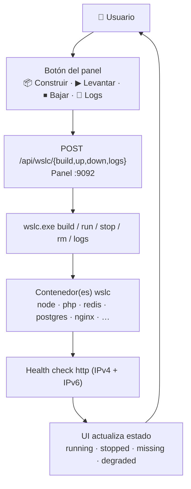

# 📘 Manual de Usuario — WSL Container Center

> **Versión**: v1 · **Estado**: 🟢 Operativo
> **Audiencia**: 👥 Operadores del panel, usuarios del día a día
> **Objetivo**: Operar el panel para construir, levantar, inspeccionar y bajar
> **contenedores** con `wslc` (el motor de contenedores nativo de WSL) desde Windows.
<!-- -->

> [!NOTE]
> `wsl-labs` es **100 % local**: todo corre en tu Windows + WSL 2. Es como
> [`docker-labs`](https://github.com/vladimiracunadev-create/docker-labs), pero
> el motor es **`wslc`** en vez de Docker. El panel es un servidor Node.js en
> `http://localhost:9092` que ejecuta `wslc.exe` para gestionar contenedores.

## 🗺️ Esquema



---

## 🧭 Flujo recomendado

1. Abre el panel en **<http://localhost:9092>**
2. Elige un caso (por ejemplo, `01 API Node.js`)
3. Si el caso usa **imagen custom** y aparece **Imagen sin construir**, pulsa **📦 Construir**
4. Pulsa **▶ Levantar**
5. Comprueba que el estado pasa a **✅ running**
6. Pulsa **🌐 Abrir** para verlo en el navegador
7. Revisa **📄 Logs** si algo queda a medias
8. Pulsa **⏹ Bajar** cuando termines

> [!TIP]
> El ciclo es siempre el mismo, estilo Docker: **📦 Construir → ▶ Levantar → 🌐 Abrir**.
> Los casos que usan imágenes **públicas** (redis, postgres, jenkins…) no necesitan
> construir: van directo a **▶ Levantar**. No hace falta terminal.

---

## 🧠 Diferencia clave

| Concepto | Significado |
| --- | --- |
| **Estado del caso** | Si sus contenedores están construidos, corriendo y respondiendo en el puerto |
| **Abrir** | Entra a la app/servicio real publicado por el contenedor en `localhost` |
| **Panel (`:9092`)** | La capa de control en Windows — no es el contenedor, lo administra |

Ejemplo: `06 Nginx web` puede aparecer **running** en el panel, pero el sitio real
lo ves en **<http://localhost:8104>**.

---

## 🐳 Catálogo de casos y puertos

Los 12 casos vienen portados de `docker-labs` y están **verificados corriendo** con
`wslc`. Se agrupan en tres categorías: **starter**, **platform** y **infra**.

| Caso | Categoría | Contenedores | Puerto | URL |
| :---: | --- | --- | ---: | --- |
| 🧭 Panel | — | — | 9092 | <http://localhost:9092> |
| `01` API Node.js | starter | 1 (custom) | 8101 | <http://localhost:8101> |
| `02` LAMP (PHP + MariaDB) | platform | 2 (+ red) | 8107 | <http://localhost:8107> |
| `03` API Python (Flask) | starter | 1 (custom) | 8102 | <http://localhost:8102> |
| `04` Cache Redis + app | platform | 2 (+ red) | 8105 | <http://localhost:8105> |
| `05` API + PostgreSQL | platform | 2 (+ red) | 8106 | <http://localhost:8106> |
| `06` Nginx web | starter | 1 (custom) | 8104 | <http://localhost:8104> |
| `07` RabbitMQ | infra | 1 (público) | 8109 | <http://localhost:8109> |
| `08` Prometheus + Grafana | infra | 2 (+ red) | 8110 | <http://localhost:8110> (+ `:8111`) |
| `09` App multi-servicio (Mongo) | platform | 2 (+ red) | 8112 | <http://localhost:8112> |
| `10` API Go | starter | 1 (custom) | 8103 | <http://localhost:8103> |
| `11` Elasticsearch | infra | 1 (público) | 8113 | <http://localhost:8113> |
| `12` Jenkins CI | infra | 1 (público) | 8114 | <http://localhost:8114> |

> [!NOTE]
> Los casos **starter** y los `06`, `10` construyen una **imagen custom** desde un
> `Dockerfile` en `containers/NN-*/`. Los casos **multi-contenedor** (LAMP, redis,
> postgres, mongo, observabilidad) levantan sus contenedores sobre una **red wslc**
> dedicada para que se vean entre sí por nombre.

---

## 🎯 Operación por casos

### Caso 1 — Construir la imagen de un caso custom

1. Abre el panel → localiza la tarjeta (p. ej. `01 API Node.js`).
2. Si el estado es **Imagen sin construir**, pulsa **📦 Construir**.
3. El panel llama a `POST /api/wslc/build`, que ejecuta `wslc build -t <imagen>
   <contexto>` por cada imagen declarada del caso (contexto en `containers/NN-*/`).
4. Al terminar verás `[build <imagen>] OK` en la salida.

> [!IMPORTANT]
> La primera construcción descarga la imagen base y las capas: puede tardar un
> minuto (o varios en Elasticsearch/Jenkins). No cierres el panel mientras corre.

### Caso 2 — Levantar un caso

1. Con la imagen ya construida (o si el caso usa imágenes públicas), pulsa **▶ Levantar**.
2. El panel llama a `POST /api/wslc/up`. Por cada contenedor del caso ejecuta
   `wslc run -d --name … [-p …] [-e …] [--network …]`. Si el caso define una red,
   el panel la crea antes con `wslc network create`.
3. El estado debería pasar a **✅ running** en unos segundos.

> [!TIP]
> Levantar es **idempotente**: antes de crear cada contenedor, el panel hace
> `wslc stop` + `wslc rm` de un contenedor previo con el mismo nombre. Puedes
> pulsar **▶ Levantar** de nuevo sin miedo a duplicados.

### Caso 3 — Abrir el caso en el navegador

1. Con el caso **running**, pulsa **🌐 Abrir** (o escribe la URL a mano).
2. Comprueba la respuesta:

```powershell
Invoke-WebRequest http://localhost:8101 -UseBasicParsing
```

### Caso 4 — Ver logs

1. Pulsa **📄 Logs** en la tarjeta del caso.
2. El panel llama a `POST /api/wslc/logs`, que hace `wslc logs <contenedor
   principal>` y devuelve las últimas líneas. El contenedor "principal" es el que
   publica el puerto del caso.

### Caso 5 — Bajar un caso

1. Pulsa **⏹ Bajar**.
2. El panel llama a `POST /api/wslc/down`: hace `wslc stop` + `wslc rm` de cada
   contenedor del caso y, si el caso tiene red propia, `wslc network rm`.
3. El estado pasa a **⏹ stopped**. La **imagen construida permanece** en
   `wslc images`, lista para volver a levantar sin reconstruir.

### Caso 6 — Verificar el estado global

```powershell
# Estado de los 12 casos + disponibilidad del motor wslc
Invoke-RestMethod http://localhost:9092/api/wslc/overview
```

---

## 📊 Tabla de estados

El panel clasifica cada caso así:

| Estado | Emoji | Significado | Acción típica |
| --- | :---: | --- | --- |
| `running` | ✅ | Contenedor(es) arriba y respondiendo en su puerto | Usar / **Abrir** |
| `degraded` | ⚠️ | Contenedor arriba pero aún no responde (arrancando) | Esperar / **Logs** |
| `stopped` | ⏹ | Imagen lista, contenedores abajo | **▶ Levantar** |
| `missing` | 📦 | **Imagen sin construir** (caso custom) | **📦 Construir** |
| `unavailable` | 🚫 | `wslc` no disponible en la máquina | Ver [Instalación](INSTALL.md) |

> [!TIP]
> Los health-checks prueban **IPv4 e IPv6** (`127.0.0.1` y `::1`), igual que
> `curl localhost`. Un caso recién levantado puede verse **degraded** unos segundos
> mientras el proceso interno arranca: refresca y pasará a **running**.

---

## 🔌 La API REST (ejemplos PowerShell)

El panel expone una API sencilla en `127.0.0.1:9092`. Todo lo que hacen los botones
puedes hacerlo con `Invoke-RestMethod`. Las acciones `POST` reciben el `id` del caso.

### Autenticación (opcional)

Por defecto la API está abierta en modo local. Si defines `WSL_LABS_TOKEN` antes de
arrancar el panel, cada llamada `/api` requiere el header `Authorization: Bearer <token>`.

```powershell
# Cabeceras base (con token opcional)
$h = @{ 'Content-Type' = 'application/json' }
# $h['Authorization'] = 'Bearer <tu-token>'   # solo si activaste WSL_LABS_TOKEN
```

### GET `/api/wslc/overview` — estado de todo el catálogo

```powershell
Invoke-RestMethod http://localhost:9092/api/wslc/overview
```

### POST `/api/wslc/build` — construir la imagen de un caso

```powershell
Invoke-RestMethod -Method Post -Headers $h -Body '{ "id": "01" }' `
  http://localhost:9092/api/wslc/build
```

### POST `/api/wslc/up` — levantar un caso

```powershell
Invoke-RestMethod -Method Post -Headers $h -Body '{ "id": "01" }' `
  http://localhost:9092/api/wslc/up
```

### POST `/api/wslc/down` — bajar un caso

```powershell
Invoke-RestMethod -Method Post -Headers $h -Body '{ "id": "01" }' `
  http://localhost:9092/api/wslc/down
```

### POST `/api/wslc/logs` — leer logs del contenedor principal

```powershell
Invoke-RestMethod -Method Post -Headers $h -Body '{ "id": "01" }' `
  http://localhost:9092/api/wslc/logs
```

> [!WARNING]
> El panel escucha **solo en `127.0.0.1`**, nunca en la red. Las acciones `POST`
> tienen **rate-limit** (30 solicitudes / IP / 60 s). Trátalo como una herramienta
> con acceso al motor de contenedores de tu máquina — consulta [SECURITY.md](../SECURITY.md).

---

## ✅ Buenas prácticas

- Construye solo las imágenes de los casos que vayas a usar.
- Usa **▶ Levantar / ⏹ Bajar** desde el panel en vez de manipular contenedores a mano.
- Si un caso queda **degraded**, refresca y mira **📄 Logs** antes de reconstruir.
- **⏹ Bajar** elimina los contenedores pero conserva la imagen: relanzar es rápido.
- Los casos pesados (`11` Elasticsearch, `12` Jenkins) tardan más en pasar a
  **running**: dales tiempo antes de darlos por fallidos.
- Repasa la [Guía de resolución de problemas](TROUBLESHOOTING.md) si un caso no levanta.

---

## 🔗 Documentos relacionados

- [README del proyecto](../README.md)
- [Guía para principiantes](BEGINNERS_GUIDE.md)
- [Setup del panel](DASHBOARD_SETUP.md)
- [Instalación completa](INSTALL.md)
- [Requisitos](REQUIREMENTS.md)
- [Resolución de problemas](TROUBLESHOOTING.md)
- [Track de contenedores WSLC](wslc-contenedores.md)
- [RUNBOOK operativo](../RUNBOOK.md)
