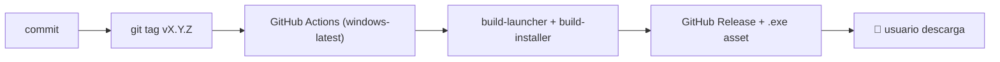

# 📦 Estrategia de distribución vía GitHub Releases — WSL Container Center

> **Versión**: 0.3.0
> **Última actualización**: 2026-07-06
> **Audiencia**: mantenedores, contribuidores, revisores técnicos

---

## 🗺️ Descripción general

WSL Container Center usa **GitHub Releases** como canal exclusivo de distribución
para el instalador precompilado de Windows. El repositorio contiene únicamente
**código fuente y scripts de build**: no se versiona ningún binario en el historial
de git.

Este documento explica el razonamiento, el flujo completo de release y cómo enlazar
el instalador desde la web del proyecto.

### 🗺️ Esquema



---

## 🚫 Por qué los binarios NO van en el repositorio

El `.gitignore` ignora explícitamente los artefactos de build:

```gitignore
# Artefactos de build (launcher / instalador)
launcher/windows/*.exe
dist/
```

Es decir: **ni el launcher (`wsl-labs-launcher.exe`) ni el instalador
(`dist/wsl-labs-setup-*.exe`) entran nunca al repo**. Se generan on-demand y se
publican como assets de Release.

| Opción | Por qué no se usa |
| -------- | ------------------ |
| Incluir el `.exe` en `main` | Contamina el historial, infla el tamaño del repo, mezcla fuentes con artefactos, no se puede diff-ear |
| Guardar en la rama `gh-pages` | GitHub Pages es para sitios estáticos, no para binarios grandes; sin almacenamiento content-addressed |
| Servidor de archivos propio | Carga operativa, responsabilidad de uptime, sin integración nativa con CI |
| ✅ **GitHub Releases** | Canal oficial de artefactos, integrado con CI, TLS-verificado, URLs permanentes, verificación SHA, gratuito |

> [!NOTE]
> Este es el mismo modelo que usan proyectos open-source profesionales como VS Code,
> Docker Desktop y el propio Go: fuente en el repo, binarios en Releases.

---

## 🚀 Flujo de release

### Automatizado (recomendado)

Pushear un tag `vX.Y.Z` dispara el workflow de GitHub Actions
[`build-windows.yml`](../.github/workflows/build-windows.yml):

```powershell
# Opción A — script de conveniencia (crea el tag y lo pushea)
.\scripts\windows\release.ps1 -Push

# Opción B — a mano
git tag v0.3.0
git push origin v0.3.0
```

El script `release.ps1` **no compila localmente**: lee la versión de `version.txt`,
verifica que el árbol esté limpio, crea el tag anotado y (con `-Push`) lo sube.
El build ocurre en el runner `windows-latest`, que:

1. Determina la versión (tag → input `workflow_dispatch` → `version.txt`).
2. Configura Go 1.21 (`cache: false`, porque el launcher solo usa stdlib).
3. Compila el launcher Go con `build-launcher.ps1`.
4. Instala **Inno Setup vía Chocolatey** (`choco install innosetup`).
5. Compila el instalador con `build-installer.ps1` (`/DAppVersion`).
6. Sube el `.exe` como **workflow artifact** (retención 30 días).
7. En push de tag: **crea el GitHub Release** (si no existe) con `gh release create`
   y **adjunta** `wsl-labs-setup-{version}.exe` con `gh release upload --clobber`.

> [!IMPORTANT]
> `git push` de un tag crea el tag pero **no** el Release. Por eso el workflow
> comprueba con `gh release view` y lo crea si falta. Requiere el permiso
> `contents: write`.

El release queda disponible en:

```text
https://github.com/vladimiracunadev-create/wsl-labs/releases/tag/v0.3.0
```

### Build manual (sin release)

`workflow_dispatch` permite disparar el build a mano desde la pestaña **Actions**
(con un input `version` opcional). En ese modo **solo** se genera el artifact
descargable — **no** se crea ni modifica ningún Release (el paso de upload está
condicionado a `github.ref_type == 'tag'`).

Para compilar del todo en local, ver [windows-installer.md](windows-installer.md#-compilar-el-instalador-localmente).

---

## 🏷️ Releases publicados

| Tag | Instalador | Notas |
| ----- | ----------- | ------- |
| `v0.3.0` | `wsl-labs-setup-0.3.0.exe` | **WSL Container Center**: 12 casos portados de docker-labs, verificados corriendo con `wslc` |

Ver el historial completo en [CHANGELOG.md](../CHANGELOG.md).

---

## ✅ Lista de verificación antes de publicar

```text
[ ] version.txt actualizado con la nueva versión
[ ] CHANGELOG.md actualizado con los cambios de este release
[ ] CI en verde (docs.yml, dashboard.yml, build-windows.yml)
[ ] Instalador probado en una máquina Windows limpia con WSL 2.9+ (wslc) + Node
[ ] Los binarios NO están en el repo (.gitignore cubre launcher/windows/*.exe y dist/)
[ ] Árbol de trabajo limpio (release.ps1 lo verifica antes de taggear)
```

> [!TIP]
> `release.ps1` aborta si el árbol tiene cambios sin commitear o si el tag ya
> existe — evita releases accidentales o duplicados.

---

## 🔗 Patrón de URL para descargar assets

GitHub Releases usa un formato de URL estable y versionado:

```text
https://github.com/<owner>/<repo>/releases/download/<tag>/<archivo>
```

Ejemplo:

```text
https://github.com/vladimiracunadev-create/wsl-labs/releases/download/v0.3.0/wsl-labs-setup-0.3.0.exe
```

Esta URL es permanente una vez publicado el release.

---

## 🌐 Enlazar desde el sitio web / GitHub Pages

El sitio del proyecto debe enlazar a GitHub Releases para las descargas.
**El binario nunca se almacena en la rama `gh-pages` ni en el repositorio.**

```html
<!-- Siempre el release más reciente (no hay que tocar el HTML en cada release) -->
<a href="https://github.com/vladimiracunadev-create/wsl-labs/releases/latest"
   class="btn-download">
  Descargar para Windows
</a>

<!-- Asset directo de una versión concreta (actualizar en cada release) -->
<a href="https://github.com/vladimiracunadev-create/wsl-labs/releases/download/v0.3.0/wsl-labs-setup-0.3.0.exe"
   class="btn-download">
  Descargar v0.3.0 — Instalador Windows (.exe)
</a>
```

**Usa `/releases/latest`** para que el botón apunte siempre al release más reciente
sin editar el HTML en cada publicación.

---

## 🏷️ Convención de nombres

| Componente | Convención | Ejemplo |
| ------------ | ----------- | --------- |
| Tag Git | `v{semver}` | `v0.3.0` |
| Nombre del instalador | `wsl-labs-setup-{semver}.exe` | `wsl-labs-setup-0.3.0.exe` |
| Título del release | `WSL Container Center v{semver}` | `WSL Container Center v0.3.0` |

El disparador del workflow solo acepta tags que casen `v[0-9]+.[0-9]+.[0-9]+`.

---

## 💬 Cómo justificar esta estrategia en una entrevista

**P: ¿Por qué no incluir el binario directamente en el repositorio?**

> Los binarios en control de versiones son un anti-patrón: inflan el historial, no
> se pueden diff-ear y mezclan fuentes con artefactos. GitHub Releases es la capa
> correcta — se integra con CI, provee URLs versionadas, soporta checksums y es
> gratis. El `.gitignore` deja esto explícito ignorando `launcher/windows/*.exe` y `dist/`.

**P: ¿Qué pasa si GitHub tiene una caída?**

> El release es una capa de conveniencia sobre un build completamente reproducible.
> Cualquiera puede reconstruir el instalador desde el código fuente con
> `build-launcher.ps1` + `build-installer.ps1`. No es un único punto de falla.

**P: ¿Cómo se garantiza que el `.exe` publicado corresponde al código?**

> El build corre en GitHub Actions sobre `windows-latest` a partir del tag, sin
> intervención manual: el mismo commit produce el mismo instalador. El proceso es
> auditable de punta a punta en la pestaña Actions.

---

## 🔗 Documentos relacionados

- [windows-installer.md](windows-installer.md)
- [technical-audit.md](technical-audit.md)
- [../.github/workflows/build-windows.yml](../.github/workflows/build-windows.yml)
- [../CHANGELOG.md](../CHANGELOG.md)
