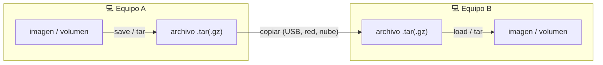

# 🚚 Portabilidad — mover imágenes y volúmenes a otro equipo

> Cómo llevar una **imagen**, un **volumen** (datos) o la **distro** completa de un
> equipo a otro con `wslc` / WSL. Todos los comandos de esta guía están
> **verificados** sobre `wslc 2.9.3`.

`wslc` no comparte nada por red por defecto: para mover algo a otra máquina se
**empaqueta a un archivo**, se **copia** (USB, red, nube) y se **restaura** en destino.

## 🗺️ Esquema



---

## 🖼️ Mover una imagen

Una imagen es autocontenida: se guarda a un `.tar` y se carga en el otro equipo.

```powershell
# Equipo A — guardar la imagen a un archivo (ruta de Windows)
wslc save wsl-labs/node-api:latest -o C:\tmp\node-api.tar

# …copias node-api.tar al equipo B…

# Equipo B — cargarla
wslc load -i C:\tmp\node-api.tar
```

> [!TIP]
> Alternativa por **registro**: si tienes un registro (Docker Hub, GHCR, uno
> privado), es más cómodo `wslc push <imagen>` en A y `wslc pull <imagen>` en B.
> Ver la [referencia CLI](wslc-cli-referencia.md).

---

## 💽 Mover un volumen (los datos)

Los volúmenes con nombre guardan los **datos** de las bases de datos (PostgreSQL,
MariaDB, MongoDB, Elasticsearch, Jenkins…). `wslc` no exporta un volumen
directamente, así que se **empaqueta su contenido** con un contenedor efímero.

```powershell
# Equipo A — backup del volumen a un .tar.gz (por stdout)
wslc run --rm -v wslc-pgdata:/data alpine tar czf - -C /data . > C:\tmp\pgdata.tar.gz

# …copias pgdata.tar.gz al equipo B…

# Equipo B — crear el volumen y restaurar (por stdin)
wslc volume create wslc-pgdata
wslc run --rm -i -v wslc-pgdata:/data alpine tar xzf - -C /data < C:\tmp\pgdata.tar.gz
```

> [!WARNING]
> **Quirk de la preview de `wslc`:** el bind mount a una ruta de Windows
> (`-v C:\...:/backup`) hoy falla con *"Too many volumes have been mounted
> (limit: 15)"*. Por eso el método fiable es el de **stdout/stdin** de arriba (una
> sola redirección, sin bind mount). Si acumulas el error, reinicia la sesión:
> `wslc system session list` y `wslc system session terminate <id>`, o
> `wslc volume prune` para soltar los volúmenes huérfanos.
<!-- -->

> [!TIP]
> Para una base de datos, otra opción robusta es un **dump lógico** (no depende de
> volúmenes): `wslc exec wslc-postgres pg_dump -U postgres app > dump.sql` en A, y
> reimportarlo en B. Igual con `mysqldump` / `mongodump`.

---

## 🐧 Mover la distro WSL completa

Si quieres llevar **todo el entorno WSL** (la distro con sus datos), es una función
de WSL, no de `wslc`:

```powershell
# Equipo A — exportar la distro a un .tar
wsl --export Ubuntu C:\tmp\ubuntu.tar

# Equipo B — importarla
wsl --import Ubuntu C:\WSL\Ubuntu C:\tmp\ubuntu.tar
```

Más detalle en la [historia y referencia de WSL](wsl-historia-y-referencia.md).

---

## 🧰 Helpers del repo

Para no recordar los comandos, el repo trae atajos que hacen exactamente lo anterior:

### PowerShell (Windows)

```powershell
.\scripts\windows\wslc-portable.ps1 export-image  -Image wsl-labs/node-api:latest -File C:\tmp\node-api.tar
.\scripts\windows\wslc-portable.ps1 import-image  -File C:\tmp\node-api.tar
.\scripts\windows\wslc-portable.ps1 backup-volume -Volume wslc-pgdata -File C:\tmp\pgdata.tar.gz
.\scripts\windows\wslc-portable.ps1 restore-volume -Volume wslc-pgdata -File C:\tmp\pgdata.tar.gz
```

### Make (si lo tienes instalado)

```bash
make export-image  IMG=wsl-labs/node-api:latest FILE=/c/tmp/node-api.tar
make import-image  FILE=/c/tmp/node-api.tar
make backup-volume VOL=wslc-pgdata FILE=/c/tmp/pgdata.tar.gz
make restore-volume VOL=wslc-pgdata FILE=/c/tmp/pgdata.tar.gz
```

> [!NOTE]
> El helper de PowerShell usa `cmd /c` para la redirección **binaria** del `.tar.gz`
> (PowerShell trata la salida como texto y corrompería el archivo).

---

## ✅ Verificado

- **Imagen**: `wslc save … -o …` generó el `.tar` (p. ej. 8.7 MB para `alpine`) y
  `wslc load -i …` la cargó.
- **Volumen**: ciclo completo `backup → restore` a un **volumen nuevo**; el dato
  escrito en el equipo "A" apareció íntegro tras restaurar.

---

## 🔗 Ver también

- [🧰 Referencia CLI de `wslc`](wslc-cli-referencia.md)
- [🐳 Guía de contenedores con WSLC](wslc-contenedores.md)
- [🕰️ Historia y referencia de WSL](wsl-historia-y-referencia.md)
- [📁 README del repositorio](../README.md)
