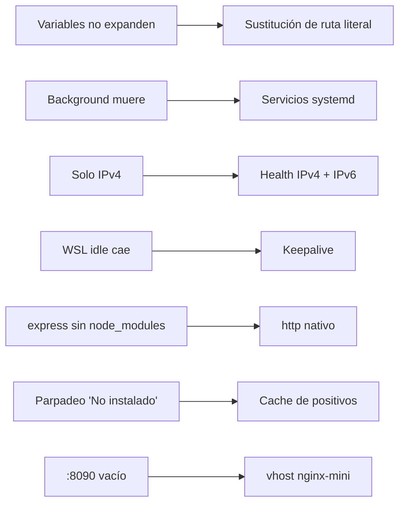

# 🔍 Auditoría técnica — WSL Labs

> **Fecha**: 2026-07-06
> **Alcance**: Control Center (Node.js), launcher Windows (Go), puente Windows ↔ WSL2, servicios Linux
> **Estado**: Problemas resueltos y **verificados end-to-end** — ver registro más abajo

---

## 🎯 Objetivo

Puentear Windows y WSL 2 tiene fricciones que no aparecen ni en Docker ni en una VM:
`wsl.exe` tiene su propio comportamiento con la salida UTF-16 y la expansión de
variables, los procesos en background mueren al reciclarse la instancia WSL, y la
red `localhost` cruza un límite Windows↔Linux. Esta auditoría documenta con honestidad
los problemas reales encontrados durante el desarrollo (v0.1.0 → v0.1.2), su impacto y
la corrección aplicada. Todos los hallazgos están resueltos y verificados.

### 🗺️ Esquema

---

## 🧩 Hallazgos y correcciones

### CRÍTICO-01 — Las variables de shell no se expanden vía `wsl.exe`

**Hallazgo**
El Control Center invoca comandos con `wsl.exe -d <distro> -- bash -lc "<comando>"`.
Los `startCommand` del catálogo usaban variables como `$WSL_LABS_ROOT`, pero **las
variables asignadas dentro de `bash -lc` no se expanden** al pasar por `wsl.exe` como
se esperaba: el comando llegaba con la variable literal sin resolver.

**Impacto**
Los servicios que dependían de esas rutas no arrancaban. La detección de servicios
además devolvía vacío por la combinación de este comportamiento con un exit-code.

**Corrección aplicada**

- El servidor **sustituye la ruta literal** en lugar de delegar la expansión al shell.
- La detección usa **comandos literales sin variables de shell**.

*(Registrado en CHANGELOG v0.1.1 y afinado en v0.1.2.)*

---

### CRÍTICO-02 — `node` y `flask` no persistían (procesos background que morían)

**Hallazgo**
Los servicios `node` (`:8082`) y `flask` (`:8083`) se levantaban como **procesos en
background** dentro de WSL. Al reciclarse o reiniciarse la instancia WSL, esos
procesos morían y el panel los mostraba como caídos, a diferencia de
nginx/apache/postgres que sí persistían.

**Impacto**
Servicios intermitentes: aparecían operativos justo tras levantarlos y "detenidos"
poco después. Experiencia inconsistente respecto a los servicios gestionados por systemd.

**Corrección aplicada**

- Convertidos en **servicios systemd habilitados**: `wsl-labs-node` y `wsl-labs-flask`.
- Sus `install-*.sh` crean las unidades, que arrancan solas en cada boot igual que
  nginx/apache/postgres.

*(CHANGELOG v0.1.2.)*

---

### CRÍTICO-03 — `node-api` usaba `express` sin `node_modules`

**Hallazgo**
El ejemplo `node-api` importaba **express**, pero el repo no incluye `node_modules`
(está en `.gitignore`) y el flujo 1-click no corre `npm install`. Sin la dependencia,
el servicio no arrancaba.

**Impacto**
El lab de Node fallaba en una instalación limpia salvo que el usuario hiciera
`npm install` a mano — rompiendo la promesa de "Instalar → Levantar" sin fricción.

**Corrección aplicada**

- Reescrito con el módulo **`http` nativo** de Node: arranca **sin `npm install`**.

*(CHANGELOG v0.1.2.)* El propio Control Center sigue el mismo principio: usa `http`
nativo, sin dependencias npm.

---

### CRÍTICO-04 — Health-checks solo probaban IPv4 (falsos "detenido")

**Hallazgo**
Los health-checks del panel probaban únicamente **IPv4**. Servicios que escuchan
también en **IPv6** (como apache y node bajo ciertas configuraciones) devolvían
falsos negativos: el panel los marcaba "detenido" aunque respondían.

**Impacto**
Falsos "detenido" en apache/node pese a servir HTTP 200 desde `curl localhost`.

**Corrección aplicada**

- Los health-checks prueban **IPv4 e IPv6** (equivalente a `curl localhost`, que
  resuelve ambas familias).

*(CHANGELOG v0.1.2.)*

---

### MEDIO-01 — La detección de "instalado" parpadeaba a "No instalado"

**Hallazgo**
La sonda de binarios en WSL era sensible a la latencia: en sondas lentas, un servicio
ya instalado parpadeaba a **"No instalado"** en el dashboard.

**Impacto**
UI inestable: el estado de instalación oscilaba, confundiendo al usuario sobre qué
estaba realmente instalado.

**Corrección aplicada**

- La detección **cachea y acumula positivos**: un servicio detectado como instalado
  no vuelve a mostrarse como no instalado por una sonda lenta puntual.

*(CHANGELOG v0.1.2.)*

---

### MEDIO-02 — WSL en idle: los servicios dejaban de ser accesibles

**Hallazgo**
WSL apaga la instancia tras un periodo de inactividad. Con el Control Center corriendo
en Windows pero WSL en idle, los servicios Linux dejaban de responder desde `localhost`.

**Impacto**
El panel quedaba operativo pero los servicios caían solos tras un rato sin actividad.

**Corrección aplicada**

- **Keepalive**: mientras el Control Center corre, mantiene viva la instancia WSL
  (análogo a Docker Desktop manteniendo su VM), para que los servicios sigan accesibles.

*(CHANGELOG v0.1.2.)*

---

### MEDIO-03 — Lab 11 (mini-servidor) no tenía nada escuchando en `:8090`

**Hallazgo**
El lab 11 (mini-servidor completo) declaraba el puerto `:8090` pero **nada escuchaba
ahí**: faltaba el vhost.

**Corrección aplicada**

- Añadido un vhost nginx propio en `labs/11-mini-servidor-completo/nginx-mini.conf`
  que sirve en `:8090`.

*(CHANGELOG v0.1.2.)*

---

## 🌐 Mapa de puertos — Verificado, sin conflictos

| Puerto | Servicio | Lab | Estado v0.1.2 |
| :------: | ---------- | :---: | :-------------: |
| 9092 | 🧭 Control Center (Node.js, Windows) | — | ✅ |
| 8080 | 🌐 NGINX | 05 | ✅ HTTP 200 |
| 8081 | 🐘 Apache + PHP | 06 | ✅ HTTP 200 |
| 8082 | 🟢 Node API (systemd `wsl-labs-node`) | 07 | ✅ HTTP 200 |
| 8083 | 🐍 Flask (systemd `wsl-labs-flask`) | 08 | ✅ HTTP 200 |
| 8090 | 🧱 Mini-servidor (vhost nginx) | 11 | ✅ HTTP 200 |
| 5432 | 🗄️ PostgreSQL | 09 | ✅ acepta conexiones |

**Resultado verificado (v0.1.2)**: los **6 servicios** instalados y operados desde el
panel (como **root, sin contraseña**) responden desde Windows — **dashboard 6/6 saludables**.

---

## 🏗️ Notas de arquitectura

### El puente Windows ↔ WSL2

El Control Center corre en **Windows** (Node.js, `127.0.0.1:9092`) y actúa de puente
hacia WSL 2 vía `wsl.exe -d <distro> -- bash -lc "<comando>"`. Decisiones clave:

1. **Ejecución como root** (`wsl.exe -u root`) — igual que Docker corre privilegiado.
   Elimina la necesidad de contraseña/sudo para arrancar, detener e instalar servicios
   desde el panel (v0.1.1). El passwordless-sudo queda opcional para uso por terminal.
2. **Salida UTF-16** — `wsl.exe -l -q` devuelve UTF-16 en Windows; el launcher Go
   limpia los bytes nulos (`\x00`) antes de parsear la distro.
3. **Comandos literales, sin variables de shell** — para sortear la no-expansión de
   variables vía `wsl.exe` (ver CRÍTICO-01).
4. **Persistencia vía systemd** — los servicios se habilitan como unidades systemd, no
   como procesos background, para sobrevivir a los reciclados de WSL (ver CRÍTICO-02).
5. **Keepalive de la instancia** — el Control Center mantiene WSL viva mientras corre
   (ver MEDIO-02).

### Sin dependencias externas

- **Control Center**: módulo `http` nativo de Node, sin `node_modules`. Escucha solo en
  `127.0.0.1`, con rate-limit nativo y token opcional `WSL_LABS_TOKEN`.
- **Launcher**: Go con biblioteca estándar pura (`go.sum` vacío). En CI se compila con
  `cache: false` porque no hay nada que cachear y `setup-go@v5` con `go.sum` vacío
  fallaba (exit 128) al intentar operaciones git en runners Windows.

---

## 🧪 Estado de cobertura de tests y CI

| Workflow | Qué cubre | Estado |
| ---------- | ----------- | :------: |
| `docs.yml` | markdownlint sobre la documentación | ✅ |
| `dashboard.yml` | Tests Node del Control Center | ✅ |
| `build-windows.yml` | Build del launcher Go + instalador Inno Setup; adjunta al Release en push de tag | ✅ |

**Honestidad sobre la cobertura:**

- ✅ **Verificación funcional end-to-end** de los 6 servicios (HTTP 200 / conexión
  postgres) hecha y registrada en el CHANGELOG v0.1.2 — es la garantía principal de
  operatividad hoy.
- ⚠️ **La verificación 6/6 es manual**, no un test automatizado en CI. El puente
  Windows↔WSL2 depende de `wsl.exe` y de una distro real, algo no reproducible en los
  runners estándar sin nested virtualization.
- ⚠️ El **launcher Go** se compila y se verifica que el binario exista en CI, pero **no
  hay tests unitarios** de `detectDistro`, `findRepoRoot`, etc.
- ⚠️ Los **`install-*.sh`** de los labs no tienen tests automatizados; su validación es
  la ejecución manual desde el panel.

**Siguiente paso razonable**: tests unitarios del launcher Go (parseo de la salida de
`wsl.exe`, resolución de `WSL_LABS_HOME`) y tests del Control Center para la
sustitución literal de rutas y el parseo de health IPv4/IPv6 — todo ejecutable sin una
distro WSL real.

---

## 📁 Alcance y límites conocidos

- **LOCAL únicamente** — sin cloud, sin Kubernetes. El diseño apunta a `localhost` de
  Windows sobre WSL2, no a despliegue remoto.
- **Sin firma digital** en v0.x/v1.x — decisión intencional documentada en
  [windows-installer.md](windows-installer.md#-por-qué-no-se-usa-firma-digital-en-esta-fase).
- **Requiere WSL2 y Node.js preinstalados** — el instalador no los provee (ver
  requisitos previos en [windows-installer.md](windows-installer.md#-requisitos-previos-usuario-final)).

---

## 🔗 Documentos relacionados

- [windows-installer.md](windows-installer.md)
- [github-releases-distribution.md](github-releases-distribution.md)
- [../CHANGELOG.md](../CHANGELOG.md)
- [../RUNBOOK.md](../RUNBOOK.md)
