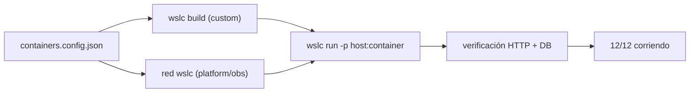

# 🔍 Auditoría técnica — WSL Container Center

> **Fecha**: 2026-07-06
> **Alcance**: giro a contenedores con `wslc` — panel Node.js (`:9092`), motor WSLC, launcher Windows (Go), 12 casos portados de docker-labs
> **Estado**: los 12 casos **verificados corriendo** — ver registro más abajo

---

## 🎯 Objetivo

`wsl-labs` giró de "servicios dentro de la distro" a **contenedores reales con
WSLC**, el motor de contenedores nativo de WSL 2.9+ (preview). Esta auditoría
documenta con honestidad qué se verificó al portar los 12 casos de `docker-labs`,
cómo se comprobó cada uno y qué límites tiene el enfoque hoy.

### 🗺️ Esquema

---

## ✅ Verificación de los 12 casos

Cada caso se levantó con `wslc` y se comprobó desde Windows. El criterio de "sano"
depende del servicio (no todo es HTTP 200):

| Caso | Puerto | Comprobación | Resultado |
| --- | :---: | --- | :---: |
| `01-node-api` | `8101` | `GET /` → HTTP `200` (JSON) | ✅ |
| `03-python-api` | `8102` | `GET /` → HTTP `200` (JSON) | ✅ |
| `10-go-api` | `8103` | `GET /` → HTTP `200` (JSON) | ✅ |
| `06-nginx-web` | `8104` | `GET /` → HTTP `200` (HTML) | ✅ |
| `04-redis-cache` | `8105` | `GET /` → HTTP `200` + Redis **reachable** | ✅ |
| `05-postgres-api` | `8106` | `GET /` → HTTP `200` + PostgreSQL **reachable** | ✅ |
| `02-php-lamp` | `8107` | `GET /` → HTTP `200` + MariaDB **reachable** | ✅ |
| `09-multi-service` | `8112` | `GET /` → HTTP `200` + MongoDB **reachable** | ✅ |
| `07-rabbitmq` | `8109` | panel admin → HTTP `200`/`302` | ✅ |
| `08-prometheus-grafana` | `8110`/`8111` | Grafana `302` (login), Prometheus `200` | ✅ |
| `11-elasticsearch` | `8113` | `GET /` → HTTP `200` (JSON del clúster) | ✅ |
| `12-jenkins` | `8114` | `GET /` → HTTP `403` (setup protegido → **vivo**) | ✅ |

> [!NOTE]
> HTTP `403` en Jenkins y `302` en Grafana/RabbitMQ **no** son fallos: son la
> respuesta esperada de un servicio vivo con autenticación o setup inicial. Marcar
> "sano" solo por `200` daría falsos negativos en esos casos.

---

## 🧩 Multi-contenedor + red `wslc` (verificado)

Los cuatro casos **platform** y el de observabilidad no son un solo contenedor: son
app + backend conectados por una **red `wslc`** creada para el caso. Se verificó que:

- La red se crea con `wslc network create <red>` antes de levantar los contenedores.
- El backend de datos se levanta **sin publicar puerto** (`ports: []`): solo es
  accesible dentro de la red del caso.
- La app se conecta **por nombre de contenedor** (DNS interno de la red `wslc`), no
  por IP ni por `localhost`.

| Caso | Red | Backend (interno) | La app apunta a |
| --- | --- | --- | --- |
| `04-redis-cache` | `wslc-redis-net` | `wslc-redis` | `REDIS_HOST=wslc-redis` |
| `05-postgres-api` | `wslc-pg-net` | `wslc-postgres` | `PG_HOST=wslc-postgres` |
| `02-php-lamp` | `wslc-lamp-net` | `wslc-mariadb` | `DB_HOST=wslc-mariadb` |
| `09-multi-service` | `wslc-multi-net` | `wslc-mongo` | `MONGO_HOST=wslc-mongo` |
| `08-prometheus-grafana` | `wslc-obs-net` | `wslc-prometheus` | Grafana consume Prometheus |

**Verificado**: la resolución por nombre en la red `wslc` funciona — las apps
alcanzan su base de datos y devuelven HTTP `200`, lo que confirma que el backend está
**reachable** a través de la red del contenedor.

---

## 🔨 `wslc build` desde Dockerfile (verificado)

Las imágenes `wsl-labs/*` **no** son oficiales: se construyen con `wslc build` desde
un `Dockerfile` propio en el contexto del caso.

| Caso | Imagen custom | Base | Nota |
| --- | --- | --- | --- |
| `01-node-api` | `wsl-labs/node-api` | `node:20-alpine` | `http` nativo, sin `npm install` |
| `03-python-api` | `wsl-labs/python-api` | `python:3.12-alpine` | Flask con deps en build |
| `10-go-api` | `wsl-labs/go-api` | multi-stage | compila y copia binario a imagen mínima |
| `06-nginx-web` | `wsl-labs/nginx-web` | `nginx:alpine` | contenido estático |
| `04-redis-cache` | `wsl-labs/redis-app` | Node | cliente Redis |
| `05-postgres-api` | `wsl-labs/pg-app` | Python | cliente PostgreSQL |
| `02-php-lamp` | `wsl-labs/php-lamp` | PHP+Apache | cliente MariaDB |
| `09-multi-service` | `wsl-labs/multi-backend` | Node | cliente MongoDB |

**Verificado**: `wslc build -t <imagen> containers/<caso>` produce una imagen que
aparece en `wslc images` y se levanta con `wslc run`. El caso `10-go-api` confirma el
soporte de **builds multi-stage** (compilar en una capa, copiar el binario a otra).

---

## 🌐 Mapa de puertos — verificado, sin conflictos

| Puerto | Caso | Servicio | Estado |
| :---: | :---: | --- | :---: |
| 9092 | — | 🧭 WSL Container Center (Node.js, Windows) | ✅ |
| 8101 | 01 | 🟢 API Node | ✅ 200 |
| 8102 | 03 | 🐍 API Python | ✅ 200 |
| 8103 | 10 | 🐹 API Go | ✅ 200 |
| 8104 | 06 | 🌐 Nginx web | ✅ 200 |
| 8105 | 04 | 🟢 App + Redis | ✅ 200 |
| 8106 | 05 | 🗄️ API + PostgreSQL | ✅ 200 |
| 8107 | 02 | 🐘 LAMP + MariaDB | ✅ 200 |
| 8109 | 07 | 🐰 RabbitMQ (panel) | ✅ 200/302 |
| 8110/8111 | 08 | 📊 Grafana / Prometheus | ✅ 302 / 200 |
| 8112 | 09 | 🍃 Backend + MongoDB | ✅ 200 |
| 8113 | 11 | 🔍 Elasticsearch | ✅ 200 |
| 8114 | 12 | 🧰 Jenkins | ✅ 403 (vivo) |

**Resultado verificado (v0.3.0)**: los **12 casos** construidos/levantados con `wslc`
y respondiendo desde Windows — **12/12 corriendo**.

---

## ⚠️ Notas honestas y límites conocidos

### WSLC está en preview

- `wslc` requiere **WSL 2.9+ (preview)**: `wsl --update --pre-release`. El API y el
  comportamiento del motor pueden cambiar entre builds de WSL.
- El binario vive en `C:\Program Files\WSL\wslc.exe`; el panel lo localiza ahí. Si tu
  instalación lo tiene en otra ruta, el motor no se detecta.
- No existe (todavía) un `wslc compose`: el multi-contenedor se arma **a mano** con
  una red `wslc` y varios `wslc run`. Es más verboso que un `docker-compose.yml`.

### Casos pesados: Elasticsearch y Jenkins

- `11-elasticsearch` corre sobre **JVM** con ~512 MB de heap (más overhead): pesa
  ~1.2 GB en la práctica. No lo levantes con 4 GB de RAM.
- `12-jenkins` también es **JVM** y **tarda en arrancar**; su primer `GET /` devuelve
  `403` (setup inicial) — es la señal de que está vivo, no un error.
- Levantar ES o Jenkins junto a varios casos platform puede saturar una máquina de
  8 GB. Ver [referencia de runtime](LABS_RUNTIME_REFERENCE.md#-recomendaciones-de-uso).

### Verificación manual, no en CI

- La verificación 12/12 es **manual**: depende de `wslc` y de una WSL real, algo no
  reproducible en los runners estándar de CI sin virtualización anidada.
- El **launcher Go** se compila y se comprueba que el binario exista en CI, pero no
  hay tests unitarios de la detección de distro/motor.

---

## 📁 Alcance y límites de diseño

- **LOCAL únicamente** — sin cloud, sin Kubernetes. Apunta a `localhost` de Windows
  sobre WSL 2.9+, no a despliegue remoto.
- **Sin firma digital** en v0.x/v1.x — decisión intencional documentada en
  [windows-installer.md](windows-installer.md#-por-qué-no-se-usa-firma-digital-en-esta-fase).
- **Requiere WSL 2.9+ (preview) y Node.js** preinstalados — el instalador no los
  provee (ver [windows-installer.md](windows-installer.md#-requisitos-previos-usuario-final)).

---

## 🔗 Documentos relacionados

- [windows-installer.md](windows-installer.md)
- [github-releases-distribution.md](github-releases-distribution.md)
- [wslc-contenedores.md](wslc-contenedores.md)
- [../CHANGELOG.md](../CHANGELOG.md)
