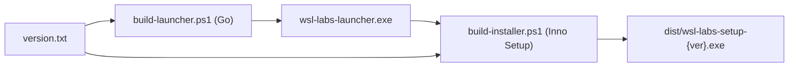

# 🪟 Instalador Windows — WSL Container Center

> **Versión**: 0.3.0
> **Última actualización**: 2026-07-06
> **Audiencia**: usuarios finales de Windows, mantenedores, revisores técnicos
> **Distribución**: GitHub Releases (el binario **no** se incluye en el repositorio)

---

## 🗺️ Descripción general

WSL Container Center incluye un instalador nativo para Windows
(`wsl-labs-setup-{version}.exe`) para usuarios que prefieren una instalación con un
clic en lugar de clonar el repositorio a mano. El instalador está construido con
**Inno Setup**, empaqueta el **launcher compilado con Go** e instala el workspace en
`%LOCALAPPDATA%\WSLLabs`.

A diferencia de un instalador tradicional, **no instala el motor de contenedores**:
se apoya en **WSLC**, incluido en **WSL 2.9+ (preview)**, que debe estar disponible
por separado. El launcher lo verifica antes de arrancar nada.

### 🗺️ Esquema



> [!NOTE]
> El instalador es un **artefacto de release** — nunca se versiona en git. Se publica
> como asset en [GitHub Releases](https://github.com/vladimiracunadev-create/wsl-labs/releases)
> y se descarga desde allí. Ver [github-releases-distribution.md](github-releases-distribution.md).

---

## 🧱 Requisitos previos (usuario final)

| Requisito | Versión | Notas |
| ----------- | --------- | ------- |
| 🪟 Windows | 10 (2004+) u 11, 64-bit | Obligatorio (`MinVersion=10.0` en el `.iss`) |
| 🐳 WSL 2.9+ con WSLC | Preview | Obligatorio — **no** viene en el instalador. `wsl --update --pre-release` |
| 🟢 Node.js | LTS (18+) en el PATH | Obligatorio — el panel corre en Windows con Node |

> [!IMPORTANT]
> Ni WSLC ni Node.js se empaquetan en el instalador, por diseño. El launcher valida
> su presencia al arrancar y guía al usuario con instrucciones si falta alguno.

---

## 📥 Instalación

1. Descarga `wsl-labs-setup-{version}.exe` desde [GitHub Releases](https://github.com/vladimiracunadev-create/wsl-labs/releases).
2. Ejecuta el instalador.
3. Aparecerá un **aviso de binario sin firma** (diálogo del propio instalador) → clic en **Sí** para continuar.
4. Si Windows SmartScreen muestra una advertencia → ver [¿Por qué no se usa firma digital?](#-por-qué-no-se-usa-firma-digital-en-esta-fase).
5. Acepta el directorio de instalación (`%LOCALAPPDATA%\WSLLabs` por defecto).
6. Opcionalmente marca **"Crear acceso directo en el escritorio"** (desmarcado por defecto).
7. Clic en **Instalar** → **Iniciar WSL Container Center**.

El instalador **no requiere permisos de administrador** (`PrivilegesRequired=lowest`):
instala en el espacio del usuario.

---

## ✅ Qué hace el instalador

| Paso | Acción |
| ------ | -------- |
| 🔔 Muestra aviso de binario sin firma | `MsgBox` de confirmación antes de instalar (función `InitializeSetup`) |
| 📂 Copia el launcher | `wsl-labs-launcher.exe` a `{app}` |
| 🧭 Copia el panel | `dashboard-server\` (backend Node.js), excluyendo `node_modules` |
| 🎨 Copia los assets del panel | `index.html`, `dashboard.css`, `dashboard.js` |
| 📇 Copia el catálogo | `containers\containers.config.json` (fuente única de verdad) |
| 🐳 Copia los 12 casos | `containers\` (Dockerfiles + código de las imágenes custom), excluyendo `node_modules`, `__pycache__`, `*.pyc` |
| 📄 Copia docs base | `README.md`, `LICENSE` |
| 🧭 Crea entradas en el menú Inicio | "WSL Container Center" y "WSL Container Center — Uninstall" |
| 🖥️ Crea acceso directo opcional en el escritorio | Desmarcado por defecto |
| 🗑️ Registra el desinstalador | Eliminación limpia desde Configuración → Aplicaciones |
| ▶️ Ofrece iniciar al finalizar | Paso `[Run]`, opcional |

---

## 🚫 Qué NO hace el instalador

- **No** instala WSL ni el motor WSLC (usa `wsl --update --pre-release`).
- **No** instala Node.js (el panel lo necesita en el PATH).
- **No** requiere permisos de administrador (instala en el espacio del usuario).
- **No** modifica el PATH del sistema ni el registro más allá de las entradas estándar de Inno Setup.
- **No** contiene firma digital en v0.x/v1.x (ver más abajo).

---

## 🚀 El launcher (`wsl-labs-launcher.exe`)

El launcher es un binario Go compilado (`launcher/windows/main.go`) que sirve de
punto de entrada principal para usuarios de Windows. **Solo usa la biblioteca
estándar de Go** — sin dependencias externas.

### Qué hace

1. Muestra el banner de inicio con la versión y el aviso de binario sin firma.
2. **Verifica WSL** (`wsl.exe --status`); si falta, guía con `wsl --install` / `wsl --update --pre-release`.
3. **Detecta la distro** (`wsl.exe -l -q`, limpiando los bytes nulos del UTF-16).
4. Localiza la raíz del workspace (variable `WSL_LABS_HOME`, directorio del `.exe` o `cwd`; válida si contiene `dashboard-server/`).
5. **Verifica Node.js** (`node --version`).
6. Arranca el panel en segundo plano: `node dashboard-server/server.js` (puerto **9092**), con la raíz del repo como directorio de trabajo.
7. Hace **polling** a `http://localhost:9092/api/wslc/overview` hasta 90 s (cada 3 s).
8. Abre `http://localhost:9092` en el navegador por defecto (`rundll32`, con fallback a `cmd /c start`).
9. Muestra el resumen de URLs. La ventana se puede cerrar; el panel sigue corriendo.

> [!TIP]
> Si el launcher se lanza por doble clic (sin consola interactiva), pausa con
> "Presiona ENTER para cerrar…" para que puedas leer la salida antes de que la
> ventana desaparezca.

Si algún paso falla, el launcher imprime un mensaje de error claro con instrucciones
de solución y mantiene la consola abierta.

### Código fuente

```text
launcher/
  windows/
    main.go   # Fuente Go — stdlib pura, sin dependencias externas
```

### Compilar localmente

```powershell
# Desde la raíz del repo
.\scripts\windows\build-launcher.ps1 -Version 0.3.0
```

El script inyecta la versión con `-ldflags "-X main.launcherVersion=..."` y lee
`version.txt` si no se pasa `-Version`. Salida: `launcher\windows\wsl-labs-launcher.exe`.

---

## 🔨 Compilar el instalador localmente

### Requisitos (máquina de build)

| Herramienta | Versión | Descarga |
| ------------- | --------- | ---------- |
| Go | 1.21+ | <https://go.dev/dl/> |
| Inno Setup | 6.x | <https://jrsoftware.org/isinfo.php> |
| Git | cualquiera | Para clonar el repositorio |

### Pasos

```powershell
# 1. Clonar el repositorio
git clone https://github.com/vladimiracunadev-create/wsl-labs.git
cd wsl-labs

# 2. Compilar el launcher (Go)
.\scripts\windows\build-launcher.ps1 -Version 0.3.0

# 3. Compilar el instalador (Inno Setup)
.\scripts\windows\build-installer.ps1 -Version 0.3.0

# Resultado: dist\wsl-labs-setup-0.3.0.exe
```

`build-installer.ps1` localiza `ISCC.exe` automáticamente (o acepta `-InnoSetupPath`),
invoca Inno Setup con `/DAppVersion=$Version` y deja el `.exe` en `dist\`.

> [!NOTE]
> `build-launcher.ps1` **debe** ejecutarse antes: el `.iss` empaqueta el `.exe`
> del launcher y `build-installer.ps1` aborta si no lo encuentra.

---

## 📦 Qué contiene el instalador

El script de Inno Setup (`installer/wsl-labs.iss`, sección `[Files]`) empaqueta:

| Elemento | Incluido | Notas |
| ---------- | :--------: | ------- |
| `wsl-labs-launcher.exe` | ✅ | Compilado desde `launcher/windows/main.go` |
| `dashboard-server/` | ✅ | Panel (Node.js), `node_modules` excluido |
| `index.html`, `dashboard.css`, `dashboard.js` | ✅ | Assets del panel servidos en `:9092` |
| `containers/containers.config.json` | ✅ | Catálogo — fuente única de verdad |
| `containers/` (01–12) | ✅ | Dockerfiles + código de las imágenes custom; `node_modules`/`__pycache__`/`*.pyc` excluidos |
| `README.md`, `LICENSE` | ✅ | Documentación base |
| `node_modules/` | ❌ | El panel usa `http` nativo, no necesita npm install |
| `.git/` | ❌ | No necesario en tiempo de ejecución |
| `dist/` | ❌ | Artefactos de build |
| `installer/`, `scripts/windows/` | ❌ | Scripts de build, no necesarios en ejecución |
| `.github/` | ❌ | Workflows de CI, no necesarios en ejecución |

---

## 🗑️ Desinstalación

Desde **Configuración de Windows → Aplicaciones → WSL Container Center → Desinstalar**
(o el acceso directo "WSL Container Center — Uninstall" del menú Inicio).

El desinstalador:

1. Elimina todos los archivos instalados en `%LOCALAPPDATA%\WSLLabs`.
2. Elimina los accesos directos del menú Inicio y del escritorio.
3. Elimina la entrada de registro del desinstalador.

> [!IMPORTANT]
> El desinstalador **no** toca tu instalación de WSL ni las imágenes/contenedores
> `wslc` que hayas construido. Para limpiar esos artefactos, usa `wslc stop`,
> `wslc images` y `wslc network` antes de desinstalar.

---

## 🔏 ¿Por qué no se usa firma digital en esta fase?

### La decisión

WSL Container Center v0.x/v1.x **no** usa firma digital de código para el instalador
ni el launcher. Es una **decisión de producto intencional y explícita**, no un
descuido. El `.iss` ya deja la directiva `SignTool` comentada, lista para activarse.

### Razones

| Razón | Detalle |
| ------- | --------- |
| 💰 **Costo** | Un certificado EV (necesario para reputación plena en SmartScreen) cuesta $300–700/año. Para un proyecto de portfolio open-source no se justifica en la fase inicial. |
| 🧪 **Fase de validación** | El objetivo de v0.x es validar la experiencia de instalación, el comportamiento del launcher y el flujo de distribución. Firmar agrega complejidad sin valor funcional aún. |
| 🔧 **Carga de mantenimiento** | Los certificados requieren renovación, custodia de claves y configuración del pipeline de CI. |
| 🎯 **Prioridad** | El valor técnico está en el motor de contenedores y los 12 casos, no en la infraestructura de firma. |

### Impacto para el usuario final

Al ejecutar el instalador sin firma, Microsoft SmartScreen puede mostrar:

| Escenario | Mensaje | Acción |
| ----------- | --------- | -------- |
| Publicador desconocido | "Windows protegió tu PC" | **Más información** → **Ejecutar de todas formas** |
| Reputación baja | Ventana de advertencia | Igual que el caso anterior |
| Antivirus | Puede marcarlo como desconocido | Agregar a exclusiones si es necesario |

Este comportamiento es normal para software nuevo o descargado con poca frecuencia.
**No** indica que el software sea malicioso.

### Cómo GitHub Releases mitiga el riesgo

- Descargas verificadas con TLS servidas por GitHub.
- El release está etiquetado a un commit específico (`vX.Y.Z`).
- El código fuente es públicamente auditable y el build es **reproducible**.
- Cualquiera puede reconstruir el instalador con `build-launcher.ps1` + `build-installer.ps1`.

### Hoja de ruta para la firma

Se considerará firmar cuando el proyecto alcance una base de usuarios mayor, cuando
un certificado Azure Code Signing ($99/año) sea factible, o cuando lo adopte una
organización que pueda proveer un certificado EV. El `.iss` ya tiene el hueco:

```iss
; No signing en v0.x/v1.x
; SignTool=...
```

---

## 🩺 Solución de problemas de instalación

| Síntoma | Causa | Solución |
| --------- | ------- | --------- |
| Advertencia de SmartScreen | Binario sin firma | **Más información** → **Ejecutar de todas formas** |
| `wsl.exe no encontrado` | WSL no instalado | `wsl --install`, reiniciar Windows y reintentar |
| `wslc no encontrado` | WSL sin el motor de contenedores | `wsl --update --pre-release`, luego `wsl --shutdown` |
| `Node.js no encontrado` | Node no está en el PATH | Instalar Node.js LTS desde <https://nodejs.org/> y reabrir la terminal |
| `No se pudo localizar la raíz del workspace` | Launcher fuera de la carpeta de instalación | Ejecutar desde `%LOCALAPPDATA%\WSLLabs` o definir `WSL_LABS_HOME` |
| El navegador no abre / panel no carga | Puerto 9092 en uso | Verificar con `netstat -ano \| findstr 9092`; recargar el navegador |
| El panel no responde tras 90 s | Node/WSL lentos en primer arranque | Recargar `http://localhost:9092`; revisar que `node dashboard-server\server.js` corra a mano |

---

## 🎤 Presentación en demos y portfolio

Esta capa de distribución Windows demuestra:

- **Pensamiento de producto**: diseñar para el usuario final más allá del `git clone`.
- **Dominio de Go**: binario nativo Windows sin dependencias en runtime.
- **Puente Windows ↔ WSLC**: el launcher valida `wsl.exe`, detecta la distro y orquesta el arranque del panel de contenedores.
- **Packaging Windows**: Inno Setup para una instalación profesional sin admin.
- **CI/CD**: build automatizado vía GitHub Actions al pushear un tag.
- **Conciencia de seguridad**: política explícita de binario sin firma con medidas compensatorias.

---

## 🔗 Documentos relacionados

- [github-releases-distribution.md](github-releases-distribution.md)
- [technical-audit.md](technical-audit.md)
- [wslc-contenedores.md](wslc-contenedores.md)
- [../README.md](../README.md)
- [../CHANGELOG.md](../CHANGELOG.md)
