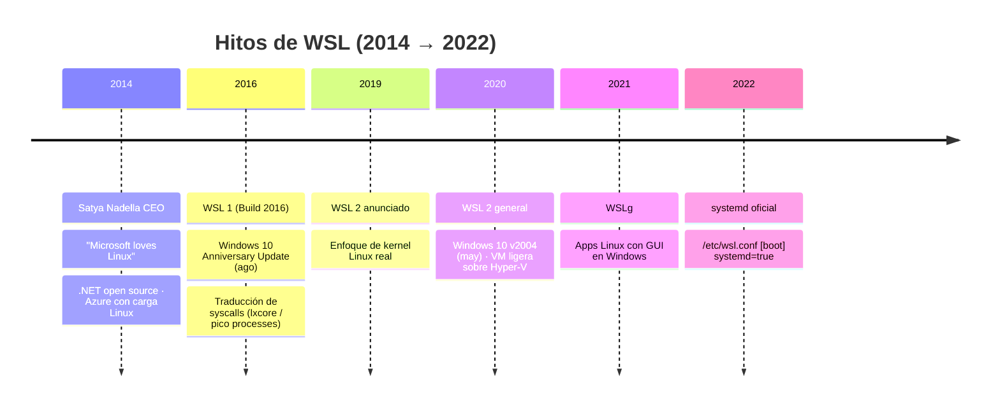
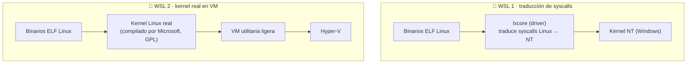

# 📜 WSL — Historia, fundamentos y referencia completa de comandos

> [!NOTE]
> **Documento vivo.** Pensado para crecer con el proyecto: aquí se consolidan la
> **historia** de WSL, sus **fundamentos técnicos** (WSL 1 vs WSL 2) y una
> **referencia completa de comandos** de `wsl.exe` y de configuración. Si echas
> algo en falta, este es el lugar para añadirlo. Complementa —no duplica— a
> [`docs/00-que-es-wsl.md`](00-que-es-wsl.md),
> [`docs/02-comandos-basicos.md`](02-comandos-basicos.md) y
> [`cheatsheets/comandos-wsl.md`](../cheatsheets/comandos-wsl.md).

---

## 1. 🏛️ Historia de WSL — por qué Microsoft lo creó

### El contexto: "Microsoft loves Linux"

Cuando **Satya Nadella** asumió como CEO en **2014**, Microsoft giró de forma
radical su relación con el software libre. Ese mismo año acuñó públicamente la
frase **"Microsoft loves Linux"** y empezó una apertura sostenida al open source:
**.NET pasó a ser open source**, y **Azure** —el negocio en la nube que Nadella
quería hacer crecer— empezaba a alojar **muchísima carga de trabajo Linux**.

> [!TIP]
> La clave no fue idealismo, fue negocio: la nube que Microsoft quería vender
> corría, en buena parte, **Linux**. Pelearse con Linux era pelearse con sus
> propios clientes.

### El problema de negocio: se iban los desarrolladores

Los desarrolladores **web, backend y cloud** necesitaban herramientas Unix en su
día a día: `bash`, `grep`, `ssh`, `git`, `node`, `python`, `ruby`, contenedores…
En Windows, conseguir eso significaba **doble arranque** (dual-boot) o **VMs
pesadas**. Resultado: mucha gente se pasaba a **macOS** o **Linux** de escritorio.
Windows estaba **perdiendo a la comunidad dev**, justo el público que decide qué
plataforma usan los equipos.

La respuesta de Microsoft fue traer Linux **dentro** de Windows, sin dual-boot y
sin la fricción de una VM tradicional.

### 🧱 WSL 1 — traducción de syscalls (2016)

- **Anunciado en Build 2016**; llegó con **Windows 10 Anniversary Update
  (agosto de 2016)**.
- Enfoque técnico: **traducía las llamadas al sistema (syscalls) de Linux a NT**
  mediante un **driver de kernel** (`lxcore`, apoyado en el mecanismo de
  **pico processes**). No había kernel Linux: los binarios ELF de Linux corrían
  y sus syscalls se **traducían** al kernel de Windows en tiempo real.
- Sus raíces técnicas están parcialmente en **Project Astoria** (el intento de
  correr apps Android en Windows).
- **Ventaja:** muy **ligero** e **integrado**, arranque casi instantáneo.
- **Límite:** no implementaba **todas** las syscalls → **incompatibilidades**
  (por ejemplo, **Docker no corría bien**) y **rendimiento pobre** en ciertas
  operaciones del sistema.

### 🚀 WSL 2 — un kernel Linux real (2020)

- **Anunciado en 2019**; **general en Windows 10 versión 2004 (mayo de 2020)**.
- Cambio de enfoque: en lugar de traducir syscalls, WSL 2 ejecuta un **kernel
  Linux real** —**compilado por Microsoft**, bajo licencia **GPL** y
  **distribuido vía Windows Update**— dentro de una **VM utilitaria ligera sobre
  Hyper-V**.
- **Motivo:** **compatibilidad total de syscalls** y un rendimiento de **E/S del
  sistema de archivos Linux mucho mejor** que WSL 1.
- **Trade-off:** el **acceso cruzado a archivos de Windows** (`/mnt/c/...`) es
  **más lento** que en WSL 1, porque cruza la frontera entre la VM y el host.

> [!WARNING]
> Regla práctica: **guarda tus proyectos dentro del sistema de archivos de Linux**
> (`~/` o `\\wsl$\...`), no en `/mnt/c`. En WSL 2 la E/S sobre `/mnt/c` es
> notablemente más lenta.

### 🖼️ WSLg y ⚙️ systemd

- **WSLg (2021–2022):** soporte para ejecutar **aplicaciones Linux con GUI**
  directamente en el escritorio de Windows.
- **systemd (2022):** soporte **oficial** para `systemd`, activable por distro
  vía `/etc/wsl.conf` (`[boot] systemd=true`). Esto habilitó gestionar servicios
  con `systemctl` de forma nativa.

### 📊 Razones fundamentadas (resumen)

| Razón | Qué resolvía WSL |
| --- | --- |
| 🧑‍💻 **Retención de desarrolladores** | Evitar que la comunidad dev migrara a macOS/Linux |
| 🌐 **Tooling web/backend** | `bash`, `git`, `node`, `python`, `ruby`, `ssh` nativos en Windows |
| 🐳 **Contenedores / Docker** | Un kernel Linux real (WSL 2) para correr Docker sin fricción |
| ☁️ **Cargas Linux de Azure** | Desarrollar en local igual que corre en la nube |
| 💽 **Evitar dual-boot / VM** | Linux integrado, sin reinicios ni VMs pesadas |
| 🔵 **Integración con VS Code** | Editar en Windows, ejecutar en Linux, sin copiar archivos |

### 🗓️ Línea de tiempo de hitos



---

## 2. 🔬 WSL 1 vs WSL 2 — arquitectura

La diferencia central es **cómo se ejecuta Linux**:

- **WSL 1** → **no hay kernel Linux**. Un driver de Windows (`lxcore`) **traduce
  las syscalls** de Linux a llamadas del kernel NT.
- **WSL 2** → **hay un kernel Linux real** corriendo dentro de una **VM ligera
  sobre Hyper-V**; Windows habla con esa VM.



### Tabla comparativa

| Aspecto | 🧱 WSL 1 | 🚀 WSL 2 |
| --- | --- | --- |
| **Compatibilidad de syscalls** | Parcial (traducción) | **Total** (kernel real) |
| **Rendimiento FS Linux** (`~/`) | Bueno | **Muy bueno** |
| **Rendimiento `/mnt/c`** (archivos Windows) | **Más rápido** | Más lento (cruza la VM) |
| **Arranque** | Casi instantáneo | Ligeramente mayor (levanta la VM) |
| **Docker** | ❌ Problemático | ✅ Nativo y recomendado |
| **Uso de memoria** | Menor | Mayor (VM; se libera con `--shutdown`) |
| **Cuándo usarlo** | Trabajo intensivo sobre archivos de Windows | **Por defecto**: contenedores, servicios, dev general |

> [!TIP]
> WSL 2 es el **recomendado** para casi todo, y es lo que asume este repo.
> Fija WSL 2 como versión por defecto con `wsl --set-default-version 2`.

---

## 3. 🖥️ WSL no tiene "plataforma desktop" como Docker

A diferencia de **Docker** —que trae **Docker Desktop**, con **GUI oficial**,
panel de contenedores, imágenes y volúmenes— **WSL se gestiona por CLI**:
`wsl.exe` desde PowerShell/CMD, más **Windows Terminal** como consola. **No hay un
panel de control oficial de escritorio** para arrancar/parar servicios ni ver su
salud de un vistazo.

**Aquí encaja `wsl-labs`:** aporta ese **"plano de control" que le falta** a WSL:

- 🧭 **Control Center** web en **`http://localhost:9092`** para arrancar/detener
  servicios y ver su estado (📦 Instalar → ▶ Levantar), como haría Docker Desktop.
- 🪟 **Launcher de Windows** (`.exe`) que detecta la distro, levanta el stack y
  abre el navegador.

Ver el detalle en el [README](../README.md) y en la guía
[`docs/DASHBOARD_SETUP.md`](DASHBOARD_SETUP.md).

> [!NOTE]
> Esta pieza es deliberadamente **extensible**: el Control Center puede crecer con
> **más servicios y funcionalidades** a futuro (nuevos labs, métricas, acciones).

---

## 4. ⌨️ Referencia completa de comandos WSL (`wsl.exe` desde Windows)

> [!TIP]
> Estos comandos se ejecutan desde **PowerShell / CMD / Windows Terminal**, no
> dentro de la distro. Para comandos de dentro de Linux, ve a la
> [sección 5](#5--comandos-dentro-de-la-distro-linux-útiles-en-wsl).

### 📦 Instalación y actualización

| Comando | Descripción |
| --- | --- |
| `wsl --install` | Instala WSL 2 + la distro por defecto (Ubuntu). Requiere reinicio la 1.ª vez |
| `wsl --install -d <distro>` | Instala una distro concreta (p. ej. `-d Debian`) |
| `wsl --update` | Actualiza el **kernel Linux** de WSL (vía Windows Update) |
| `wsl --version` | Muestra versiones de WSL, kernel, WSLg, etc. |
| `wsl --status` | Estado general: distro por defecto, versión por defecto, kernel |
| `wsl --list --online` | Lista las distros **disponibles para instalar** desde el catálogo |

```powershell
# Instalar WSL 2 + Ubuntu (reinicia si es la primera vez)
wsl --install

# Instalar una distro específica
wsl --install -d Debian

# Actualizar el kernel de WSL
wsl --update
```

### 🗂️ Gestión de distribuciones

| Comando | Descripción |
| --- | --- |
| `wsl -l -v` | Lista distros instaladas con **estado** y **versión** (1 o 2) |
| `wsl --set-default <distro>` | Fija la distro por defecto (la que abre `wsl` sin argumentos) |
| `wsl --set-version <distro> 2` | Convierte una distro existente a WSL 2 (o `1`) |
| `wsl --set-default-version 2` | Fija la versión por defecto para **nuevas** distros |
| `wsl --unregister <distro>` | **Elimina** la distro y **todos sus datos** |

```powershell
wsl -l -v
wsl --set-default Ubuntu
wsl --set-version Ubuntu 2
wsl --set-default-version 2
```

> [!WARNING]
> `wsl --unregister <distro>` es **destructivo**: borra la distro y sus datos sin
> vuelta atrás. Haz un `wsl --export` antes (ver
> [Backup y portabilidad](#-backup-y-portabilidad)).

### 🔄 Ciclo de vida

| Comando | Descripción |
| --- | --- |
| `wsl` | Abre una shell en la distro por defecto |
| `wsl -d <distro>` | Abre una shell en una distro concreta |
| `wsl --shutdown` | **Apaga todas** las distros y la VM de WSL 2 (libera memoria) |
| `wsl --terminate <distro>` | Detiene **una** distro concreta |
| `wsl -u <user>` / `wsl -u root` | Entra como un usuario concreto (p. ej. `root`) |
| `wsl -e <cmd>` | Ejecuta un comando en la distro y sale |
| `wsl -- <cmd>` | Todo lo que va tras `--` se pasa tal cual a la distro |
| `wsl --cd <path>` | Abre la shell en un directorio de trabajo concreto |

```powershell
wsl -d Ubuntu                 # shell en Ubuntu
wsl --shutdown                # apaga todo WSL (libera RAM)
wsl --terminate Ubuntu        # detiene solo Ubuntu
wsl -u root -d Ubuntu         # shell como root
wsl -d Ubuntu -e uname -a     # ejecuta un comando y sale
wsl --cd ~ -d Ubuntu          # abre en el home de Linux
```

### 💾 Backup y portabilidad

| Comando | Descripción |
| --- | --- |
| `wsl --export <distro> <archivo.tar>` | Exporta la distro completa a un `.tar` |
| `wsl --import <nombre> <carpeta> <archivo.tar>` | Importa un `.tar` como nueva distro |
| `wsl --import-in-place <nombre> <archivo.vhdx>` | Registra un `.vhdx` existente como distro |
| `wsl --mount <disco>` | Monta un disco/partición física dentro de WSL |
| `wsl --unmount [<disco>]` | Desmonta un disco montado (todos si se omite) |

```powershell
# Backup completo de la distro
wsl --export Ubuntu .\ubuntu-backup.tar

# Restaurar como una distro nueva en WSL 2
wsl --import Ubuntu-Lab .\Ubuntu-Lab .\ubuntu-backup.tar --version 2
```

Más detalle en el lab [`labs/10-backup-export-import/`](../labs/10-backup-export-import/)
y en el [cheatsheet](../cheatsheets/comandos-wsl.md).

### 🧭 Ejemplos reales de `wsl-labs`

El **Control Center** invoca la distro desde Windows con esta forma —usuario
`root`, shell de login, comando entre comillas— para instalar y levantar servicios:

```powershell
# Patrón que usa el Control Center para operar la distro
wsl -d Ubuntu -u root -- bash -lc "systemctl start nginx && ss -tlnp | grep :8080"

# Levantar el stack y comprobar salud de un servicio
wsl -d Ubuntu -u root -- bash -lc "service postgresql start && pg_isready"
```

---

## 5. 🐧 Comandos dentro de la distro (Linux) útiles en WSL

Una vez dentro de la distro, la gestión es Linux estándar:

| Comando | Uso |
| --- | --- |
| `service <svc> start\|stop\|status` | Gestión clásica de servicios (SysV) |
| `systemctl start\|status\|enable <svc>` | Gestión de servicios con systemd (requiere `[boot] systemd=true`) |
| `ss -tlnp` | Puertos en escucha (sustituto moderno de `netstat`) |
| `curl -I http://localhost:8080` | Probar un servicio HTTP local |
| `sudo apt update && sudo apt upgrade -y` | Actualizar paquetes |
| `journalctl -u <svc> -e` | Ver logs de un servicio bajo systemd |

> [!NOTE]
> Para el detalle de comandos Linux del día a día, cruza a
> [`docs/02-comandos-basicos.md`](02-comandos-basicos.md),
> [`cheatsheets/comandos-linux.md`](../cheatsheets/comandos-linux.md) y
> [`cheatsheets/systemd.md`](../cheatsheets/systemd.md).

---

## 6. ⚙️ Configuración: `.wslconfig` y `/etc/wsl.conf`

Hay **dos archivos** de configuración con ámbitos distintos:

| Archivo | Ámbito | Ubicación |
| --- | --- | --- |
| `.wslconfig` | **Global** (toda la VM de WSL 2) | `%UserProfile%\.wslconfig` (Windows) |
| `/etc/wsl.conf` | **Por distro** | Dentro de cada distro Linux |

### `.wslconfig` — límites globales de la VM

Controla memoria, CPU, swap y red de la **VM utilitaria** de WSL 2.

```ini
# %UserProfile%\.wslconfig
[wsl2]
memory=4GB              # RAM máxima para la VM
processors=2            # núcleos asignados
swap=2GB                # tamaño del swap
vmIdleTimeout=60000     # ms de inactividad antes de suspender la VM
networkingMode=mirrored # modo de red (p. ej. mirrored)
```

> [!TIP]
> Tras editar `.wslconfig`, aplica los cambios con `wsl --shutdown` y vuelve a
> abrir la distro.

### `/etc/wsl.conf` — ajustes por distro

Configura systemd, montajes automáticos, red y usuario por defecto de **esa** distro.

```ini
# /etc/wsl.conf (dentro de la distro)
[boot]
systemd=true            # habilita systemd (systemctl, journalctl)

[automount]
enabled=true            # monta discos de Windows en /mnt
options=metadata        # permite permisos/propietario en /mnt

[network]
generateHosts=true      # gestiona /etc/hosts

[user]
default=vlad            # usuario por defecto al entrar
```

> [!WARNING]
> Los cambios en `/etc/wsl.conf` **no** se aplican en caliente: ejecuta
> `wsl --shutdown` en Windows y reinicia la distro.

---

## 7. 🔗 Ver también

- [`docs/00-que-es-wsl.md`](00-que-es-wsl.md) — Fundamentos de WSL
- [`docs/01-instalacion-wsl.md`](01-instalacion-wsl.md) — Instalación paso a paso
- [`docs/02-comandos-basicos.md`](02-comandos-basicos.md) — Comandos básicos
- [`docs/03-wsl-vs-docker-vs-vm.md`](03-wsl-vs-docker-vs-vm.md) — Comparativa con la línea
- [`cheatsheets/comandos-wsl.md`](../cheatsheets/comandos-wsl.md) — Cheatsheet de `wsl.exe`
- [`docs/DASHBOARD_SETUP.md`](DASHBOARD_SETUP.md) — Montar el Control Center
- [`docs/DOCUMENTATION_INDEX.md`](DOCUMENTATION_INDEX.md) — Índice maestro de la documentación
- [`../README.md`](../README.md) — Visión general del repo
