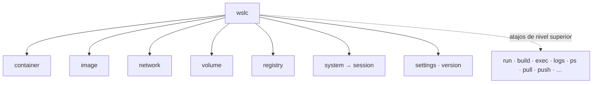

# 🧰 Referencia de la CLI de `wslc`

> Referencia **completa** de la línea de comandos de `wslc` (WSL Containers, WSL 2.9+),
> explorada a fondo sobre `wslc 2.9.3`. Para el enfoque general ver
> [wslc-contenedores.md](wslc-contenedores.md); para los casos de este repo, el
> [catálogo de casos](LABS_CATALOG.md).

`wslc` es el motor de contenedores nativo de WSL. Su interfaz replica el subconjunto
más usado de Docker. Binario: `C:\Program Files\WSL\wslc.exe` (se obtiene con
`wsl --update --pre-release`).

---

## 🗺️ Estructura de la CLI



`wslc` tiene **grupos de comandos** (`container`, `image`, `network`, `volume`,
`registry`, `system`) y **atajos de nivel superior** que apuntan a los subcomandos
más habituales (por ejemplo `wslc run` == `wslc container run`, `wslc build` ==
`wslc image build`).

| Grupo | Subcomandos |
| --- | --- |
| `container` | `run` · `create` · `start` · `stop` · `kill` · `remove` · `list` · `logs` · `exec` · `attach` · `inspect` · `stats` · `export` · `prune` |
| `image` | `build` · `list` · `pull` · `push` · `tag` · `save` · `load` · `import` · `inspect` · `remove` · `prune` |
| `network` | `create` · `list` · `inspect` · `remove` · `prune` |
| `volume` | `create` · `list` · `inspect` · `remove` · `prune` |
| `registry` | `login` · `logout` |
| `system session` | `enter` · `list` · `run` · `shell` · `terminate` |
| (raíz) | `settings` · `version` |

---

## 🐳 Contenedores (`wslc container …`)

### `run` — crear y arrancar un contenedor

```powershell
wslc run [opciones] <imagen> [comando] [args...]
```

| Opción | Qué hace |
| --- | --- |
| `-d, --detach` | Ejecuta en segundo plano |
| `--name` | Nombre del contenedor |
| `-p, --publish` | Publica un puerto `host:contenedor` |
| `-P, --publish-all` | Publica todos los puertos expuestos en puertos aleatorios |
| `-e, --env` / `--env-file` | Variables de entorno (`KEY=VALUE`) / desde archivo |
| `--network` / `--network-alias` | Conecta a una red / alias en la red |
| `-v, --volume` | Monta un volumen o bind mount |
| `-m, --memory` | Límite de memoria (`512M`, `1G`) |
| `--cpus` | Nº de CPU (`0.5`, `1`, `2.5`) |
| `--gpus` | Añade GPUs (`all` para todas) |
| `--shm-size` | Tamaño de `/dev/shm` |
| `-w, --workdir` | Directorio de trabajo dentro del contenedor |
| `-u, --user` | Usuario (`name` \| `uid` \| `uid:gid`) |
| `-h, --hostname` / `--domainname` | Hostname / dominio |
| `-i, --interactive` / `-t, --tty` | stdin abierto / TTY |
| `--entrypoint` | Sobrescribe el entrypoint |
| `--rm` | Elimina el contenedor al detenerse |
| `--stop-signal` | Señal para detener |
| `--dns` / `--dns-option` / `--dns-search` | Configuración DNS |
| `-l, --label` | Metadatos (`KEY=VALUE`) |
| `--ulimit` | Límites (`nofile=1024:2048`) |
| `--cidfile` | Escribe el id del contenedor en un archivo |
| `--tmpfs` | Monta un `tmpfs` en una ruta |

```powershell
# Ejemplo: nginx con límites de recursos y una red
wslc run -d --name web --network mi-red -p 8080:80 -m 256M --cpus 0.5 nginx:alpine
```

> [!TIP]
> Docker: `docker run`. Los flags `-p`, `-e`, `-v`, `-m`, `--cpus`, `--network`
> funcionan igual que en Docker.

### `create` / `start` / `stop` / `kill` / `remove`

| Comando | Qué hace | Docker |
| --- | --- | --- |
| `wslc create [opciones] <imagen>` | Crea el contenedor sin arrancarlo (mismas opciones que `run`) | `docker create` |
| `wslc start <id\|nombre>` | Arranca un contenedor creado/detenido | `docker start` |
| `wslc stop <id\|nombre>` | Detiene un contenedor | `docker stop` |
| `wslc kill <id\|nombre>` | Envía SIGKILL | `docker kill` |
| `wslc remove <id\|nombre>` (`rm`) | Elimina un contenedor detenido | `docker rm` |
| `wslc container prune` | Elimina **todos** los contenedores detenidos | `docker container prune` |

### `list` — listar contenedores (alias `ls`, `ps`)

```powershell
wslc list [opciones]
```

| Opción | Qué hace |
| --- | --- |
| `-a, --all` | Incluye los detenidos |
| `-f, --filter` | Filtra por condiciones |
| `--format` | `table` (por defecto) o `json` |
| `-q, --quiet` | Solo los ids |
| `-n, --last` / `-l, --latest` | Últimos N / el último creado |
| `--no-trunc` | No trunca la salida |

```powershell
wslc ps                 # contenedores en ejecución
wslc ps -a --format json # todos, en JSON (útil para scripts)
```

### `logs` — ver logs

```powershell
wslc logs [opciones] <id\|nombre>
```

| Opción | Qué hace |
| --- | --- |
| `-f, --follow` | Sigue la salida en vivo |
| `-n, --tail <N>` | Últimas N líneas |
| `-t, --timestamps` | Añade marcas de tiempo |
| `--since` / `--until` | Rango temporal (epoch o RFC3339) |

```powershell
wslc logs -n 50 -t web
```

### `exec` — ejecutar en un contenedor vivo

```powershell
wslc exec [opciones] <id\|nombre> <comando> [args...]
```

Opciones: `-d`, `-e/--env`, `--env-file`, `-i/--interactive`, `-t/--tty`,
`-u/--user`, `-w/--workdir`.

```powershell
wslc exec -it web sh              # shell interactiva dentro del contenedor
wslc exec web env                 # ver variables de entorno
```

### `attach` / `inspect` / `stats` / `export`

| Comando | Qué hace | Docker |
| --- | --- | --- |
| `wslc attach <id>` | Se conecta a stdin/stdout del contenedor | `docker attach` |
| `wslc inspect <id>` | Detalle JSON del contenedor (o imagen/red) | `docker inspect` |
| `wslc stats [-a] [<id>]` | Snapshot de CPU/memoria/red/E-S/PIDs | `docker stats` |
| `wslc export <id>` | Exporta el filesystem del contenedor a un `.tar` | `docker export` |

```powershell
wslc stats -a           # uso de recursos de todos los contenedores
```

---

## 🖼️ Imágenes (`wslc image …`)

### `build` — construir desde un Dockerfile

```powershell
wslc build [opciones] <ruta-contexto>
```

| Opción | Qué hace |
| --- | --- |
| `-t, --tag` | Etiqueta de la imagen (`nombre:tag`) |
| `-f, --file` | Ruta al `Dockerfile` (`-` = stdin) |
| `--build-arg` | Variables de build (`KEY=VALUE`) |
| `--target` | Etapa objetivo (multi-stage) |
| `--no-cache` | No usar caché |
| `--pull` | Forzar pull de la imagen base |
| `-l, --label` | Metadatos |
| `--verbose` | Salida detallada |

```powershell
wslc build -t wsl-labs/go-api:latest --target build containers/10-go-api
```

### Resto de comandos de imagen

| Comando | Qué hace | Docker |
| --- | --- | --- |
| `wslc images` / `wslc image list` | Lista imágenes locales | `docker images` |
| `wslc pull <imagen:tag>` | Descarga una imagen de un registro | `docker pull` |
| `wslc push <imagen:tag>` | Sube una imagen a un registro | `docker push` |
| `wslc tag <origen> <destino>` | Reetiqueta una imagen | `docker tag` |
| `wslc save <imagen> > f.tar` | Guarda imágenes en un `.tar` | `docker save` |
| `wslc load` | Carga imágenes desde un `.tar` | `docker load` |
| `wslc image import <tar>` | Importa una imagen desde un tarball | `docker import` |
| `wslc image inspect <imagen>` | Detalle JSON de la imagen | `docker image inspect` |
| `wslc rmi <imagen>` | Elimina una imagen | `docker rmi` |
| `wslc image prune` | Elimina imágenes no usadas | `docker image prune` |

---

## 🌐 Redes (`wslc network …`)

| Comando | Qué hace |
| --- | --- |
| `wslc network create [-d driver] [-o opt] [-l label] <nombre>` | Crea una red (driver por defecto `bridge`) |
| `wslc network list` (`ls`) | Lista redes |
| `wslc network inspect <nombre>` | Detalle de una red |
| `wslc network remove <nombre>` (`rm`) | Elimina una o varias redes |
| `wslc network prune` | Elimina todas las redes sin usar |

```powershell
wslc network create mi-red
wslc run -d --name db --network mi-red postgres:15
wslc run -d --name app --network mi-red -p 8000:8000 mi-app   # 'app' alcanza a 'db' por su nombre
```

> [!TIP]
> Un stack multi-contenedor (app + base de datos) que en Docker harías con
> `docker compose`, en `wslc` se arma con **una red + varios `wslc run`**
> conectados por nombre. Es justo lo que hacen los casos `platform` de este repo.

---

## 💽 Volúmenes (`wslc volume …`)

| Comando | Qué hace |
| --- | --- |
| `wslc volume create [-d driver] [<nombre>]` | Crea un volumen. Driver `guest` (por defecto) o **`vhd`** (disco virtual) |
| `wslc volume list` (`ls`) | Lista volúmenes |
| `wslc volume inspect <nombre>` | Detalle de un volumen |
| `wslc volume remove <nombre>` (`rm`) | Elimina volúmenes |
| `wslc volume prune` | Elimina volúmenes locales no usados |

```powershell
# Persistir los datos de una base de datos entre reinicios del contenedor
wslc volume create pgdata
wslc run -d --name db -v pgdata:/var/lib/postgresql/data postgres:15
```

> [!NOTE]
> Los contenedores de base de datos crean **volúmenes anónimos** para sus datos.
> `wslc volume ls` los muestra; `wslc volume prune` limpia los que quedan huérfanos.

---

## 🔑 Registro (`wslc registry …`)

| Comando | Qué hace | Docker |
| --- | --- | --- |
| `wslc registry login` (`wslc login`) | Inicia sesión en un registro | `docker login` |
| `wslc registry logout` (`wslc logout`) | Cierra sesión | `docker logout` |

---

## ⚙️ Sistema y sesiones (`wslc system session …`)

`wslc` corre los contenedores dentro de una **sesión** (una VM ligera de WSL,
`wslcsession.exe`). Normalmente no hace falta gestionarla a mano.

| Comando | Qué hace |
| --- | --- |
| `wslc system session list` | Lista las sesiones activas |
| `wslc system session enter <storage-path> [--name N]` | Entra a una sesión temporal (con almacenamiento propio) |
| `wslc system session run <comando> [args]` | Ejecuta un comando en una sesión |
| `wslc system session shell` | Abre una shell asociada a la sesión |
| `wslc system session terminate <id>` | Finaliza una sesión |

```powershell
wslc system session list   # p.ej.  Id 1 · wslc-cli-<usuario>
```

---

## 🔧 Otros

| Comando | Qué hace |
| --- | --- |
| `wslc settings` | Abre el archivo de configuración de `wslc` en el editor por defecto |
| `wslc version` | Versión de `wslc` (p. ej. `wslc 2.9.3.0`) |
| `wslc <cmd> --help` (`-?`) | Ayuda de cualquier comando o subcomando |

---

## 🔀 Equivalencias `wslc` ↔ `docker` (resumen)

| Tarea | `wslc` | `docker` |
| --- | --- | --- |
| Construir imagen | `wslc build -t n:t ctx` | `docker build` |
| Correr contenedor | `wslc run -d -p H:C n:t` | `docker run` |
| Listar contenedores | `wslc ps` / `wslc list` | `docker ps` |
| Ver logs | `wslc logs -f <id>` | `docker logs` |
| Entrar al contenedor | `wslc exec -it <id> sh` | `docker exec` |
| Uso de recursos | `wslc stats` | `docker stats` |
| Crear red | `wslc network create` | `docker network create` |
| Crear volumen | `wslc volume create` | `docker volume create` |
| Limpiar parados | `wslc container prune` | `docker container prune` |
| Login al registro | `wslc login` | `docker login` |

> [!IMPORTANT]
> `wslc` **no tiene** `compose` ni `up`/`down` como comandos de CLI (en este repo,
> los botones **Levantar/Bajar** del panel llaman a los endpoints `/api/wslc/up` y
> `/api/wslc/down`, que por debajo ejecutan `wslc run` y `wslc stop`+`remove`).

---

## 🧭 Qué comandos usa el panel de wsl-labs

El [Control Center](DASHBOARD_SETUP.md) traduce cada botón a comandos `wslc`:

| Botón | Comandos `wslc` que ejecuta |
| --- | --- |
| 📦 **Construir** | `wslc build -t <imagen> <contexto>` (por cada imagen del caso) |
| ▶ **Levantar** | `wslc network create <red>` (si aplica) + `wslc run -d --name … [--network …] [-p …] [-e …]` por contenedor |
| ⏹ **Bajar** | `wslc stop <c>` + `wslc remove <c>` por contenedor + `wslc network remove <red>` |
| 📄 **Logs** | `wslc logs <contenedor-principal>` |
| 📊 **Overview** | `wslc version` + `wslc images` + `wslc list` + health por puerto |

> [!TIP]
> Todo lo que hace el panel lo puedes reproducir en la terminal con los comandos de
> esta referencia — y **más**: límites de recursos (`-m`, `--cpus`), volúmenes
> persistentes (`-v`), GPU (`--gpus`), `exec`, `stats`, etc.

---

## 🔗 Ver también

- [🚚 Portabilidad — mover imágenes y volúmenes a otro equipo](portabilidad.md)
- [🐳 Guía de contenedores con WSLC](wslc-contenedores.md)
- [📚 Catálogo de casos](LABS_CATALOG.md)
- [🧾 Referencia de runtime por caso](LABS_RUNTIME_REFERENCE.md)
- [🕰️ Historia y referencia de WSL](wsl-historia-y-referencia.md)
- [📁 README del repositorio](../README.md)
