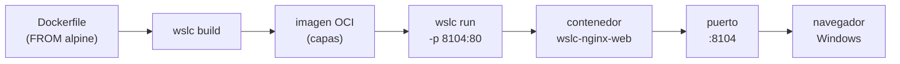

# 🐳 Guía de contenedores con WSLC

> Guía general del enfoque de **WSL Container Center**: qué es `wslc`, cómo se usan
> los 12 casos del catálogo y cómo se traducen los comandos `wslc` ↔ `docker`.
> Para el estado del proyecto consulta el [PROJECT_STATUS.md](../PROJECT_STATUS.md).

---

## 📖 ¿Qué es WSLC?

**WSLC** es el motor de contenedores **nativo** que Microsoft integró en WSL (a
partir de **WSL 2.9+**). Se maneja con el comando `wslc` (ejecutable en
`C:\Program Files\WSL\wslc.exe`) y su interfaz es casi idéntica a la de Docker:
`wslc build / up / down / pull / images / list / logs / network`.

WSLC construye **imágenes OCI reales por capas** a partir de un `Dockerfile`
(`FROM nginx:alpine`, `FROM node:20-alpine`, …) y levanta **contenedores aislados**
con red y filesystem propios — igual que cualquier runtime de contenedores. No hay
demonios `apt` dentro de la distro: cada caso es una imagen y uno o varios
contenedores que se crean y se descartan.

> [!NOTE]
> WSLC está en **preview**. Requiere WSL **2.9+** con el componente de contenedores
> habilitado. Si `wslc` no existe en tu máquina, se obtiene con:
>
> ```powershell
> wsl --update --pre-release
> ```

### 🆚 `wslc` frente a Docker

| Aspecto | 🐳 WSLC | 🐋 Docker |
| --- | --- | --- |
| Motor | Nativo de WSL 2.9+ (preview) | Docker Engine / Docker Desktop |
| Ejecutable | `C:\Program Files\WSL\wslc.exe` | `docker` |
| Imágenes | OCI reales por capas desde `Dockerfile` | OCI reales por capas desde `Dockerfile` |
| Multi-contenedor | Contenedores + **red `wslc`** | `docker compose` |
| Puertos | `-p host:container` | `-p host:container` |
| Instalación | Ya viene con WSL preview | Requiere instalar Docker Desktop |

> [!TIP]
> Si sabes Docker, sabes WSLC. El modelo mental —imagen, contenedor, red, puerto—
> es el mismo; cambia el binario y que el motor viene incluido en WSL.

---

## 🗺️ Esquema



---

## ⚙️ Requisitos e instalación

| Requisito | Detalle |
| --- | --- |
| WSL | **2.9+** con el componente WSLC (preview) |
| Ejecutable | `C:\Program Files\WSL\wslc.exe` |
| Sistema | Windows 10/11 con WSL 2 |

**1. Actualizar WSL a la versión preview** (trae el motor de contenedores):

```powershell
wsl --update --pre-release
wsl --version
```

**2. Verificar que `wslc` está disponible** usando la ruta completa:

```powershell
& "C:\Program Files\WSL\wslc.exe" --version
```

> [!WARNING]
> Si `wslc` no aparece tras actualizar, reinicia WSL con `wsl --shutdown` y vuelve
> a comprobarlo. El panel localiza el binario en `C:\Program Files\WSL\wslc.exe`;
> si tu instalación lo tiene en otra ruta, no encontrará el motor.

---

## 📦 Cómo se usan los 12 casos

El catálogo [`containers/containers.config.json`](../containers/containers.config.json)
es la fuente única de verdad: define para cada caso su imagen(es), puerto host, red y
contenedores. Los 12 casos se agrupan en tres categorías:

- 🟢 **starter** — un solo contenedor de aplicación (Node, Python, Go, Nginx).
- 🧩 **platform** — app + backend de datos comunicados por una **red `wslc`**
  (Redis, PostgreSQL, MariaDB/LAMP, MongoDB).
- 🏗️ **infra** — piezas de infraestructura desde imágenes oficiales (RabbitMQ,
  Prometheus+Grafana, Elasticsearch, Jenkins).

Para el rol de cada caso y su puerto, consulta el
[catálogo de casos](LABS_CATALOG.md); para el detalle operativo (imagen, comando
`wslc` real, red, health y RAM), la [referencia de runtime](LABS_RUNTIME_REFERENCE.md).

### Ciclo de vida de un caso

```powershell
# 1. Construir las imágenes custom del caso (desde su Dockerfile)
wslc build -t wsl-labs/nginx-web:latest containers/06-nginx-web

# 2. Levantar el/los contenedor(es)
wslc run -d --name wslc-nginx-web -p 8104:80 wsl-labs/nginx-web:latest

# 3. Verificar desde Windows
curl http://localhost:8104
```

Los casos **platform** y **infra multi-contenedor** crean primero una red `wslc` y
conectan los contenedores por nombre de servicio (por ejemplo, la app apunta a
`REDIS_HOST=wslc-redis`). El detalle por caso está en la
[referencia de runtime](LABS_RUNTIME_REFERENCE.md).

---

## 🧭 Uso desde el panel (WSL Container Center)

El panel Node.js (`localhost:9092`) incorpora la sección de contenedores con botones
por caso. Endpoints:

| Botón | Acción | Endpoint |
| --- | --- | --- |
| 🔨 **Construir** | `wslc build` de las imágenes del caso | `POST /api/wslc/build` |
| ▶ **Levantar** | crea red (si aplica) y hace `wslc run` de los contenedores | `POST /api/wslc/up` |
| 🛑 **Bajar** | detiene y elimina contenedores del caso | `POST /api/wslc/down` |
| 📄 **Logs** | `wslc logs` del contenedor principal | `POST /api/wslc/logs` |
| 📊 **Overview** | estado de todos los casos + detección de `wslc` | `GET /api/wslc/overview` |

El panel localiza el motor en `C:\Program Files\WSL\wslc.exe` y avisa si no está.

> [!NOTE]
> Primero **Construir** (una vez por caso, solo los que tienen imágenes custom),
> luego **Levantar**. Al **Bajar**, los contenedores se descartan pero las imágenes
> construidas permanecen en `wslc images` listas para volver a levantarse.

---

## 📋 Comandos `wslc` ↔ `docker`

`wslc` reproduce el subconjunto más habitual de `docker`:

| Comando `wslc` | Qué hace | Equivalente Docker |
| --- | --- | --- |
| `wslc build -t nombre:tag ctx` | Construye una imagen desde un `Dockerfile` | `docker build` |
| `wslc run -d --name N -p H:C img` | Levanta un contenedor en segundo plano | `docker run -d` |
| `wslc stop <nombre>` | Detiene y elimina un contenedor | `docker rm -f` |
| `wslc pull imagen:tag` | Descarga una imagen de un registro | `docker pull` |
| `wslc images` | Lista imágenes locales | `docker images` |
| `wslc list` | Lista contenedores | `docker ps` |
| `wslc logs <nombre>` | Muestra los logs de un contenedor | `docker logs` |
| `wslc network create <red>` | Crea una red de contenedores | `docker network create` |
| `wslc network …` | Gestiona redes | `docker network` |

> [!TIP]
> Un stack multi-contenedor (app + base de datos) que en Docker harías con
> `docker compose`, en WSLC se arma con una **red `wslc`** y varios `wslc run`
> conectados por nombre. Ver [mapeo desde docker-labs](mapping-from-docker-labs.md).

---

## 🚦 Límites de recursos y 💽 persistencia

El panel aplica automáticamente, al **Levantar** cada caso:

- **Límites de recursos** (`wslc run -m <RAM>M --cpus <n>`): la RAM tope sale del
  valor **recomendado medido** de cada caso (ver [REQUIREMENTS.md](REQUIREMENTS.md))
  y la CPU según la categoría (`starter` 0.5 · `platform` 1 · `infra` 2). El panel
  lo muestra como `🚦 tope …` en cada tarjeta. *(WSL puede avisar "Memory limited
  without swap" — es inocuo; el límite de RAM se aplica igual.)*
- **Volúmenes persistentes** (`wslc volume create` + `-v nombre:/ruta`): las bases
  de datos (PostgreSQL, MariaDB, MongoDB, Elasticsearch, RabbitMQ, Jenkins) montan un
  **volumen con nombre** en su directorio de datos. Así, al **Bajar** un caso se
  eliminan los contenedores **pero el volumen se conserva**: los datos sobreviven al
  siguiente **Levantar**. El panel marca estos casos con `💽 persistente`.

```powershell
# Equivalente manual de lo que hace el panel para postgres-api:
wslc volume create wslc-pgdata
wslc run -d --name wslc-postgres --network wslc-pg-net -m 1024M --cpus 1 \
  -e POSTGRES_PASSWORD=wsl-labs -e POSTGRES_DB=app \
  -v wslc-pgdata:/var/lib/postgresql/data postgres:15
```

> [!TIP]
> Para **borrar** también los datos de un caso, elimina su volumen a mano:
> `wslc volume ls` y `wslc volume rm <nombre>` (o `wslc volume prune` para los
> huérfanos). Ver la [referencia CLI de `wslc`](wslc-cli-referencia.md).

---

## 🔗 Ver también

- [🧰 Referencia completa de la CLI de `wslc`](wslc-cli-referencia.md)
- [📚 Catálogo de casos de contenedores](LABS_CATALOG.md)
- [🧾 Referencia de runtime por caso](LABS_RUNTIME_REFERENCE.md)
- [🔀 Mapeo desde docker-labs](mapping-from-docker-labs.md)
- [🕰️ Historia y referencia de WSL](wsl-historia-y-referencia.md)
- [📁 README del repositorio](../README.md)
