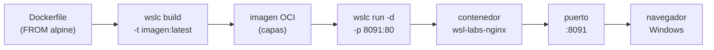

# 🐳 Track de Contenedores WSLC

> Guía del **segundo track** de `wsl-labs`: imágenes y contenedores **reales** con
> `wslc`, el motor de contenedores nativo de WSL. Complementa (no reemplaza) al
> [track clásico de servicios](../README.md) que corre demonios dentro de la distro
> Ubuntu.

---

## 📖 ¿Qué es WSLC?

**WSLC** es el motor de contenedores nativo que Microsoft añadió a WSL (a partir de
**WSL 2.9.3+**). Se maneja con el comando `wslc` (ejecutable en
`C:\Program Files\WSL\wslc.exe`) y su interfaz es casi idéntica a la de Docker:
`wslc build / run / pull / images / list / logs / stop / rm / volume / network`.

A diferencia del track clásico, WSLC construye **imágenes OCI reales por capas** a
partir de un `Dockerfile` (`FROM nginx:alpine`, `FROM node:20-alpine`, …). **No**
instala paquetes con `apt` dentro de la distro: levanta contenedores aislados y
efímeros, como cualquier runtime de contenedores.

> [!NOTE]
> WSLC está en **preview**. Requiere WSL **2.9+** con el componente de contenedores
> habilitado. Si `wslc` no existe en tu máquina, se obtiene con
> `wsl --update --pre-release`.

### 🆚 WSLC vs. el track de servicios

| Aspecto | 🐳 Contenedores (WSLC) | ⚙️ Servicios (track clásico) |
| --- | --- | --- |
| Unidad de despliegue | **Contenedor** desde una **imagen** OCI | **Demonio** dentro de la distro Ubuntu |
| Cómo se construye | `wslc build` desde un `Dockerfile` (`FROM …`) | `apt install` + configuración en la distro |
| Ciclo de vida | **Efímero** (se crea y se descarta) | **Persistente** (vive en la instancia WSL) |
| Aislamiento | Alto — filesystem y red propios del contenedor | Comparte el filesystem de la distro |
| Puertos | **8091 – 8093** | **8080 – 8090** |
| Ejecución | `wslc run -d -p …` | `wsl -u root` → `service`/`systemctl` |
| Analogía | `docker` nativo dentro de WSL | Servidor Linux "de sistema" tradicional |

> [!TIP]
> Los dos tracks son **complementarios**. Usa WSLC cuando quieras una imagen
> reproducible y aislada; usa el track de servicios cuando quieras un demonio
> Linux persistente integrado en tu distro.

---

## 🗺️ Esquema



---

## ⚙️ Requisitos e instalación

| Requisito | Detalle |
| --- | --- |
| WSL | **2.9+** con el componente WSLC (preview) |
| Ejecutable | `C:\Program Files\WSL\wslc.exe` |
| Sistema | Windows 10/11 con WSL 2 |

**1. Actualizar WSL a la versión preview** (trae el motor de contenedores):

```powershell
wsl --update --pre-release
wsl --version
```

**2. Verificar que `wslc` está disponible** usando la ruta completa:

```powershell
& "C:\Program Files\WSL\wslc.exe" --version
```

> [!WARNING]
> Si `wslc` no aparece tras actualizar, reinicia WSL con `wsl --shutdown` y vuelve
> a comprobarlo. El track de contenedores del Control Center localiza el binario
> en `C:\Program Files\WSL\wslc.exe`; si tu instalación lo tiene en otra ruta, ese
> panel no encontrará el motor.

---

## 📦 Las 3 imágenes del track

Las tres imágenes están **construidas y verificadas** (HTTP 200 desde Windows).
Los `Dockerfile` y el código fuente viven en [`wslc/`](../wslc/); el mapeo completo
está en [`wslc/wslc.config.json`](../wslc/wslc.config.json).

| Imagen | Base | Contenedor | Puerto | Contexto |
| --- | --- | --- | --- | --- |
| `wsl-labs/web-nginx` | `nginx:alpine` | `wsl-labs-nginx` | **8091** → 80 | [`wslc/web-nginx`](../wslc/web-nginx) |
| `wsl-labs/node-api` | `node:20-alpine` | `wsl-labs-node` | **8092** → 8082 | [`wslc/node-api`](../wslc/node-api) |
| `wsl-labs/python-flask` | `python:3.12-alpine` | `wsl-labs-flask` | **8093** → 8083 | [`wslc/python-flask`](../wslc/python-flask) |

### 🌐 `wsl-labs/web-nginx` → `localhost:8091`

```dockerfile
FROM nginx:alpine
COPY index.html /usr/share/nginx/html/index.html
EXPOSE 80
```

```powershell
wslc build -t wsl-labs/web-nginx:latest wslc/web-nginx
wslc run -d --name wsl-labs-nginx -p 8091:80 wsl-labs/web-nginx:latest
curl http://localhost:8091
```

### 🟢 `wsl-labs/node-api` → `localhost:8092`

API Node.js con el módulo `http` nativo (sin dependencias). Escucha en `PORT=8082`
dentro del contenedor.

```dockerfile
FROM node:20-alpine
WORKDIR /app
COPY server.js .
ENV PORT=8082
EXPOSE 8082
CMD ["node", "server.js"]
```

```powershell
wslc build -t wsl-labs/node-api:latest wslc/node-api
wslc run -d --name wsl-labs-node -p 8092:8082 wsl-labs/node-api:latest
curl http://localhost:8092
```

### 🐍 `wsl-labs/python-flask` → `localhost:8093`

App Flask que expone `/` y `/health`. Escucha en `PORT=8083` dentro del contenedor.

```dockerfile
FROM python:3.12-alpine
WORKDIR /app
COPY requirements.txt .
RUN pip install --no-cache-dir -r requirements.txt
COPY app.py .
ENV PORT=8083
EXPOSE 8083
CMD ["python", "app.py"]
```

```powershell
wslc build -t wsl-labs/python-flask:latest wslc/python-flask
wslc run -d --name wsl-labs-flask -p 8093:8083 wsl-labs/python-flask:latest
curl http://localhost:8093
```

> [!TIP]
> Los tres endpoints devuelven JSON con `"runtime": "wslc-container"`, lo que
> confirma que la respuesta viene de un contenedor real y no de un demonio de la
> distro.

---

## 🧭 Uso desde el Control Center

El dashboard incorpora una sección **🐳 Contenedores (WSLC)** con botones por imagen:

| Botón | Acción | Endpoint |
| --- | --- | --- |
| **🔨 Construir** | Ejecuta `wslc build -t <imagen> <contexto>` | `/api/wslc/build` |
| **▶ Ejecutar** | Ejecuta `wslc run -d --name … -p …` | `/api/wslc/run` |
| **🛑 Detener** | Ejecuta `wslc stop` + `wslc rm` | `/api/wslc/stop` |

El panel localiza el motor en `C:\Program Files\WSL\wslc.exe`. Consulta la puesta
en marcha del dashboard en [DASHBOARD_SETUP.md](DASHBOARD_SETUP.md).

> [!NOTE]
> Primero **Construir** (una vez por imagen), luego **Ejecutar**. Al pulsar
> **Detener** el contenedor se descarta (es efímero), pero la imagen construida
> permanece en `wslc images` lista para volver a ejecutarse.

---

## 📋 Referencia rápida de comandos `wslc`

`wslc` reproduce el subconjunto más habitual de `docker`:

| Comando | Qué hace | Equivalente Docker |
| --- | --- | --- |
| `wslc build -t nombre:tag ctx` | Construye una imagen desde un `Dockerfile` | `docker build` |
| `wslc run -d --name N -p H:C img` | Ejecuta un contenedor en segundo plano | `docker run` |
| `wslc pull imagen:tag` | Descarga una imagen de un registro | `docker pull` |
| `wslc images` | Lista imágenes locales | `docker images` |
| `wslc list` | Lista contenedores | `docker ps` |
| `wslc logs <nombre>` | Muestra los logs de un contenedor | `docker logs` |
| `wslc stop <nombre>` | Detiene un contenedor | `docker stop` |
| `wslc rm <nombre>` | Elimina un contenedor | `docker rm` |
| `wslc volume …` | Gestiona volúmenes | `docker volume` |
| `wslc network …` | Gestiona redes | `docker network` |

---

## 🔗 Ver también

- [🕰️ Historia y referencia de WSL](wsl-historia-y-referencia.md) — ver §4 (WSL hoy: open source y WSLC)
- [🖥️ Puesta en marcha del dashboard](DASHBOARD_SETUP.md)
- [🧪 Lab 13 · Contenedores WSLC](../labs/13-wslc-contenedores/README.md)
- [📁 README del repositorio](../README.md)
