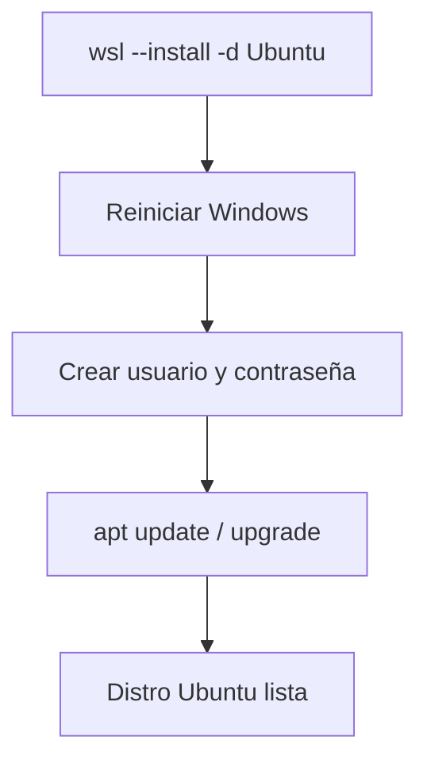

# 01 · Instalación de Ubuntu 📦

> Instalar y configurar WSL 2 + Ubuntu desde cero.

---

## 📋 Datos del lab

| Campo | Valor |
| --- | --- |
| Tipo | learning |
| Estado | ✅ ready |

---

### 🗺️ Esquema



---

## 🎯 Objetivo

Instalar Ubuntu sobre WSL 2 y dejarlo listo para el resto de laboratorios de la suite.

---

## 📋 Pasos

### 1. Revisar e instalar WSL desde PowerShell

```powershell
wsl --status
wsl --list --online
wsl --install -d Ubuntu
wsl --list --verbose
```

### 2. Entrar a Ubuntu

```powershell
wsl -d Ubuntu
```

### 3. Actualizar el sistema y herramientas base

```bash
sudo apt update
sudo apt upgrade -y
sudo apt install -y git curl wget unzip build-essential ca-certificates
```

---

## ✅ Comprobación

```bash
lsb_release -a
uname -a
whoami
```

Debes obtener una distribución Ubuntu funcionando sobre WSL 2.

---

## 🎯 Por qué importa

Este es el punto de partida de toda la suite: sin una Ubuntu limpia sobre WSL 2 no hay servicios que levantar ni ejemplos que ejecutar. Dejar la base actualizada y con las herramientas de compilación instaladas evita fallos difíciles de diagnosticar en los labs posteriores.

---

Parte de [wsl-labs](../../README.md) · ver [labs.config.json](../../labs.config.json)
