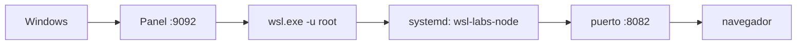

# 07 · Entorno Node.js 🟢

> API Node.js de ejemplo en `localhost:8082`.

---

## 📋 Datos del lab

| Campo | Valor |
| --- | --- |
| Tipo | service |
| Estado | ✅ ready |
| Puerto | `8082` |
| URL | [http://localhost:8082](http://localhost:8082) |
| Health | HTTP |

---

### 🗺️ Esquema



---

## 📦 Instalación (una vez)

```bash
sudo apt update
sudo apt install -y nodejs npm
node -v
npm -v

cd ../../examples/node-api
npm install
```

> El ejemplo [`examples/node-api/server.js`](../../examples/node-api/server.js) escucha en
> `process.env.PORT || 3000`, por lo que respeta el puerto que le inyecta el catálogo.

---

## 🚀 Ejecutar

La API corre como **servicio systemd** (`wsl-labs-node`, creado por
`scripts/install-node.sh`), por lo que sobrevive a reinicios de la instancia WSL.
El catálogo lo arranca con:

```bash
systemctl enable --now wsl-labs-node
systemctl restart wsl-labs-node
```

> [!NOTE]
> El servicio fija `PORT=8082` y corre `node server.js` (módulo `http` nativo,
> sin `npm install`) desde `examples/node-api`.

---

## ✅ Verificar

```bash
curl http://localhost:8082
journalctl -u wsl-labs-node -n 50 --no-pager
```

---

## 🧭 Desde el Control Center

En el dashboard ([http://localhost:9092](http://localhost:9092)) el botón **▶** de este lab
ejecuta el `startCommand` del catálogo (arranca `node server.js` con `PORT=8082`) sobre WSL,
y el estado de salud se comprueba por HTTP contra el puerto `8082`.

---

## 🛑 Detener

```bash
systemctl stop wsl-labs-node
```

---

## 🎯 Por qué importa

Node.js con Express es el punto de entrada para explorar APIs modernas. Ejecutar el servicio con `PORT` inyectado desde el entorno, en segundo plano y con logs a fichero, reproduce el patrón real de despliegue de un proceso gestionado por un orquestador o supervisor.

---

Parte de [wsl-labs](../../README.md) · ver [labs.config.json](../../labs.config.json)
