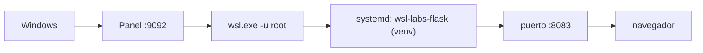

# 08 · Entorno Python (Flask) 🐍

> App Flask de ejemplo en `localhost:8083`.

---

## 📋 Datos del lab

| Campo | Valor |
| --- | --- |
| Tipo | service |
| Estado | ✅ ready |
| Puerto | `8083` |
| URL | [http://localhost:8083](http://localhost:8083) |
| Health | HTTP |

---

### 🗺️ Esquema



---

## 📦 Instalación (una vez)

```bash
sudo apt update
sudo apt install -y python3 python3-pip python3-venv

cd ../../examples/python-flask
python3 -m venv .venv
source .venv/bin/activate
pip install -r requirements.txt
```

> El ejemplo [`examples/python-flask/app.py`](../../examples/python-flask/app.py) escucha en
> `int(os.environ.get("PORT", 5000))`, por lo que respeta el puerto que le inyecta el catálogo.

---

## 🚀 Ejecutar

La app corre como **servicio systemd** (`wsl-labs-flask`, creado por
`scripts/install-python.sh`), por lo que sobrevive a reinicios de la instancia WSL.
El catálogo lo arranca con:

```bash
systemctl enable --now wsl-labs-flask
systemctl restart wsl-labs-flask
```

> [!NOTE]
> El servicio fija `PORT=8083` y ejecuta `app.py` con el Python del **venv**
> (`examples/python-flask/.venv`), donde está instalado Flask.

---

## ✅ Verificar

```bash
curl http://localhost:8083
journalctl -u wsl-labs-flask -n 50 --no-pager
```

---

## 🧭 Desde el Control Center

En el dashboard ([http://localhost:9092](http://localhost:9092)) el botón **▶** de este lab
ejecuta el `startCommand` del catálogo (arranca `python3 app.py` con `PORT=8083`) sobre WSL,
y el estado de salud se comprueba por HTTP contra el puerto `8083`.

---

## 🛑 Detener

```bash
systemctl stop wsl-labs-flask
```

---

## 🎯 Por qué importa

Flask es el microframework de referencia para prototipar servicios web en Python. Aislar dependencias en un `venv` y leer el puerto desde el entorno son dos prácticas que separan un script de juguete de un servicio desplegable, y permiten que conviva con las demás APIs de la suite sin colisiones.

---

Parte de [wsl-labs](../../README.md) · ver [labs.config.json](../../labs.config.json)
