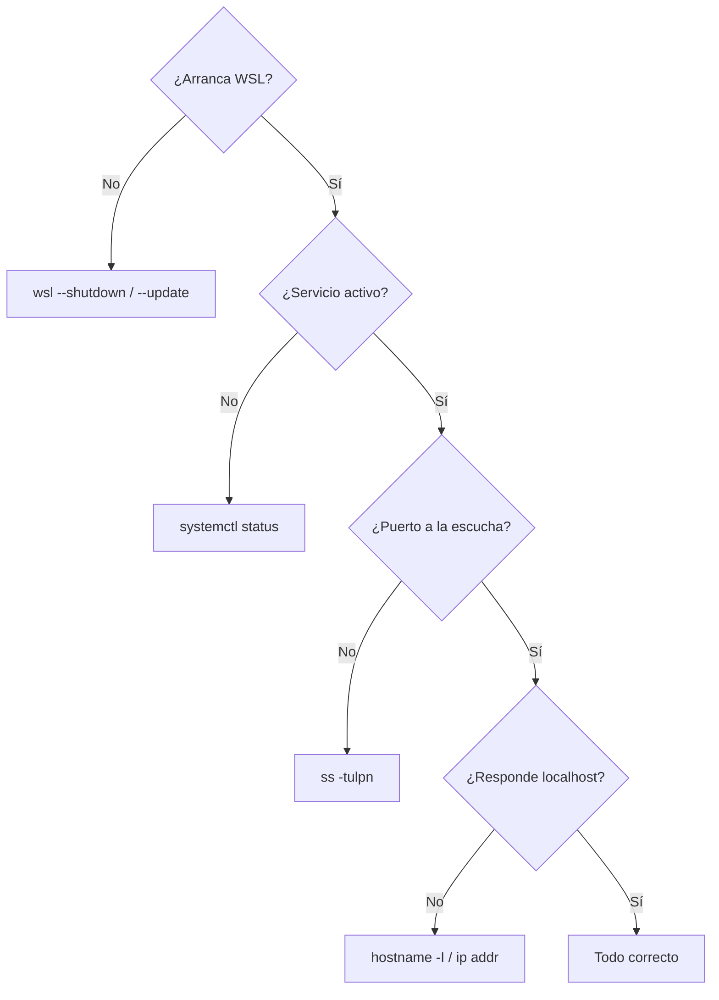

# 12 · Troubleshooting 🧯

> Diagnóstico y resolución de problemas comunes en WSL.

---

## 📋 Datos del lab

| Campo | Valor |
| --- | --- |
| Tipo | learning |
| Estado | ✅ ready |

---

### 🗺️ Esquema



---

## 🎯 Objetivo

Reunir los comandos de diagnóstico para resolver los problemas más habituales de WSL: arranque, servicios, puertos y red.

---

## 📋 Pasos

### 1. WSL no inicia

Desde PowerShell:

```powershell
wsl --shutdown
wsl --status
```

### 2. Ver las distros instaladas

```powershell
wsl --list --verbose
```

### 3. Actualizar WSL

```powershell
wsl --update
```

### 4. Problemas con servicios

Dentro de Ubuntu:

```bash
ps -p 1 -o comm=
systemctl status
```

### 5. Problemas de puertos

```bash
ss -tulpn
```

### 6. Ver la IP de WSL

```bash
hostname -I
ip addr
```

---

## ✅ Comprobación

Tras aplicar el diagnóstico correspondiente, `wsl --status` reporta la distro activa, `systemctl status` muestra los servicios en verde y `ss -tulpn` confirma que los puertos esperados están a la escucha.

---

## 🎯 Por qué importa

Los servicios en WSL fallan de formas concretas y repetibles: systemd que no arranca, un puerto ocupado, una IP que cambió. Tener a mano el comando de diagnóstico correcto convierte una tarde perdida en una corrección de dos minutos, y cierra la suite con la red de seguridad que todo entorno de servicios necesita.

---

Parte de [wsl-labs](../../README.md) · ver [labs.config.json](../../labs.config.json)
