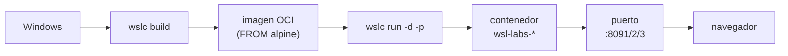

# 13 · Contenedores WSLC 🐳

> Tres **contenedores reales** (imágenes OCI construidas con `wslc`) sirviendo en
> `localhost:8091`, `:8092` y `:8093`.

---

## 📋 Datos del lab

| Campo | Valor |
| --- | --- |
| Tipo | container |
| Estado | ✅ ready |
| Imágenes | `wsl-labs/web-nginx`, `wsl-labs/node-api`, `wsl-labs/python-flask` |
| Puertos | `8091` · `8092` · `8093` |
| Motor | `wslc` (`C:\Program Files\WSL\wslc.exe`) |
| Health | HTTP |

---

## 🗺️ Esquema



---

## 🚀 Construir y ejecutar

> [!NOTE]
> Requiere WSL **2.9+** con WSLC (preview). Si no tienes `wslc`, instálalo con
> `wsl --update --pre-release` y verifica con
> `& "C:\Program Files\WSL\wslc.exe" --version`.

```powershell
# 🌐 NGINX  →  :8091
wslc build -t wsl-labs/web-nginx:latest wslc/web-nginx
wslc run -d --name wsl-labs-nginx -p 8091:80 wsl-labs/web-nginx:latest

# 🟢 Node   →  :8092
wslc build -t wsl-labs/node-api:latest wslc/node-api
wslc run -d --name wsl-labs-node -p 8092:8082 wsl-labs/node-api:latest

# 🐍 Flask  →  :8093
wslc build -t wsl-labs/python-flask:latest wslc/python-flask
wslc run -d --name wsl-labs-flask -p 8093:8083 wsl-labs/python-flask:latest
```

Comprueba las imágenes y los contenedores:

```powershell
wslc images
wslc list
```

---

## ✅ Verificar

```powershell
curl http://localhost:8091
curl http://localhost:8092
curl http://localhost:8093
```

Luego abre en Windows: [http://localhost:8091](http://localhost:8091),
[http://localhost:8092](http://localhost:8092) y
[http://localhost:8093](http://localhost:8093).

> [!TIP]
> Node y Flask responden JSON con `"runtime": "wslc-container"`. Si necesitas
> depurar, mira los logs con `wslc logs wsl-labs-node` (o `-flask` / `-nginx`).

---

## 🧭 Desde el Control Center

En el dashboard ([http://localhost:9092](http://localhost:9092)), la sección
**🐳 Contenedores (WSLC)** ofrece por imagen los botones **🔨 Construir**,
**▶ Ejecutar** y **🛑 Detener**, que llaman a los endpoints `/api/wslc/build`,
`/api/wslc/run` y `/api/wslc/stop`. El panel localiza el motor en
`C:\Program Files\WSL\wslc.exe`.

---

## 🛑 Detener

```powershell
wslc stop wsl-labs-nginx  wsl-labs-node  wsl-labs-flask
wslc rm   wsl-labs-nginx  wsl-labs-node  wsl-labs-flask
```

> [!NOTE]
> Los contenedores son **efímeros**: al eliminarlos no queda nada en la distro.
> Las **imágenes** siguen en `wslc images`, listas para un nuevo `wslc run`.

---

## 🎯 Por qué importa

Este lab demuestra el motor de contenedores **nativo** de WSL: imágenes OCI reales
por capas, construidas desde un `Dockerfile` y aisladas del sistema de archivos de
la distro — a diferencia del track de servicios (labs 05–11), que instala demonios
con `apt`. Es la vía de Microsoft para tener contenedores tipo Docker sin Docker
Desktop, integrados directamente en WSL y expuestos de forma transparente en
`localhost`.

---

## 🔗 Ver también

- [🐳 Guía del track de contenedores WSLC](../../docs/wslc-contenedores.md)
- [🕰️ Historia y referencia de WSL](../../docs/wsl-historia-y-referencia.md) — ver §4 (WSL hoy: open source y WSLC)

---

Parte de [wsl-labs](../../README.md)
